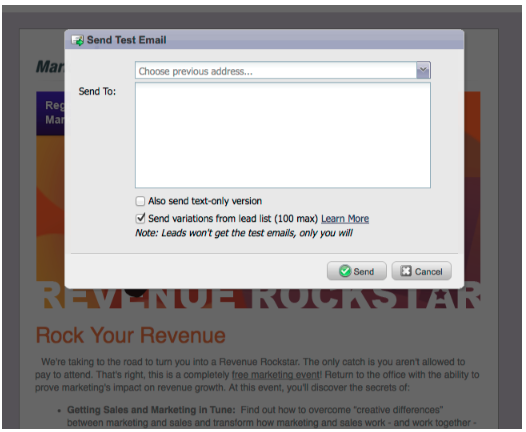

# 发行说明： 2012年3月 {#release-notes-march}

## 解析我的令牌 {#resolve-my-tokens}

我的令牌（项目令牌）将在预览电子邮件、发送测试电子邮件以及通过单个流量操作发送本地电子邮件时解析。 您不再需要在该程序中创建智能营销活动来测试您的“我的令牌”！

## 在电子邮件和登陆页面中的预览器和编辑器之间切换 {#toggle-between-previewer-and-editor-in-emails-and-landing-pages}

只需单击一下，即可轻松地在编辑器和预览器之间来回切换。

编辑者到预览者：

预览器到编辑器：

## 代码片段预览器 {#snippet-previewer}

通过从菜单中选择“预览代码片段”，您可以查看代码片段，而不会将其变为草稿。此外，如果您对共享代码片段具有只读访问权限（通过工作区），则可以通过此操作查看代码片段

## 发送多封测试电子邮件 {#send-multiple-test-emails}

随着动态内容的添加，预览和测试可能发送给潜在客户的所有电子邮件变体变得越来越重要。 使用“按潜在客户详细信息查看”进行预览时，您可以选择从潜在客户列表中发送变体测试（最多100封测试电子邮件）。

## 基于URL参数的动态登陆页面 {#dynamic-landing-pages-based-on-url-parameter}

匿名潜在客户在您的登陆页面访问中占很大比例。 再加上动态内容以及将分段作为参数放入URL的功能，您可以在匿名或已知潜在客户点击链接时动态显示登陆页面内容。
