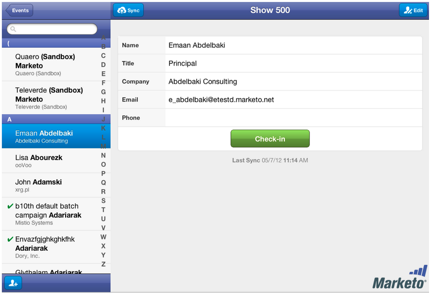

# 发行说明：2012年5月 {#release-notes-may}

## 重新设计电子邮件性能报表 {#email-performance-report-redesign}

注意：这将是从5月版开始的分阶段推出

我们使“电子邮件效果”和“促销活动电子邮件效果”报表的运行速度更快。 我们还改进了某些量度的定义，并将“已发送消息”和“已发送潜在客户”量度整合到单个量度“已发送”。 我们已将“已投放的消息”和“已投放的商机”合并到“已投放的商机”。

## 等待步骤增强功能 {#wait-step-enhancements}

使用新的高级等待属性，您可以将智能促销活动流量操作中的等待步骤配置为“等待”一周中的特定日期、下一工作日、特定日期或时间。 这些增强功能可确保您的培养型电子邮件在工作时间送达收件箱！

图1. 指定在工作日结束的等待步骤

## 隐藏的已存档资产 {#archived-assets-hidden}

存档的资产会自动从自动建议、下拉列表和报表中进行过滤，以便更轻松地查找您要查找的内容！

图2. 存档电子邮件过滤器的示例

## 适用于iPad的新事件签入应用程序 {#new-event-check-in-app-for-ipad}

使用我们新的iPad应用程序简化事件签入流程！ 事件签入应用程序与您的Marketo计划同步，允许您轻松地将注册者签入事件，并即时添加新潜在客户。

需要iOS 5.1或更高版本；iPad。

图3. 事件签入主页

图4. 事件签入：选择您的事件！

图5. 签入

## 增强的网络研讨会确认URL {#enhanced-webinar-confirmation-url}

现在可用于ON24和Adobe Connect! 在确认电子邮件中，使用新 `{{member.webinar URL}}` 令牌。 Adobe Connect增强功能还包括打开/关闭Adobe帐户信息电子邮件的功能，电子邮件中包含用户的登录ID和密码。

图6. 将人员吸引到网络研讨会

## 模板预览 {#template-preview}

在构建电子邮件或登陆页面时正在查找特定模板，但不确定模板的外观如何？ 利用新的模板预览功能，您可以在保存新资产之前验证选定的模板！

图7. 预览所选模板

## 可配置表单预填充 {#configurable-form-prefill}

在订阅级别控制表单数据的预填充，并在登陆页面级别覆盖。 如果没有预填充，您可以确保潜在客户提供最新的信息。

图8. 管理员中的表单预填充配置

图9. 编辑登陆页面上的表单预填充设置

## Marketo金库 {#marketo-treasure-chest}

访问由Marketo工程师开发的实验功能，以增强您的用户体验。 此版本包括电子邮件撤消，以及在您的登陆页面上输入评论并与其他用户协作的功能。

\

图10. 管理员的理财箱功能

## Microsoft Dynamics® CRM集成 {#microsoft-dynamics-crm-integration}

使用我们新的预建集成，在Marketo和Microsoft Dynamics CRM Online之间同步帐户、联系人和潜在客户！

图11. Microsoft Dynamics配置

## Marketo Sales Insight增强功能 {#marketo-sales-insight-enhancements}

**取消订阅页脚选项**

为通过Sales Insight发送的电子邮件配置何时以及是否显示取消订阅页脚。

图12. 管理员中的销售分析设置

## 销售电子邮件模板的文件夹 {#folders-for-sales-email-templates}

现在，您可以将与Marketo Sales Insight共享的电子邮件模板组织到指定的文件夹中，从而更便于销售代表找到正确的电子邮件。

图13. 为电子邮件选择文件夹

## 从Sales Insight访问Opportunity Analyzer {#access-opportunity-analyzer-from-sales-insight}

通过从Marketo Sales Insight直接访问Opportunity Analyzer ，为销售代表提供关于哪些营销活动在推动参与的洞察信息。 注释. 需要Revenue Cycle Analytics许可证。

## 联系状态的自定义字段 {#custom-field-for-contact-status}

您现在可以在Salesforce中映射一个自定义字段，以在“我的最佳下注”、“我团队的最佳下注”和自定义视图中填充“联系人”的“状态”字段。

图14. 将自定义字段映射到联系人

请参阅匿名潜在客户访问的页面

从“匿名Web活动”视图向下访问由匿名潜在客户查看的页面。

图15. 请参阅匿名Web活动

## 增强的潜在客户和联系人订阅 {#enhanced-lead-and-contact-subscribe}

使用记录详细信息页面上的新订阅按钮，随时跟踪潜在客户或联系。
