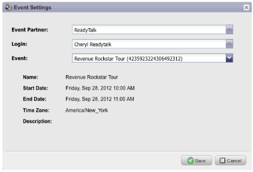

# 发行说明：2012 年 9 月 {#release-notes-september}

此版本包括备受期待的集成式社交功能和商机管理实用组件！ 注意：社交功能作为加载项或选定捆绑的一部分提供。

## 通过社交共享发布YouTube视频 {#publish-a-youtube-video-with-social-sharing}

通过在您的登陆页面上使用新的视频共享，鼓励您的访客在社交上共享视频，从而扩大视频的受众。

## 添加共享按钮 {#add-a-share-button}

完全自定义共享消息和一组新社交共享按钮的外观。 此外，在您的潜在客户共享您的内容时捕获社交个人资料数据。

## 社交登录 {#social-sign-on}

获取insight并通过允许潜在客户使用来自其社交网络的信息预填充表单来减少摩擦。

## 将登陆页面发布到[!DNL Facebook] {#publish-landing-pages-to-facebook}

通过将登陆页面直接发布到[!DNL Facebook]中来扩展这些登陆页面的访问范围，并使用社交应用程序、表单和Marketo登陆页面的完整功能。

## [!DNL ReadyTalk]事件适配器 {#readytalk-event-adapter}

将Marketo事件无缝连接到[!DNL ReadyTalk]会议。 使用Marketo表单捕获注册者并自动在[!DNL ReadyTalk]中注册他们。 双向同步允许将出勤信息填充到Marketo中。

## Microsoft [!DNL Dynamics]内部部署 {#microsoft-dynamics-on-premise}

现在，我们通过面向Internet的部署来支持Microsoft [!DNL Dynamics] 2011内部部署。

## Webhooks (Treasure Check) {#webhooks-treasure-chest}

Webhook是用户定义的HTTP回调。 这是一种将数据从Marketo推送到任何其他服务的好方法。 此功能目前在Treasure Chest中可用，目前仅在触发营销活动中受支持。

有关如何使用Webhook的示例包括：将用户名和密码信息发布到其他系统以创建试用帐户；在您获得新商机时发送短信文本消息。

## getMultipleLeads API更新 {#update-to-getmultipleleads-api}

我们为getMultipleLeads API调用添加了新筛选条件。 除了按日期过滤外，我们现在还支持其他标准：

* 日期范围
* 静态列表名称
* 潜在客户键数组
