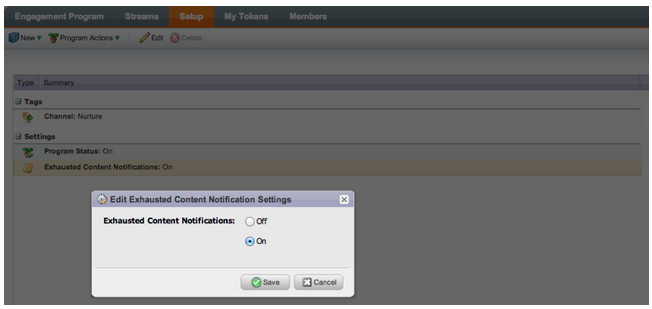

# 发行说明：2013年8月 {#release-notes-august}

2013年8月版中包含以下功能。

**仅文本电子邮件**

现在，您只能发送电子邮件的文本版本](/help/marketo/product-docs/email-marketing/general/creating-an-email/create-a-text-only-email.md)。 [请记住，使用此选项时不会修饰链接。

## 客户参与引擎增强功能 {#customer-engagement-engine-enhancements}

### 忽略已用尽的内容 {#ignore-exhausted-content}

将参与程序配置为[忽略已用尽](/help/marketo/product-docs/email-marketing/drip-nurturing/using-engagement-programs/disable-and-enable-exhausted-content-notifications.md)，包括禁止任何通知。

## 参与流测试 {#engagement-stream-testing}

使用[新测试功能](/help/marketo/product-docs/email-marketing/drip-nurturing/engagement-program-streams/test-an-engagement-stream.md)模拟转播，并测试新添加到实时流的内容。

## 个性化发送测试 {#personalized-send-test}

在发送电子邮件测试时，您可以选择潜在客户的名称以个性化测试电子邮件。

## “以网页形式查看电子邮件”和“取消订阅”系统令牌 {#view-email-as-web-page-and-unsubscribe-system-tokens}

利用这些[新令牌](/help/marketo/product-docs/email-marketing/general/using-tokens/system-tokens-glossary.md)更好地控制其在电子邮件中的放置位置。

## 自动触发营销活动清理 {#automatic-trigger-campaign-cleanup}

现在，Marketo将定期通知您并[自动停用过去六个月内未运行的触发器促销活动](/help/marketo/product-docs/core-marketo-concepts/smart-campaigns/using-smart-campaigns/automatic-trigger-campaign-cleanup.md)。

## Marketo Financial Management增强功能 {#marketo-financial-management-enhancement}

### 计划成本更新  {#program-cost-update}

程序成本同步可跨多个平台跟踪程序成本。

### Cobalt用户界面 {#cobalt-user-interface}

我们继续推出新的Cobalt界面。 这个项目将让Marketo的一切都变得超快！ 升级将在今年剩余时间继续进行。
