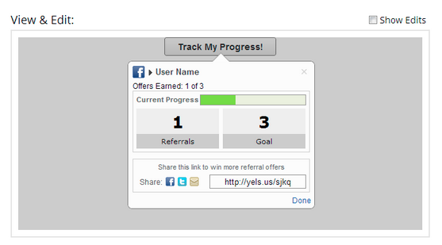

# 发行说明：2013年1月 {#release-notes-january}

1月版将通过&#x200B;**反向链接选件**&#x200B;扩展我们的社交产品。 此外，Marketo潜在客户管理用户可以设置其时区、语言和区域设置首选项。 请注意，标有*的功能仅在Select Edition中可用。

## 反向链接选件 {#referral-offers}

**推荐选件**&#x200B;会激励您的潜在客户推荐他们的朋友。 为成功推荐创建目标和奖励。 您可以在登陆页面、网站甚至Facebook上使用它。

## 时区首选项 {#time-zone-preference}

您可以更改个人Marketo帐户的默认时区。 例如，即使订阅的默认值为“太平洋时间”，您也可以将其更改为您自己帐户的“东部时间”。

## 选择您的Marketo潜在客户管理语言 {#select-your-marketo-lead-management-language}

您可以更改Marketo用户帐户的默认语言。 即使订阅的默认格式为英语，您也可以将其更改为德语或法语供您自用。

## 多语言表单错误消息 {#multi-lingual-form-error-messages}

当潜在客户填写Marketo表单时，会自动内置一些验证消息。 您可能需要为这些错误消息选择其他显示语言。 我们现在支持英语、德语和法语。

法语表单的示例：

## 选择您的销售分析语言（仅限Salesforce） {#select-your-sales-insight-language-salesforce-only}

如果您的Salesforce语言首选项设置为法语或德语，Marketo Sales Insight将遵循此首选项。 下载最新的MSI包，以获取此功能（1月14日这一周提供）。

## 字段显示名称 {#field-display-name}

字段显示名称可以显示不同语言的文本（例如，支持多字节字符）。

## 更改程序数据 {#change-program-data}

更改项目数据流步骤允许您通过营销策划手动更改项目成员的成功状态和成功日期。 您可以使用此流程步骤来更正错误，或手动更改可能未按预期参与该程序的成员。

