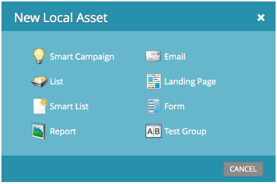

# 发行说明：2013年6月 {#release-notes-june}

6月版中包含以下功能。

## 其他用户语言 {#additional-user-languages}

查看您首选语言的Marketo Lead Management界面 — 现在支持西班牙语和葡萄牙语。

## Cobalt用户界面 {#cobalt-user-interface}

在接下来的几个月里，您会注意到一个新主题已在应用程序的不同部分推出；例如，会影响模式窗口。

## 子文件夹克隆 {#subfolder-cloning}

将资产克隆到子文件夹中。

## 多个模型 {#multiple-models}

作为社区中收入周期分析(RCA)的一个主要构思，此功能允许您创建多个模型，以按产品线、业务部门或地区对收入漏斗有更详细的了解。 “按收入阶段划分的潜在客户”、“成功路径分析器”、“程序分析器”和“收入浏览器”报表现在支持为报表选择特定模型的功能。

默认情况下，有两种型号可用于Select SMB Edition，有15种型号可用于Enterprise Edition。 您还可以购买其他型号。

