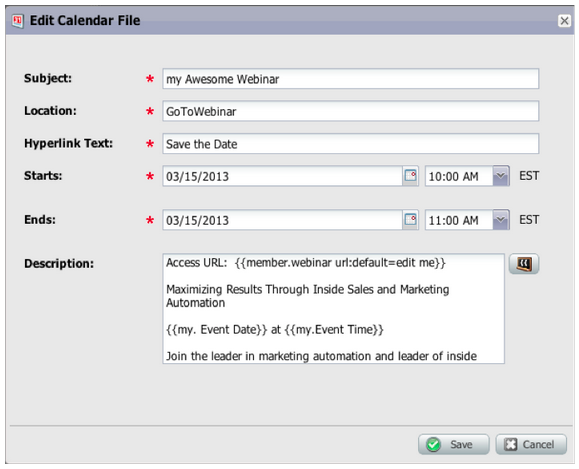

# 发行说明：2013年3月 {#release-notes-march}

3月版本中包含以下功能。

## Marketo日历文件 {#marketo-calendar-files}

将日历文件创建为&#x200B;**My Token**，以用于事件确认和提醒电子邮件。 此集成的日历文件（例如.ics文件）将呈现所有令牌，包括我的令牌和`{{member.webinar URL}}`令牌。

## 等待+/- {#wait-until}

创建可在日期令牌前后执行指定天数的等待步骤。 例如，您可以创建一个等待步骤，该步骤将在事件日期之前等待3天，然后发送提醒！

您可以创建一个等待步骤，该步骤将在潜在客户生日前等待14天。 通过选择“使用此日期的下一个周年”，系统将自动忽略与该日期关联的年份，并改用当前或下一个日历年。

## 社交抽奖 {#social-sweepstakes}

抽奖可以让你的线索有机会赢得奖品，并告诉他们的朋友你的事。 从参与者中随机选择入选者，然后向他们发送电子邮件。

## 其他表单错误消息语言 {#additional-form-error-message-languages}

表单错误消息中添加了十多种语言！

## 支持新闻和警报 {#support-news-and-alerts}

通过订阅支持新闻和P1警报警报、已知问题、支持专家的提示和提示，以及Marketo客户支持的更新，与Marketo客户支持保持联系。
