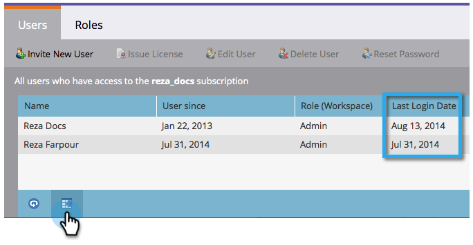

# 发行说明： 2014年8月 {#release-notes-august}

2014年8月版本中包含以下功能。 检查您的Marketo版本以了解功能可用性。 请在发布后返回以获取指向详细功能文档的链接。

## 营销日历许可证 {#marketing-calendar-licenses}

2014年9月5日之后，只有5名用户可免费访问营销日历。 请务必 [发布/撤销营销日历许可证](/help/marketo/product-docs/core-marketo-concepts/marketing-calendar/understanding-the-calendar/issue-revoke-a-marketing-calendar-license.md) 之前发送给您选择的用户，以实现无中断访问。

## 新用户权限 {#new-user-permissions}

添加了以下新用户权限：

| 权限 | 描述 |
|---|---|
| 访问Revenue Explorer | 如果您购买了RCA，您现在将控制谁可以访问该卡。 |
| 导入列表 | 限制用户将列表导入商机数据库。 |
| 列表导入 | 限制用户通过营销活动下的项目导入列表。 |
| 激活触发器营销活动 | 控制谁可以和谁无法激活触发营销活动。 |
| 计划批处理活动 | 控制谁可以计划批处理营销活动运行，谁不能计划。 |

## 从管理员中导出用户和角色 {#export-users-and-roles-from-admin}

您现在可以 [导出用户和角色列表](/help/marketo/product-docs/administration/users-and-roles/export-a-list-of-users-and-roles.md) 来自Marketo的。 您还可以包含要包含在导出中的“上次登录”时间戳。

## 删除渠道和标记 {#delete-channels-and-tags}

您现在可以删除任何未使用的渠道和状态。 与往常一样，您只能隐藏当前正在使用的文件。

## 自动DKIM {#automated-dkim}

为了提高可投放性，所有传出电子邮件都将经过DKIM（域名识别邮件）签名。 默认情况下，电子邮件将使用Marketo的共享DKIM签名。 您将可以选择自定义此签名。

>[!NOTE]
>
>DKIM将缓慢推出，您可能几周内看不到它。

## 实时个性化更新 {#real-time-personalization-updates}

我们在营销活动页面中添加了标签，以便您能够为自己的内容添加标签。

## 移动定位 {#mobile-targeting}

您向社区提问，我们完成了任务！ 您现在可以包含、排除或设置用于移动设备和平板电脑用户的特定行动号召。

## 增强的1:1分段和定位 {#enhanced-segmentation-and-targeting}

您现在可以使用高级过滤器运算符来定位已知访客。

## 营销活动共享 {#campaign-sharing}

您现在可以快速轻松地共享RTP促销活动预览链接。

## 内容推荐引擎报表 {#content-recommendation-engine-report}

我们添加了一个新的内容推荐引擎报告，供您查看漂亮的摘要。

## 增强的用户管理 {#enhanced-user-administration}

由于多次失败的登录尝试，管理员用户现在可以锁定用户。 如果需要，您还可以解锁这些用户。

## 跟踪控制 {#tracking-control}

您现在可以在实时个性化中将特定IP从所有跟踪和报告中排除。

