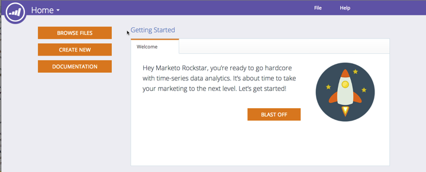
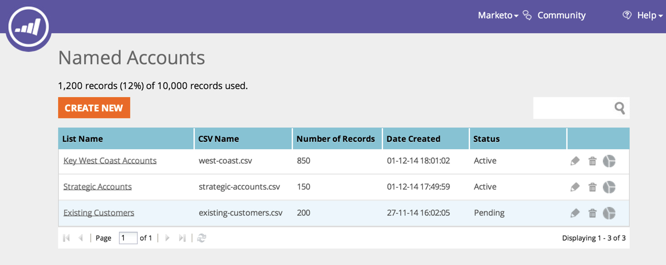

# 发行说明：2014年12月 {#release-notes-december}

2014年12月版本中包含以下功能。 请查看您的Marketo版以了解功能的可用情况。 发布后，请务必回访以查找每个功能的详细文章链接！

## 销售分析报表 {#sales-insight-reports}

的 [Sales Insight电子邮件性能报表](/help/marketo/product-docs/marketo-sales-insight/msi-for-salesforce/features/performance-reports/sales-insight-email-performance-report.md) 允许您通过电子邮件和销售代表查看电子邮件量度。 它支持通过Salesforce、Microsoft Dynamics、Outlook插件和Gmail插件发送的电子邮件。

## Facebook自定义受众 {#facebook-custom-audiences}

添加Marketo管理员后 [Facebook（通过管理员> Launchpoint）](/help/marketo/product-docs/demand-generation/ad-network-integrations/add-facebook-custom-audiences-as-a-launchpoint-service.md)，您可以轻松创建、更新或 [将Facebook自定义受众替换为来自Marketo静态或智能列表的潜在客户](/help/marketo/product-docs/demand-generation/facebook/create-a-custom-audience-in-facebook.md). 在任何静态或智能列表的潜在客户网格底部查找新的Facebook图标。

## 改进了跨工作区的克隆  {#improved-cloning-across-workspaces}

[克隆程序](/help/marketo/product-docs/core-marketo-concepts/programs/working-with-programs/clone-a-program.md) 到其他工作区从未像现在这样轻松！ 单击克隆时，将选择目标工作区。 不再将克隆到文件夹中，然后移动文件夹！

>[!NOTE]
>
>此新克隆功能目前仅适用于程序。

## 引用智能列表 {#reference-smart-list}

[可以引用与其他工作区共享的智能列表](/help/marketo/product-docs/core-marketo-concepts/smart-lists-and-static-lists/using-smart-lists/reference-a-list-or-smart-list-across-workspaces.md) 生成智能列表或流时。

## 列表导入改进 {#list-import-improvements}

[导入文件](/help/marketo/getting-started/quick-wins/import-a-list-of-people.md) 以UTF-16、Shift-JIS或EUC-JP编码。 我们继续支持UTF-8编码文件。

## 电子邮件脚本中的链接跟踪 {#link-tracking-in-email-scripting}

现在，将跟踪电子邮件脚本中的链接，并在电子邮件链接性能报表中提供这些链接。

## 令牌编码设置 {#token-encoding-setting}

我们推出了新的安全功能来自动HTML编码令牌，该功能将在2015年3月默认启用。 在此之前，请在字段管理中切换此功能，以提前测试行为。 所有潜在客户令牌和公司令牌在插入到电子邮件或登陆页面时都将进行编码。 各个字段也可使用相应的选项。

## 新的ReST API调用 {#new-rest-api-calls}

对潜在客户和活动ReST API的三个新调用：

·获取潜在客户分区

·关联潜在客户

·合并潜在客户

完整的详细信息将在以下位置发布之后提供： [developers.marketo.com](https://developers.marketo.com/)

## Munchkin Javascript兼容性增强 {#munchkin-javascript-compatibility-enhancements}

我们对Munchkin进行了几项小的增强，以确保它在页面上的其他JavaScript中继续快速加载并根据需要正常运行。

推出将于12月中旬开始，并在接下来的几个月中继续进行。

## Revenue Explorer已升级的外观 {#revenue-explorer-upgraded-look-and-feel}

## RTP:指定帐户列表模块 {#rtp-named-account-list-module}

在新的“指定帐户”页面中管理并监视关键的高收益帐户。 上传新的指定帐户列表，以识别和定位这些组织。 我们已自动化该流程，为您提供了更多控制和灵活性，以便实施基于帐户的营销计划，并跨不同渠道（Web和广告）定位您的关键帐户。

## RTP:区域营销活动中的滑动效果 {#rtp-sliding-effect-for-in-zone-campaigns}

我们为In Zone营销活动添加了新的滑动效果，以允许您的个性化内容在页面加载时滑动到适当位置。

