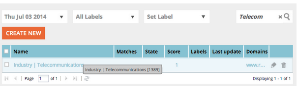

# 发行说明：2014年7月 {#release-notes-july}

2014年7月版中包含以下功能。 请查看您的Marketo版以了解功能的可用情况。 在发布后再回访，以获取详细功能文档的链接。

## 营销日历 {#marketing-calendar}

查看您在各个项目中的所有事件、电子邮件等内容。 [此新产](/help/marketo/product-docs/core-marketo-concepts/marketing-calendar/understanding-the-calendar/navigating-the-marketing-calendar.md) 品将免费提供给拥有10名或更少Marketo潜在客户管理或Dialog用户的客户。

营销日历的相关文档将在发布时提供。

## 新外观 {#new-look-and-feel}

Marketo Lead Management将更新新的外观，使其更新为现代、时尚，并包含更新的导航。

## 日期运算符 {#date-operators}

[高级](/help/marketo/product-docs/core-marketo-concepts/smart-lists-and-static-lists/creating-a-smart-list/smart-list-filter-operators-glossary.md) 过滤器“以前”、“将来”和“将来以后”。例如，查找在未来3个月内具有出生日期的潜在客户，或查找在6个月后到期的合同。

## 项目计划视图 {#program-schedule-view}

除了使用管理事件和默认项目的营销日历外，项目上还会有新的计划视图。

* 同时重新计划所有日期
* 新的暂定日期 — 铅笔入内！
* 自定义条目类型 — ToDo、新闻稿，任何您想要的内容

## ReST API中的列表操作 {#list-operations-in-the-rest-api}

我们添加了以下与ReST中的列表操作相关的调用。 有关完整文档，请参阅[developers.marketo.com](https://developers.marketo.com/documentation/rest/)。

* 按ID获取列表
* 获取多个列表
* 导入到列表
* 获取导入到列表状态

## 快速列表导入 {#fast-list-import}

在&#x200B;**50倍的速度上**，您的文件会放大到Marketo! 旧的“正常”和“针对新潜在客户优化”导入选项已替换为“默认（快速导入）”。

“跳过新潜在客户和更新”选项保持不变。

## 新改良的蒙奇金！ {#new-improved-munchkin}

推出将于7月中旬开始，并在接下来的几个月中继续进行。

* 删除依赖项jQuery以实现完全兼容和将来兼容
* 与网站上的其他JavaScript更兼容
* 过去一年在许多网站上进行了全面测试！

## RTP:实时个性化营销活动模板 {#rtp-real-time-personalization-campaign-templates}

现在，“RTP集促销活动”页面[包含已准备好的模板](/help/marketo/product-docs/web-personalization/using-templates/using-templates-to-create-web-campaigns.md)。 从各种样式中进行选择，包括网络研讨会、案例分析、电子书。

## RTP:JavaScript API增强功能 {#rtp-javascript-api-enhancements}

新的RTP API调用，用于获取实时访客数据，例如组织、行业、位置和区段代码匹配。 此外，将鼠标悬停在区段页面中的区段名称上，会显示显示区段代码的工具提示。 有关完整文档，请参阅我们的[开发人员站点](https://developers.marketo.com/documentation/websites/rtp-js-api/)。

## RTP:Campaign内容编辑器中支持HTML5 {#rtp-html-support-in-campaign-content-editor}

“设置营销活动”页面中的“所见即所得”内容编辑器现在具有完全的HTML5兼容性。 单击编辑器中的“HTML”图标以插入任何HTML5代码。
