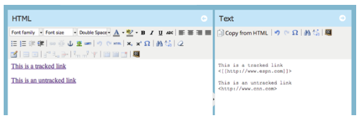

# 发行说明： 2014年5月 {#release-notes-may}

2014年5月版本中包含以下功能。 请检查您的Marketo版本是否提供了相关功能。 发布后，请务必返回以查找指向每个功能的详细知识库文章的链接！

## 删除工作区 {#delete-workspace}

现在您可以 [删除未使用的工作区](/help/marketo/product-docs/administration/workspaces-and-person-partitions/delete-a-workspace.md). 在尝试删除工作区之前，请确保将所有资源移动到另一个工作区。

## 安排首次点播 {#schedule-first-cast}

在参与计划中，您可以计划以下项目的日期 [第一个要运行的演员](/help/marketo/product-docs/email-marketing/drip-nurturing/engagement-program-streams/set-stream-cadence.md). 例如，指定每2周播放一次，然后选择第一次播放的日期。

## 增强型参与计划 {#enhanced-engagement-programs}

现在，每个人都拥有多个程序、流和通信限制。

## 文本电子邮件中的链接跟踪 {#link-tracking-in-text-emails}

[添加双方括号](/help/marketo/product-docs/email-marketing/general/functions-in-the-editor/add-tracked-links-to-a-text-email.md) 电子邮件文本版本中的URL来指示何时应将链接转换为重定向的Marketo跟踪链接

>[!NOTE]
>
>**示例**
>
>`[[https://www.marketo.com]]`

默认情况下，文本版本的电子邮件中不会跟踪任何链接。 添加此新语法以指示何时应将链接转换为跟踪链接。 HTML链接的行为保持不变。  要在电子邮件中添加跟踪链接，请执行以下操作：

* **HTML版本：** 只需插入您的链接。 默认情况下将对其进行跟踪。
* **文本版本：** 输入由双方括号括起的URL。

要在电子邮件中添加未跟踪的链接，请执行以下操作：

* **HTML版本：** 插入链接并将“mktNoTrack”类添加到该链接。
* **文本版本：** 只需输入URL即可。 默认情况下将取消跟踪该活动。

## 示例电子邮件中的链接标记 {#link-markup-in-sample-emails}

提前了解您的链接在电子邮件中的行为。 现在，示例电子邮件会显示链接，这些链接会确切地显示在潜在客户面前。 预览哪些链接已转换为跟踪链接，让您更好地了解消息实际向收件人显示的方式。

## 中止营销活动 {#abort-campaign}

不要惊慌！ 如果您发现错误，请使用新的 [中止营销活动](/help/marketo/product-docs/core-marketo-concepts/smart-campaigns/using-smart-campaigns/abort-a-smart-campaign.md) 按钮可立即停止处于其轨道中的营销活动。 您将收到一条通知，其中概述了当营销活动停止时，每个流程步骤中待定的潜在客户数量。

## Sales Insight （日语、葡萄牙语和西班牙语） {#sales-insight-in-japanese-portuguese-and-spanish}

从AppExchange下载最新版本的Sales Insight，以便说日语、葡萄牙语和西班牙语的销售代理可以使用他们的首选语言查看Sales Insight内容。

## 计划会员资格分析中的计划状态和成功时间范围 {#program-status-and-success-timeframe-in-program-membership-analysis}

查看数量 [成员处于每个项目群状态](/help/marketo/product-docs/reporting/revenue-cycle-analytics/program-analytics/build-a-program-membership-analysis-report-that-lists-leads.md) 以及他们更改为每个状态的时间，包括取得项目成功的日期。

## 电子邮件分析中的A/B测试电子邮件 {#a-b-test-emails-in-email-analysis}

报告您的每个 [A/B测试电子邮件变体](/help/marketo/product-docs/reporting/revenue-cycle-analytics/email-analysis/build-an-email-analysis-report-that-shows-program-information.md) 电子邮件分析中的。

## Analytics打包更改 {#analytics-packaging-changes}

MA Standard Edition现已包含Revenue Cycle Modeler和Success Path Analyzer。

## 移动平台信息 {#mobile-platform-info}

[区段和触发器](/help/marketo/product-docs/reporting/basic-reporting/report-activity/build-a-people-performance-report-with-mobile-platform-columns.md) 潜在客户打开和单击其移动设备的电子邮件。
