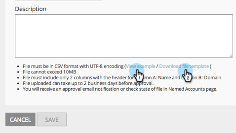

# 发行说明：2015 年 1 月 {#release-notes-january}

2015年1月版本中包含以下功能。 请检查您的Marketo版本以了解功能可用性。 发布后，请务必返回以查找每个功能的详细文章链接！

## 营销自动化更新 {#marketing-automation-updates}

**支持移动设备的登陆页面**

您现在可以从登陆页面编辑器中[构建登陆页面的移动视图](/help/marketo/product-docs/demand-generation/landing-pages/free-form-landing-pages/add-a-mobile-view-for-your-free-form-landing-page.md)。 无论使用什么设备，您都可以有效地传递您的消息，并通过定制内容以方便移动使用，从而增加参与度。 此功能将在版本发布后的一周内逐步推出。

[ — 登陆页面演练视频 — ](https://youtu.be/aPQHlG2X6c0)

**个新的REST API调用**

潜在客户与活动REST API的三个新调用：

* 删除潜在客户
* 按项目ID获取潜在客户
* 获取已删除的潜在客户

此外，还为Sync Lead提供了一个新选项，用于异步写入潜在客户更改以实现更快的API调用。 发布后，可在[https://experienceleague.adobe.com/en/docs/marketo-developer/marketo/home](https://experienceleague.adobe.com/zh-hans/docs/marketo-developer/marketo/home)上获得完整的详细信息

**电子邮件脚本自定义对象支持**

现在，可在电子邮件脚本中访问与帐户对象关联的自定义对象！

## 实时Personalization {#real-time-personalization}

**Google和[!DNL Facebook]**&#x200B;的个性化再营销

再营销可向访问过您网站的人显示广告。 您现在可以使用Real-Time Personalization中的数据在[Google](/help/marketo/product-docs/web-personalization/website-retargeting/personalized-remarketing-in-google.md)和[[!DNL Facebook]](/help/marketo/product-docs/web-personalization/website-retargeting/personalized-remarketing-in-facebook.md)上个性化再营销活动。 向来自不同行业的受众进行再营销，包括指定的帐户列表、公司规模或任何来自已知潜在客户的数据。

[指定帐户列表模块](/help/marketo/product-docs/web-personalization/account-based-web-marketing/create-a-new-account-list.md)

对指定帐户模块的增强将提高用户的匹配率和验证率。 新增内容包括：

* 使用潜在客户的电子邮件地址从指定帐户列表中匹配组织（也适用于仅RTP客户）
* 支持每个帐户最多10万条记录
* 要查看和下载的CSV文件模板

**已更新RTP标记选项**

“帐户设置”下的“RTP标记”选项已更新为包括：

1. CDN和异步（推荐的标记）
1. CDN和同步（高速）
1. 不具有CDN的异步标记
1. 不带CDN的同步标记

为获得最佳性能，建议在`<head>`之后将标记放在网页标题的顶部。 所有标记都允许使用[RTP API](https://experienceleague.adobe.com/en/docs/marketo-developer/marketo/javascriptapi/rich-media-recommendation)。 有关如何部署RTP标记的信息，请参阅[此处](/help/marketo/product-docs/web-personalization/rtp-tag-implementation/deploy-the-rtp-javascript.md)。

