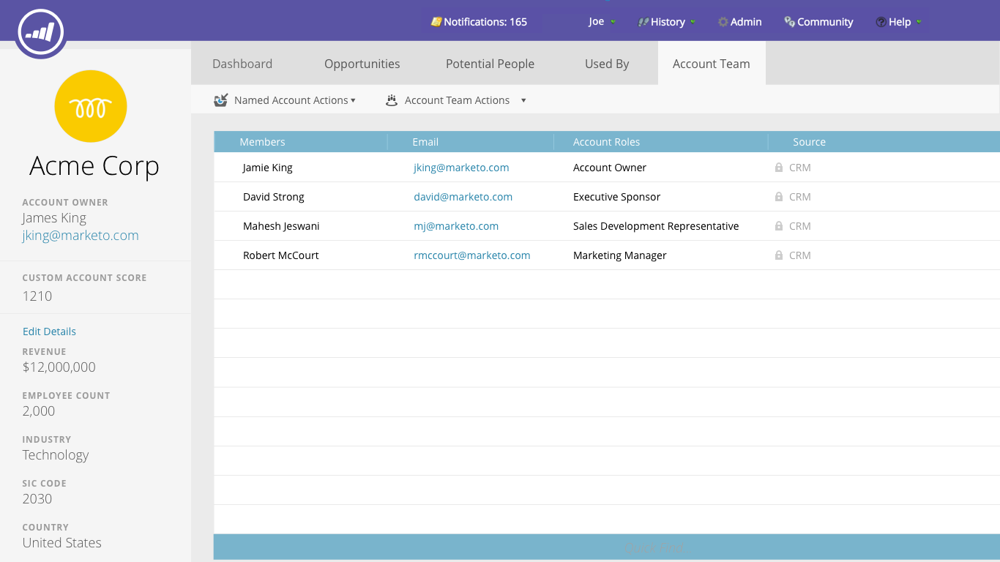
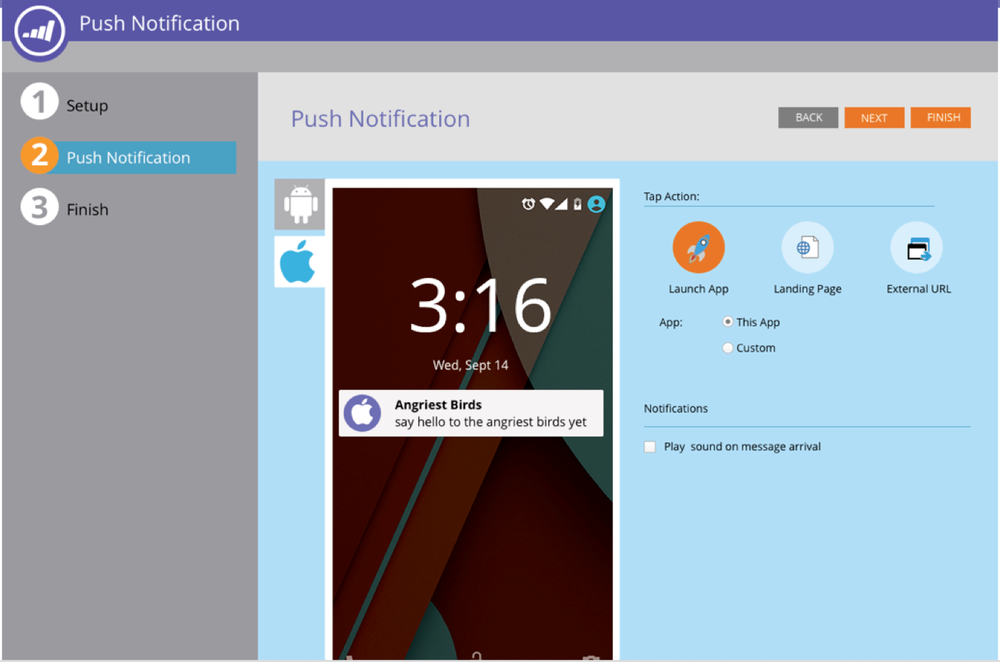

# 发行说明：’16年秋季 {#release-notes-fall}

’16年秋季版本中包含以下功能。 查看您的Marketo版本以了解功能的可用性。 请单击标题链接以查看每项功能的详细文章。

## 电子邮件中的预测内容 {#predictive-content-in-email}

我们的预测内容应用程序提供了新的用户体验，可通过我们的机器学习和预测算法在Web和电子邮件渠道中跟踪、管理和推荐您的内容。

>[!NOTE]
>
>所有具有预测模块的客户将在1月10日之前启用。

您现在可以向电子邮件添加预测内容。 打开电子邮件后，收件人会自动接收相关的推荐内容，这有助于提高内容参与度和转化率。

## [Facebook离线转化](/help/marketo/product-docs/demand-generation/facebook/understanding-facebook-offline-conversions.md) {#facebook-offline-conversions}

通过Facebook离线转化集成，Marketo中的转化数据（针对潜在客户）会自动发送回Facebook，以便您的广告团队能够更好地优化其广告支出。 在此Facebook Ad Manager报表中，离线转化会高亮显示。

## [通用ID](/help/marketo/product-docs/administration/settings/using-a-universal-id-for-subscription-login.md) {#universal-id}

通用ID允许您通过一次登录访问多个Marketo订阅，并快速在订阅之间切换。 您可以在所有订阅中使用单个社区配置文件。

>[!NOTE]
>
>请联系Marketo支持以启用此功能。

## Marketo基于帐户的营销增强功能 {#marketo-account-based-marketing-enhancements}

现在，您可以在“基于帐户的营销(ABM)”中为指定帐户分配帐户团队，例如，帐户所有者、销售开发代表、业务开发代表和客户经理。 您还可以构建特定于帐户所有者的帐户列表，并向帐户团队发送个性化的每周ABM报告。

**REST API**

此版本还允许您使用Marketo REST API在ABM中管理命名的帐户属性和帐户得分。 有关API操作的更多详细信息，请访问 [Marketo开发人员网站](https://developers.marketo.com/rest-api/lead-database/named-accounts).

## [审核记录增强功能](/help/marketo/product-docs/administration/audit-trail/change-details-in-audit-trail.md) {#audit-trail-enhancements}

审核跟踪提供了在Marketo订阅中所做更改的完整历史记录。 我们为项目添加了额外的跟踪功能，并显示了智能营销活动、智能列表以及对用户和角色所做的更改的重要更改详细信息。

## [新权限](/help/marketo/product-docs/administration/users-and-roles/descriptions-of-role-permissions.md) {#new-permissions}

**使电子邮件可运行**

您不得不担心用户向数据库中已取消订阅的用户发送事务电子邮件的日子已一去不返。 您现在可以指定哪些用户可以使电子邮件正常运行或编辑操作电子邮件。

**编辑营销活动限制**

为何设置 [活动限制](/help/marketo/product-docs/administration/email-setup/enable-person-restrictions-for-smart-campaigns.md) 如果你不能强制执行？ 当您设置促销活动限制设置以限制数据库中可以与单个促销活动进行定位的人员数量时，您现在可以限制哪些用户在计划促销活动时可以覆盖这些设置。

## [移动推送通知声音](/help/marketo/product-docs/mobile-marketing/push-notifications/configure-mobile-push-notification.md) {#sound-for-mobile-push-notifications}

通过启用声音功能，为iOS推送通知提供更丰富的内容。 这项新功能允许您在移动设备上显示推送通知时触发提示音。

>[!NOTE]
>
>* 设备所有者可以选择在设备设置中阻止播放声音，应用程序开发人员可以在应用程序中为设备所有者提供阻止播放声音的选项。
>* 在Android设备上显示推送通知时，将自动播放声音。

## [与Salesforce加密兼容的Sales Insight](/help/marketo/product-docs/marketo-sales-insight/msi-for-salesforce/installation/install-marketo-sales-insight-package-in-salesforce-appexchange.md) {#sales-insight-compatible-with-salesforce-encryption}

Market Sales Insight现在与Salesforce Shield Encryption兼容。 所有Sales Insight客户都应升级到此最新的托管包（版本1.4359.2），该包为 [可在Appexchange上获取](https://appexchange.salesforce.com/listingDetail?listingId=a0N30000001SVZmEAO).

## [指定帐户API](https://developers.marketo.com/rest-api/lead-database/named-accounts/) {#named-accounts-apis}

在此版本中，Marketo ABM用户可以通过指定帐户API管理指定帐户。 用户可以创建、更新和删除指定帐户，以及读取和更新ABM指定帐户分数。

## [电子邮件编辑器v2.0 API支持](https://developers.marketo.com/rest-api/assets/emails/) {#email-editor-v-api-support}

使用Marketo REST API以v2.0格式管理电子邮件的变量和模块。

## [对Marketo Salesforce同步的更改](https://nation.marketo.com/docs/DOC-3840) {#changes-to-marketo-salesforce-sync}

Marketo的Salesforce集成正在不断发展，以改进Marketo字段与Salesforce同步的方式。 现在，您无需同步可能或可能不需要的大量字段，而是可以选择要包含的字段。 有关更多信息，请参阅此处的文档： [https://nation.marketo.com/docs/DOC-3840](https://nation.marketo.com/docs/DOC-3840).
