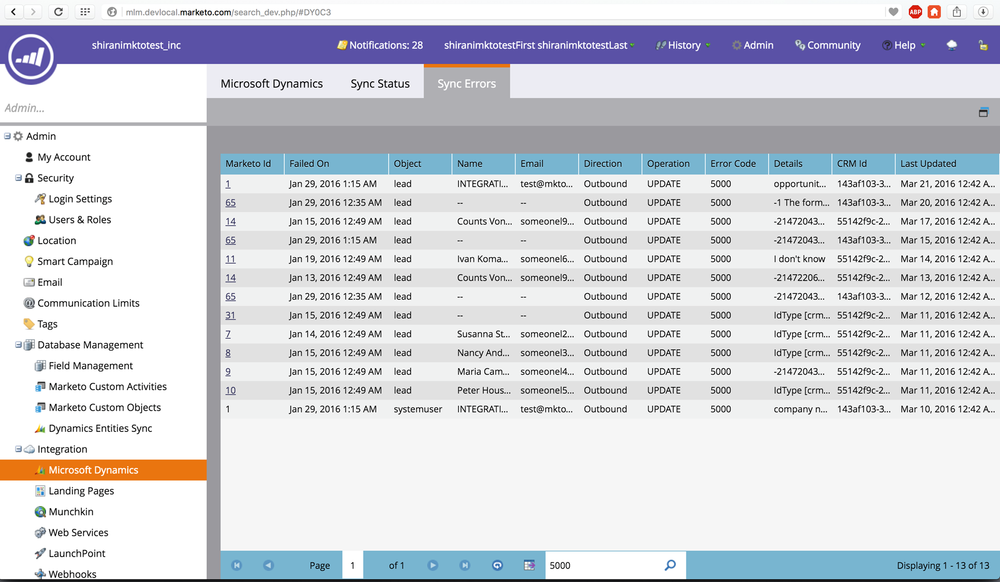

# 发行说明： 2016年春季 {#release-notes-spring}

2016年春季版中包括以下功能。 请单击标题链接以查看每个功能的详细文章。

## [电子邮件分析](/help/marketo/product-docs/reporting/email-insights/email-insights-overview.md) {#email-insights}

Email Insights是一种全新的历史聚合数据电子邮件分析体验 — 作为Project Orion的一部分，重新设计了端到端体验，以实现闪电般的快速性能。 它采用全新的用户界面设计，经优化后可满足电子邮件营销人员的需求和工作流程。

>[!NOTE]
>
>我们将从6月3日开始分批向客户启动电子邮件分析。 我们的目标是在未来几个月内完成此操作。 启用后，我们将通过电子邮件通知您。

## [电子邮件模板选取器](/help/marketo/product-docs/email-marketing/general/email-editor-2/email-template-picker-overview.md) {#email-template-picker}

使用我们的新入门模板创建漂亮的电子邮件！ 此外，还可以从实时缩略图快速找到您的模板。

>[!NOTE]
>
>从6月3日开始，电子邮件编辑器2.0（带模板选取器）将逐步推出。 我们将在6月30日之前完成推出。 与电子邮件分析不同，当您具有访问权限时，您不会收到通知。 要查看您是否这样做，请按照中的步骤操作 [本文](/help/marketo/product-docs/email-marketing/general/email-editor-2/transitioning-to-email-editor-2-0.md).

## [电子邮件编辑 — 重新想像](/help/marketo/product-docs/email-marketing/general/email-editor-2/email-editor-v2-0-overview.md) {#email-editing-re-imagined}

没错，全新的电子邮件编辑器！ 使用轻量级的拖放功能来添加和重新排序内容。 新元素（包括图像、视频、变量和模块）肯定会增强您的编辑体验。 此外，还可以查看更新的代码编辑器、预览器和预览器支持。

## [移动应用程序内消息](/help/marketo/product-docs/mobile-marketing/in-app-messages/understanding-in-app-messages.md) {#mobile-in-app-messages}

直接在Marketo中为您的应用程序创建令人惊叹的应用程序内消息。 确切定义应该看到该页面的用户以及使用应用程序内消息程序查看该页面的时间。 通过程序仪表板轻松监控其性能。

## [无草稿代码片段](/help/marketo/product-docs/administration/users-and-roles/enable-no-draft-for-snippets.md) {#no-draft-snippets}

每次更新代码片段时必须重新批准所有内容的日子已经一去不复返了！ 通过无草稿，所有使用代码片段的电子邮件和登陆页面都将获得代码片段更新并保持其先前状态。 每次批准代码片段时，您都可以选择运行无草稿并更新所有内容，或者创建草稿。 由你来决定！ 无草稿对所有客户可用，并由“管理员”中的新权限控制。

## [登陆页面、登陆页面模板和表单API](https://developers.marketo.com/blog/spring-2016-updates/) {#landing-page-landing-page-template-and-form-apis}

Marketo REST API现在支持控制Marketo登陆页面、登陆页面模板和表单。 用户现在可以通过Marketo REST API直接创建、更新内容、批准和删除这些资源。

## [用于API访问的IP列入允许列表](/help/marketo/product-docs/administration/additional-integrations/create-an-allowlist-for-ip-based-api-access.md) {#ip-allowlisting-for-api-access}

与Marketo用户登录的IP 列入允许列表功能类似，Marketo管理员现在可以设置IP地址允许列表，以访问Marketo SOAP和REST API，从而阻止从非授权IP地址访问。 这为您的Marketo实例提供了一个额外的安全层，并确保只能从贵组织的网络内部进行API访问。 有关如何进行此设置的详细信息，请参阅 [Marketo文档网站](/help/marketo/product-docs/administration/additional-integrations/create-an-allowlist-for-ip-based-api-access.md).

## [新的高速Microsoft Dynamics同步连接器](/help/marketo/product-docs/crm-sync/microsoft-dynamics-sync/microsoft-dynamics-sync-details/sync-status.md) {#new-high-speed-microsoft-dynamics-sync-connector}

全新的高速动态连接器构建在Orion体系结构之上，初始同步速度提高20倍，增量同步速度提高5倍。 所有新客户都将在发布日期加入此连接器，我们将在夏季的发布时间范围内逐步向现有客户推出它。

**刷新新字段的数据**：现在，您可以随时启用新同步字段，此字段的所有数据值都将从Dynamics CRM刷新到Marketo中。 不必再担心在初始设置期间必须选择所有字段。 如果禁用现有同步字段并稍后重新启用它，则该字段的所有数据值都将从Dynamics CRM刷新到Marketo中。

**将潜在客户同步为联系人**：将Lead同步到Microsoft流程操作新增了一个选项，可用于作为潜在客户或联系人进行同步。

**“同步错误”管理选项卡**：浏览、搜索或导出未能与操作、方向、错误代码和错误消息等详细信息同步的潜在客户（和其他对象）。

**Microsoft Dynamics 2016**：连接器已针对Dynamics 2016在线和内部部署版本获得完全认证。

**现在记录了插件更新：** 请参阅 [插件更新文档文章](/help/marketo/product-docs/crm-sync/microsoft-dynamics-sync/marketo-plugin-releases-for-microsoft-dynamics.md).

## [友好实例名称](/help/marketo/product-docs/administration/settings/edit-subscription-settings.md) {#friendly-instance-name}

如今，很难区分Marketo实例，例如沙盒实例和生产实例。 此功能可让您知道当前正在处理哪些实例。

## [订阅的有限时间访问](/help/marketo/product-docs/administration/users-and-roles/managing-marketo-users.md) {#limited-time-access-for-subscriptions}

现在，用户会被无限期地邀请加入Marketo订阅。 借助此功能，管理员可以在有限的时间内邀请用户进行订阅，例如2周或1个月。

## [自定义对象网格](/help/marketo/product-docs/administration/marketo-custom-objects/understanding-marketo-custom-objects.md) {#custom-objects-grid}

现在，您可以查看所有已发布的自定义对象的记录数和字段数。

## 自定义活动 {#custom-activities}

Marketo管理员现在可以通过Marketo自定义活动定义建模器定义和管理其自定义活动类型。 与（并结合）Marketo自定义对象建模器类似，管理员现在可以扩展数据模型以满足其确切的业务需求。 有关如何使用此功能的详细信息，请参阅 [Marketo文档网站](/help/marketo/product-docs/administration/marketo-custom-activities/understanding-custom-activities.md).
