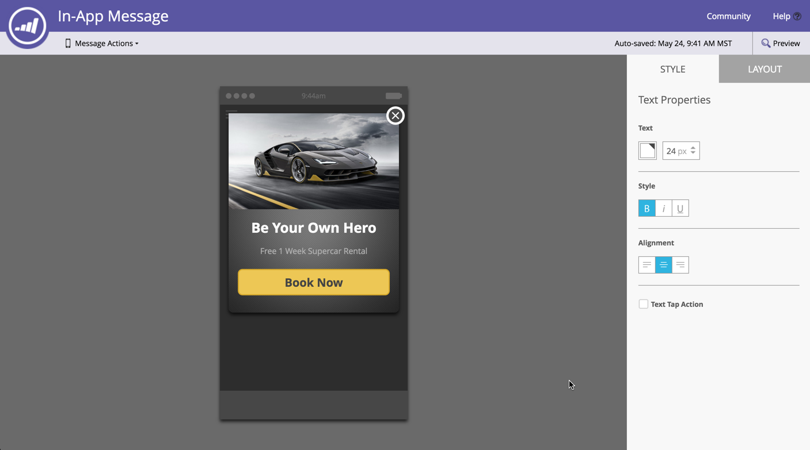

# 发行说明：’16年春 {#release-notes-spring}

’16年春季版本中包含以下功能。 请单击标题链接以查看每项功能的详细文章。

## [电子邮件分析](/help/marketo/product-docs/reporting/email-insights/email-insights-overview.md) {#email-insights}

电子邮件分析是一种全新的历史聚合数据电子邮件分析体验 — 作为Project Orion的一部分，经过了重新设计的端到端性能，实现了闪电般的快速性能。 它提供了全新的用户界面设计，经过优化，可满足电子邮件营销人员的需求和工作流程。

>[!NOTE]
>
>我们将从6月3日开始，分批向客户发布电子邮件分析。 我们的目标是在未来几个月内完成此操作。 启用后，我们会通过电子邮件通知您。

## [电子邮件模板选取器](/help/marketo/product-docs/email-marketing/general/email-editor-2/email-template-picker-overview.md) {#email-template-picker}

使用我们的新入门模板创建漂亮的电子邮件！ 此外，还可以从模板的实时缩略图中快速找到模板。

>[!NOTE]
>
>从6月3日开始，将逐步推出电子邮件编辑器2.0（包含模板选取器）。 我们将在6月30日之前完成推出。 与电子邮件分析不同，当您拥有访问权限时，系统不会向您发送通知。 要查看是否需要，请按照 [本文](/help/marketo/product-docs/email-marketing/general/email-editor-2/transitioning-to-email-editor-2-0.md).

## [电子邮件编辑 — 思路重新调整](/help/marketo/product-docs/email-marketing/general/email-editor-2/email-editor-v2-0-overview.md) {#email-editing-re-imagined}

没错，一个全新的电子邮件编辑！ 使用轻量级的拖放功能添加和重新排序内容。 新元素（包括图像、视频、变量和模块）必将增强您的编辑体验。 此外，还可了解更新的代码编辑器、预览器和标头支持。

## [移动设备应用程序内消息](/help/marketo/product-docs/mobile-marketing/in-app-messages/understanding-in-app-messages.md) {#mobile-in-app-messages}

直接在Marketo中为您的应用程序创建令人惊叹的应用程序内消息。 确切地定义应该由谁查看，以及何时使用应用程序内消息程序查看。 使用程序仪表板轻松监控其性能。

## [无草稿片段](/help/marketo/product-docs/administration/users-and-roles/managing-user-roles-and-permissions/enable-no-draft-for-snippets.md) {#no-draft-snippets}

每次更新代码片段时，您必须重新批准所有内容的日子都已过去！ 对于非草稿，所有使用代码片段的电子邮件和登陆页面都将获取代码片段更新并保持其以前的状态。 每次批准代码片段时，您都可以选择运行“无草稿”并更新所有内容，或创建草稿。 取决于你！ “无草稿”将可供所有客户使用，并由“管理员”中的新权限控制。

## [登陆页面、登陆页面模板和表单API](https://developers.marketo.com/blog/spring-2016-updates/) {#landing-page-landing-page-template-and-form-apis}

Marketo REST API现在支持对Marketo登陆页面、登陆页面模板和表单的控制。 用户现在可以直接通过Marketo REST API创建、更新内容、批准和删除这些资产。

## [IP列入允许列表以访问API](/help/marketo/product-docs/administration/additional-integrations/create-an-allowlist-for-ip-based-api-access.md) {#ip-allowlisting-for-api-access}

与用于Marketo用列入允许列表户登录的IP功能类似，Marketo管理员现在可以允许列表设置一个IP地址，以访问Marketo SOAP和REST API，从而阻止从未授权的IP地址访问。 这为Marketo实例增加了一层安全性，并确保API访问只能从贵组织的网络中进行。 有关如何设置此设置的详细信息，请参阅 [Marketo文档网站](/help/marketo/product-docs/administration/additional-integrations/create-an-allowlist-for-ip-based-api-access.md).

## [新型高速Microsoft Dynamics同步连接器](/help/marketo/product-docs/crm-sync/microsoft-dynamics-sync/microsoft-dynamics-sync-details/sync-status.md) {#new-high-speed-microsoft-dynamics-sync-connector}

新的高速动态连接器以Orion架构为基础，在初始同步方面速度提高了20倍，在增量同步方面速度提高了5倍。 所有新客户都将在发行日期载入此连接器，并且我们将在夏季发行时间范围内逐步向现有客户推出此连接器。

**刷新新字段的数据**:现在，您可以在任何时间点启用新的同步字段，该字段的所有数据值都将从Dynamics CRM刷新到Marketo。 无需再担心在初始设置期间必须选择所有字段。 如果禁用现有同步字段并稍后重新启用该字段，则该字段的所有数据值都将从Dynamics CRM刷新到Marketo。

**将潜在客户同步为联系人**:“将潜在客户同步到Microsoft”流程操作新增了一个选项，可作为潜在客户或联系人进行同步。

**“同步错误管理”选项卡**:浏览、搜索或导出无法与操作、方向、错误代码和错误消息等详细信息同步的潜在客户（和其他对象）。

**Microsoft Dynamics 2016**:Connector已获得Dynamics 2016在线版和内部部署版的完全认证。

**插件更新现已记录在案：** 请参阅 [插件更新文档文章](/help/marketo/product-docs/crm-sync/microsoft-dynamics-sync/marketo-plugin-releases-for-microsoft-dynamics.md).

## [友好实例名称](/help/marketo/product-docs/administration/settings/edit-subscription-settings.md) {#friendly-instance-name}

现在，很难区分Marketo实例，例如沙盒实例和生产实例。 此功能可让您了解当前正在处理的实例。

## [订阅的有限时间访问](/help/marketo/product-docs/administration/users-and-roles/managing-marketo-users.md) {#limited-time-access-for-subscriptions}

今天，用户将被邀请无限期地加入Marketo订阅。 此功能允许管理员在有限的时间段内（例如，2周或1个月）邀请用户订阅。

## [自定义对象网格](/help/marketo/product-docs/administration/marketo-custom-objects/understanding-marketo-custom-objects.md) {#custom-objects-grid}

现在，您可以查看所有已发布自定义对象的记录和字段数。

## 自定义活动 {#custom-activities}

Marketo管理员现在可以通过Marketo自定义活动定义建模器定义和管理其自定义活动类型。 与Marketo自定义对象建模器类似（以及与之一起），管理员现在可以扩展数据模型以满足其确切的业务需求。 有关如何使用此功能的详细信息，请访问 [Marketo文档网站](/help/marketo/product-docs/administration/marketo-custom-activities/understanding-custom-activities.md).
