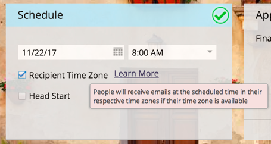

# 发行说明： 2017年秋季 {#release-notes-fall}

2017年秋季版本包括以下功能。 检查您的Marketo版本以了解功能可用性。

请单击标题链接以查看每个功能的详细文章。 注意：此版本中包含的某些功能没有关联的文章。 如果一个主题有多个子标题，则链接会放置在该处。

## 系统可靠性 {#system-reliability}

我们进一步改进了Marketo的核心基础架构，包括优化排序、减少不匹配和提高Munchkin稳定性。

## SFDC同步性能 {#sfdc-sync-performance}

利用Marketo和Salesforce之间更丰富、更快的同步。 需要批量更新帐户或潜在客户的数据更改可以拆分为并行队列以避免积压。 事件和任务的同步速度也加快了50%。

## Analytics性能改进 {#analytics-performance-improvements}

最近的基础架构改进在Marketo报告和分析工具中增加了正常运行时间和稳定性，使您能够更快地构建临时报告。

## [收件人时区](/help/marketo/product-docs/email-marketing/email-programs/email-program-actions/scheduling-with-recipient-time-zone/understanding-recipient-time-zone.md) {#recipient-time-zone}

借助此新功能，您现在可以根据本地时区保留和投放电子邮件。 可以将电子邮件和参与程序配置为在收件人的时区中发送，从而无需创建多个程序 — 只发送一次，Marketo会自动保留电子邮件，直到到达正确的本地时间。 提升电子邮件指标，观察本地实践，并在全局范围内使用单个项目来节省时间。

>[!NOTE]
>
>如果您还无法在电子邮件和参与程序上启用收件人时区，请不要惊慌！ 我们正在逐步向所有客户启用此功能。

## [按区段查看示例电子邮件](/help/marketo/product-docs/email-marketing/general/creating-an-email/send-a-sample-email.md) {#review-sample-emails-by-segment}

在发送示例电子邮件以供审阅时，Marketo新增了一个用于选取区段的选项。 您不再需要手动确定商机属于哪个区段，从而更轻松地向不同区段发送包含动态内容的电子邮件。

## [linkedIn领导小组自定义问题](/help/marketo/product-docs/demand-generation/social/social-functions/set-up-linkedin-lead-gen-forms.md) {#linkedin-lead-gen-custom-questions}

自定义您的LinkedIn潜在客户群表单，以收集自定义潜在客户属性。 现在，您最多可以为每个表单询问三个自定义问题，从单行文本输入或多选问题中进行选择，然后映射回Marketo潜在客户字段。

## Slack集成 {#slack-integration}

作为新Slack集成的一部分，我们发布了两项功能：

* 系统通知：获取有关Marketo实例中重要事件的Slack通知，例如有关当前营销活动状态的警报以及任何需要立即关注的问题。
* 有趣的时刻：当某个销售帐户中的已知个人触发了Marketo Insight时，可以通过Slack通知潜在所有者。 通知包括潜在客户信息以及有关销售帐户的详细信息。

## ABM增强功能 {#abm-enhancements}

**[显示没有联系人的帐户](https://docs.marketo.com/x/fKCt)**

Marketo ABM现在同步并显示没有联系人的CRM帐户。 包括以前没有销售或营销历史的新帐户，并通过将后续销售线索与帐户匹配来跟踪进度。

## ContentAI分析 {#contentai-analytics}

**[新建ABM帐户列表筛选器](https://docs.marketo.com/x/1BPG)**

查看和比较ABM帐户列表中的内容性能，以优化现有内容。 ContentAI向您显示：

* 查看的排名最前的内容
* 排名最前的转化内容
* AI支持的营销活动建议内容

## Web个性化增强功能 {#web-personalization-enhancements}

**[Web营销活动令牌](/help/marketo/product-docs/web-personalization/working-with-web-campaigns/using-the-web-personalization-rich-text-editor.md)**

令牌现在可在Web营销活动中使用。 利用令牌提供个性化的消息和内容，以提高Web促销活动的参与度。

**[在Web Campaign编辑器中设计Studio图像](/help/marketo/product-docs/web-personalization/working-with-web-campaigns/using-the-web-personalization-rich-text-editor.md)**

通过在Marketo中跨多个渠道重复使用创意资源和图像，节省时间。

## 集成  {#integration}

**[电子邮件预览API](https://developers.marketo.com/rest-api/assets/emails/)**

现在，您可以在Marketo之外远程预览电子邮件，从而简化电子邮件内容本地化的过程并减少错误。

**[替换HTMLAPI](https://developers.marketo.com/rest-api/assets/emails/)**

开发人员可以远程更新电子邮件资源的HTML内容，使他们能够在单个系统中维护资源。
