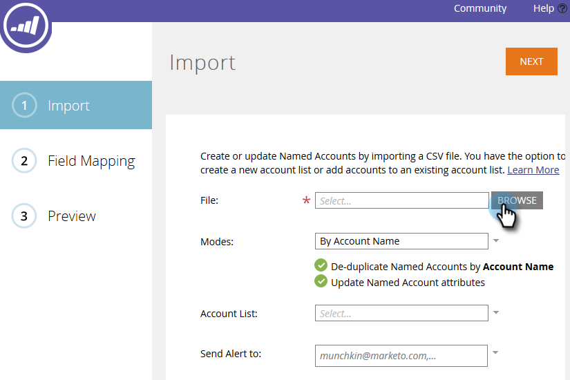

# 发行说明： 2017年冬季 {#release-notes-winter}

’17年冬季版本包括以下功能。 检查您的Marketo版本以了解功能可用性。

请单击标题链接以查看每个功能的详细文章。

>[!NOTE]
>
>如果一个主题有多个子标题，则链接会放置在该处。

## [Facebook自定义受众的高级匹配](/help/marketo/product-docs/demand-generation/ad-network-integrations/add-facebook-custom-audiences-as-a-launchpoint-service.md) {#advanced-matching-for-facebook-custom-audiences}

基本匹配仅使用电子邮件地址，但新的高级匹配使用额外的七个字段，从而提高匹配率以实现更多转化。

## [自定义对象导入API](https://developers.marketo.com/rest-api/lead-database/custom-objects/) {#custom-object-import-api}

此API提供了一个更快的界面，用于将自定义对象同步到Marketo中。 您可以将CSV、TSV或SSV电子表格文件作为自定义对象导入Marketo。

## [Web Personalization促销活动导出](/help/marketo/product-docs/web-personalization/working-with-web-campaigns/export-web-campaign-data.md) {#web-personalization-campaigns-export}

以CSV格式导出所有Web Campaign详细信息和分析。 然后，您便可以用方便的布局查看数据。

## 本地化 {#localization}

Web Personalization、[!UICONTROL Predictive Content]和电子邮件分析应用程序现在提供日语、德语和西班牙语版本。 您[选择语言和区域设置](/help/marketo/product-docs/administration/settings/select-your-language-locale-and-time-zone.md)以查看您在这些语言中的内容。

## 基于帐户的营销增强功能 {#account-based-marketing-enhancements}

**[导入指定帐户](/help/marketo/product-docs/target-account-management/target/named-accounts/import-named-accounts.md)**

使用[!UICONTROL Named Account]导入选项，通过CSV上传一次创建或更新多个记录。

**[电子邮件分析支持](/help/marketo/product-docs/reporting/email-insights/filtering-in-email-insights.md)**

在电子邮件分析中使用[!UICONTROL Named Account]或[!UICONTROL Account List]作为维度。

## [!UICONTROL Predictive Content]增强功能 {#predictive-content-enhancements}

**[按[!UICONTROL Enabled Source]](/help/marketo/product-docs/predictive-content/working-with-predictive-content/understanding-predictive-content.md)**&#x200B;筛选

筛选为[!UICONTROL Email]、[!UICONTROL Rich Media]或[!UICONTROL Recommendation Bar]启用的[!UICONTROL Predictive Content]部分。

**[筛选器[!UICONTROL Analytics by Source]](/help/marketo/product-docs/predictive-content/working-with-predictive-content/understanding-predictive-content.md)**

为特定源（[!UICONTROL Email]、[!UICONTROL Rich Media]或[!UICONTROL Recommendation Bar]）筛选[!UICONTROL Predictive Content]分析。

**[!UICONTROL Predictive Content]编辑器**

改进了按源（[!UICONTROL Email]、[!UICONTROL Rich Media]或[!UICONTROL Recommendation Bar]）拆分内容准备的编辑体验和布局。

**[预测的自动发现内容](/help/marketo/product-docs/predictive-content/getting-started/enable-content-discovery.md)**

图像URL和元数据现在用于内容自动发现过程。

## [SDK增强功能](https://developers.marketo.com/mobile/) {#sdk-enhancements}

现在，开发人员通过添加新的SDK API调用（允许开发人员删除推送令牌），对推送通知的投放进行了额外控制。

## Vibes SMS LaunchPoint集成

使用新的筛选器选项“Member of Vibes List”改进您的定位。

## [弃用旧版富文本编辑器和表单编辑器1.0](https://nation.marketo.com/docs/DOC-4315) {#legacy-rich-text-editor-and-form-editor-deprecation}

从2017年8月1日开始，仍在使用旧版富文本编辑器和表单编辑器1.0的客户将自动过渡到新体验。

## [Marketo活动API](https://developers.marketo.com/blog/important-change-activity-records-marketo-apis/) {#marketo-activity-apis}

Marketo的活动API即将发生重要更改。 准备好了吗？
