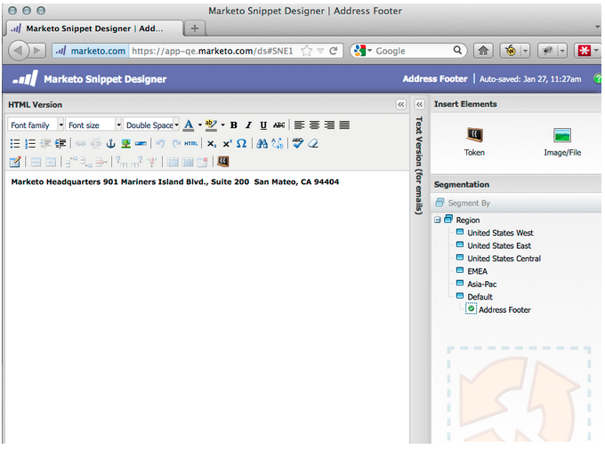
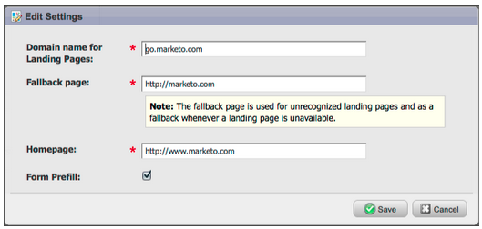
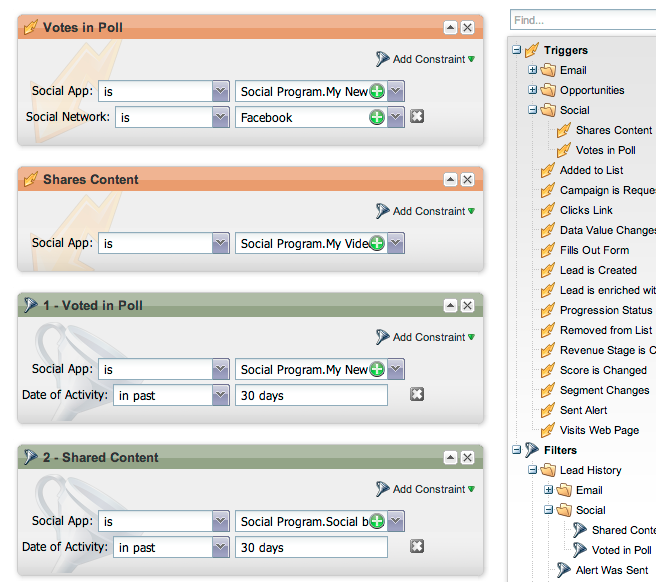

# 2012

## 2012年1/2月 {#january-february}

1月/2月版本中包含以下功能。 检查您的Marketo版本以了解功能可用性。 请在发布后返回以获取指向详细功能文档的链接。

## 高级动态内容 {#advanced-dynamic-content}

_适用于Pro和Enterprise版本_

利用高级动态内容，您可以创建与受众相关的引人入胜的电子邮件通信和登陆页面，而无需为同一消息创建多个资产。 升级后的预览器允许您在单个屏幕中查看每个唯一版本。

## 分段  {#segmentation}

_适用于Pro和Enterprise版本_

分段是一组区段，区段是面向您的营销对象的个人目标组。 区段由规则定义，这些规则由类似于智能列表的过滤条件驱动。 您的区段可以基于人口统计数据（如职务或行业），也可以基于行为（如访问的网页或单击的链接）。

## 代码段 {#snippets}

_适用于Pro和Enterprise版本_

存储丰富的内容，可重复使用它们来创建静态或动态电子邮件和登陆页面。

## PURL {#purls}

_适用于Pro和Enterprise版本_

现在，使用个性化URL (PURL)营销人员可以创建联系人特定的URL，从而在多点触控营销方案中推动直邮和电子邮件促销活动的个性化、可测量性和提升响应。

## 欧盟隐私指令支持 {#eu-privacy-directive-support}

尊重浏览器“不跟踪”设置的新功能包括禁用匿名潜在客户跟踪的功能；这使得遵守欧盟更严格的隐私跟踪法规更加容易。

## 单点登录 {#single-sign-on}

现在，组织能够支持使用SAML 2.0从公司门户进行单点登录来无缝登录Marketo应用程序。

## 更新了电子邮件和登陆页面编辑器 {#updated-email-and-landing-page-editors}

电子邮件和登陆页面编辑器经过重新设计，具有更吸引人的界面、直观的导航和显着改进的用户体验，其中包括：

并排的HTML和文本视图

编辑器中将显示发件人姓名、发件人电子邮件、回复（新）和主题。 可通过“编辑设置”按钮访问所有其他设置。

## 浏览器支持 {#browser-support}

* [!DNL Mozilla Firefox] 9.0
* [!DNL Google Chrome] 16
* [!DNL Microsoft Internet Explorer] 8 &amp; 9
* **注意**：我们不再支持[!DNL Internet Explorer] 7

## 项目管理 {#program-management}

简化的程序管理通过令牌删除提高了可用性，并更容易删除程序。

## 取消订阅订阅报告 {#unsubscribe-from-subscription-report}

现在，您可以直接从报表取消订阅该订阅！

## Munchkin更新 {#munchkin-updates}

新的Munchkin调用可减少网页加载时间，并为点击链接事件提供更一致的性能。

## 计划机会分析（仅限RCA） {#program-opportunity-analysis-rca-only}

了解营销对单个机会收入的贡献

## 项目收入阶段分析 {#program-revenue-stage-analysis}

通过了解哪些程序获得了快速推进器，使insight提升到程序领先速度

## 2012年3 {#march}

## 解析我的令牌 {#resolve-my-tokens}

我的令牌（项目令牌）将在预览电子邮件、发送测试电子邮件以及通过单个流量操作发送本地电子邮件时解析。 您不再需要在该程序中创建智能营销活动来测试您的“我的令牌”！

## 在电子邮件和登陆页面中的预览器和编辑器之间切换 {#toggle-between-previewer-and-editor-in-emails-and-landing-pages}

只需单击一下，即可轻松地在编辑器和预览器之间来回切换。

编辑者到预览者：

预览器到编辑器：

## 代码片段预览器 {#snippet-previewer}

从菜单中选择“预览代码片段”可查看代码片段，而不会将其变为草稿。 此外，如果您对共享代码片段具有只读访问权限（通过工作区），则可以通过此操作查看代码片段。

## 发送多封测试电子邮件 {#send-multiple-test-emails}

随着动态内容的添加，预览和测试可能发送给潜在客户的所有电子邮件变体变得越来越重要。 使用“按销售线索查看详细信息”进行预览时，您可以选择从销售线索列表中发送变体测试（最多100封测试电子邮件）。

## 基于URL参数的动态登陆页面 {#dynamic-landing-pages-based-on-url-parameter}

匿名潜在客户在登陆页面访问中占很大比例。 再加上动态内容以及将分段作为参数放置到URL中的功能，您可以在匿名或已知潜在客户单击链接时动态显示登陆页面内容。

## 2012年4 {#april}

## 分段过滤器和触发器 {#segmentation-filters-and-triggers}

您是否始终针对同一组潜在客户？ 如果是这样的话，请在智能列表中使用分段来定位潜在客户。 通过分段，您的整个潜在客户数据库始终是分段的，并且可以在程序间重复使用，以确保一致性。 分段结果会快速提取，因为它们不需要在请求时运行智能列表。

## 通过扩展的API功能将外部值插入电子邮件内容和其他流程步骤 {#insert-external-values-into-email-content-and-other-flow-steps-through-expanded-api-capabilities}

* 现在，您可以使用请求营销活动API为运行特定营销活动的“我的令牌”发送值，这对于通过API填充电子邮件内容尤为有用
* 新增的“上传至”列表和“计划Campaign API”功能，支持以上销售线索列表和批量促销活动。

## 更简单的[!DNL GoToWebinar]和[!DNL WebEx]确认电子邮件（Adobe Connect和[!DNL ON24]即将推出！） {#easier-confirmation-emails-for-gotowebinar-and-webex-adobe-connect-and-on-coming-soon}

我们通过创建一个显示每个商机的唯一注册确认URL的成员令牌简化了确认URL。 您将不再需要使用不同的令牌创建此URL。 这当前可供[!DNL GoToWebinar]和[!DNL WebEx]客户使用，并将在我们的下一个版本中可供Adobe Connect和[!DNL ON24]使用。

## 只需单击一下即可上传多个图像和文件！ {#upload-multiple-images-and-files-with-a-single-click}

将图像和文件导入Marketo时，可节省时间并提高效率！ 如果您使用[!DNL Firefox]或[!DNL Google Chrome]，则可以多选文件并一次上载所有文件。 尽管您可以上传的文件数没有限制，但每个文件的单个大小限制为50 MB。

注意：由于浏览器的限制，[!DNL Internet Explorer]目前不支持此功能。

## 在电子邮件中移动文本 {#move-text-in-an-email}

您可以对电子邮件中的文本块重新排序。 在文本编辑器中，选择一个文本块；在单击编辑图标时，您将看到用于上下移动块的选项。

## 为非[!DNL Salesforce]用户删除了[!DNL Salesforce]个引用 {#salesforce-references-removed-for-non-salesforce-users}

如果您没有将订阅与[!DNL Salesforce]同步，您将会注意到所有引用[!DNL Salesforce]的文件夹和流操作都已删除。

## Marketo Revenue Cycle Analytics {#marketo-revenue-cycle-analytics}

收入周期Modeler中的&#x200B;**增强关口阶段**

允许用户定义其过渡规则的顺序。

## 2012年5 {#may}

## 电子邮件性能报表重新设计 {#email-performance-report-redesign}

注意：这将从5月版本开始分阶段推出

我们使电子邮件性能和营销活动电子邮件性能报表运行得更快。 我们还改进了某些量度的定义，并将“发送的邮件数”和“发送的潜在客户数”量度整合为单个量度“已发送”。 我们已将“Messages Delivered”和“Lead Delivered”合并为“Delivered”。

## 等待步骤增强功能 {#wait-step-enhancements}

使用新的高级等待属性，您可以将Smart Campaign流量操作中的等待步骤配置为“等待”一周中的特定日期、下一工作日、特定日期或时间。 这些增强功能可确保您的培养电子邮件在工作时间到达收件箱！

图 1. 指定要在工作日结束的等待步骤

## 已存档Assets隐藏 {#archived-assets-hidden}

存档的资产会自动从自动建议、下拉列表和报告中进行过滤，以便更轻松地找到您要查找的内容！

图 2. 已存档电子邮件过滤器的示例

## 适用于iPad的新事件签入应用程序 {#new-event-check-in-app-for-ipad}

使用我们新的iPad应用程序简化您的事件登记流程！ 事件签入应用程序可与您的Marketo程序同步，并允许您轻松地将注册者签入事件中，以及动态添加新潜在客户。

需要iOS 5.1或更高版本；仅限iPad。

图 3. “事件检入”主页

图 4. 事件签入：选择您的事件！

图 5. 签入

## 增强型网络研讨会确认URL {#enhanced-webinar-confirmation-url}

现在可用于[!DNL ON24]和Adobe Connect！ 在使用新`{{member.webinar URL}}`令牌的每个已注册与会者的确认电子邮件中包含唯一链接。 Adobe Connect增强功能还包括打开/关闭Adobe帐户信息电子邮件（其中包含用户的登录ID和密码）的功能。

图 6. 让用户参加您的网络研讨会

## 模板预览 {#template-preview}

在构建电子邮件或登陆页面时查找特定模板，但不确定它是什么样的？ 利用新的模板预览功能，您可以在保存新资源之前验证选定的模板！

图 7. 预览您选择的模板

## 可配置表单预填充 {#configurable-form-prefill}

在订阅级别控制表单数据的预填充，并在登陆页面级别进行覆盖。 如果不进行预填充，您可以确保商机提供最新的信息。

图 8. Admin中的表单预填充配置

图 9. 编辑登陆页面上的表单预填充设置

## Marketo宝箱 {#marketo-treasure-chest}

获取对Marketo工程师开发的实验功能的访问权限，以增强您的用户体验。 此版本包括“电子邮件撤消”，以及输入评论和在登陆页面上与其他用户协作的能力。

\

图 10. Admin中的Manager Treasure Chest功能

## [!DNL Microsoft Dynamics]® CRM集成 {#microsoft-dynamics-crm-integration}

使用我们新的预建集成，在Marketo和[!DNL Microsoft Dynamics] CRM Online之间同步帐户、联系人和潜在客户！

图 11. [!DNL Microsoft Dynamics]配置

## Marketo [!DNL Sales Insight]增强功能 {#marketo-sales-insight-enhancements}

**取消订阅页脚选项**

为通过[!DNL Sales Insight]发送的电子邮件配置何时显示取消订阅页脚，以及是否显示取消订阅页脚。

图12. [!DNL Sales Insight] Admin中的设置

## 销售电子邮件模板文件夹 {#folders-for-sales-email-templates}

您现在可以将与Marketo [!DNL Sales Insight]共享的电子邮件模板整理到指定的文件夹中，使销售代表更容易找到正确的电子邮件。

图 13. 为您的电子邮件选择一个文件夹

## 从[!DNL Sales Insight]访问机会分析器 {#access-opportunity-analyzer-from-sales-insight}

通过从Marketo [!DNL Sales Insight]直接访问Opportunity Analyzer ，为销售代表提供营销活动推动参与的insight 。 注意。 需要Revenue Cycle Analytics许可证。

## 联系人状态的自定义字段 {#custom-field-for-contact-status}

您现在可以在[!DNL Salesforce]中映射自定义字段以在“我的首选”、“我的团队的最佳选”和自定义视图中填充“联系人”的“状态”字段。

图 14. 将自定义字段映射到联系人

查看匿名潜在客户访问的页面

从[!UICONTROL Anonymous Web Activity]视图向下钻取到匿名潜在客户查看的页面。

图 15. 请参阅匿名Web活动

## Enhanced Lead and Contact订阅 {#enhanced-lead-and-contact-subscribe}

使用记录详细信息页面上的新Subscribe按钮，随时跟踪潜在客户或联系人。

## 2012年6 {#june}

## Marketo商机管理增强功能 {#marketo-lead-management-enhancements}

### 重命名 {#rename}

您可以重命名智能列表、静态列表和营销活动。 如果您在过滤器、触发器或流中使用这些资源，则名称也会自动更新。 您始终能够重命名电子邮件、表单和文件夹。

另外，我们还改进了对资产描述文本的输入和查看功能，这是一项额外举措。

## 导入字段映射 {#import-field-mapping}

我们简化了将列表导入Marketo的过程！ 在导入过程中，您可以将Marketo字段的名称映射到导入文件中的列标题名称。 此外，在[!UICONTROL Admin]中，您可以设置映射到Marketo中的字段名称的别名，确保用户每次都选择正确的字段。

在继续导入和映射字段时，为方便使用，Marketo将在导入期间记住和显示映射。 为了使工作更轻松，您可以单击示例值标题以查看将填充该字段的不同值。 这有助于确保每次都映射正确的字段！

## 智能列表和静态列表的[!UICONTROL Summary]页面 {#summary-page-for-smart-lists-and-static-lists}

您是否曾想过您的列表在哪里被使用？ 或者是谁创建了列表，还是最后修改了列表？ 智能列表和静态列表中提供的新摘要页面将为您提供这些重要的详细信息。

在现有的项目和营销策划摘要页面上，我们还添加了“创建日期/用户”和“上次修改日期/用户”信息！

## Assets的[!UICONTROL Used By] {#used-by-for-assets}

我们在资产[!UICONTROL Summary]页面中添加了一个名为[!UICONTROL Used By]的新选项卡！

示例： [!UICONTROL Used By]表示静态列表

## 登陆页网格线 {#landing-page-gridlines}

添加登陆页面网格线可让您更轻松地对齐登陆页面上的文本、图形和表单。 打开和关闭任何给定登陆页面的导航栏，并调整线条之间的宽度！

## 邮件中阻止的潜在客户 {#leads-blocked-from-mailings}

在计划促销活动时，您可以单击链接以查看阻止您发送邮件的潜在客户列表。

## [!UICONTROL Wait]步骤 — 潜在客户令牌和我的令牌 {#wait-step-lead-token-and-my-token}

在5月版本中，我们向[!UICONTROL Wait]流程步骤添加了高级选项。 通过这些更改，您可以指定工作日、日期和时间。 在此版本中，我们增加了在等待步骤中使用令牌的功能。 例如，您可能希望使用`{{lead.Birthday}}`在他们的生日当天发送电子邮件，或使用`{{my.Event Date}}`发送最终的网络研讨会提醒。

## 在Design Studio中将[!UICONTROL View]作为[!UICONTROL Thumbnails] {#view-as-thumbnails-in-design-studio}

将视图从图像列表切换到缩略图视图！

注意：从本版本开始，智能列表网格上的先前排序将不会应用于您查看的下一个智能列表。 例如，如果您按公司名称对智能列表进行排序，我们将不会自动对由此字段查看的下一个智能列表进行排序。

提醒：电子邮件性能报告升级正在进行中！

## Marketo收入周期Analytics增强功能 {#marketo-revenue-cycle-analytics-enhancements}

### 计划机会分析中的新指标  {#new-metrics-in-program-opportunity-analysis}

您现在可以深入了解在创建或关闭机会之前的平均营销接触次数，以及营销接触的平均值。

## 显示多图表 {#displaying-multi-charts}

多图表功能允许您在单个Revenue Cycle Explorer报表中显示多个图表。 例如，当您希望在不同月份显示相同的数据时，可以使用此功能。 此功能还可让您不必创建单独的过滤器和报告。

## 热网格图表类型  {#heat-grid-chart-type}

利用热网格，可可视化数据，以便识别营销绩效模式。 此可视化图表类型将为您的结果添加颜色代码，以便您在易于理解的可视化图表中查看复杂的业务分析。

## 散点图类型  {#scatter-chart-type}

散点图有助于在一个图形中显示多个维度的数据。 此可视化图表类型将根据使用的属性，在图形上绘制气泡。 然后，可以使用测量对气泡进行颜色编码和/或使用测量指定气泡的大小。

## 2012年9 {#september}

此版本包括备受期待的集成式社交功能和商机管理实用组件！ 注意：社交功能作为加载项或选定捆绑的一部分提供。

## 通过社交共享发布YouTube视频 {#publish-a-youtube-video-with-social-sharing}

通过在您的登陆页面上使用新的视频共享，鼓励您的访客在社交上共享视频，从而扩大视频的受众。

## 添加共享按钮 {#add-a-share-button}

完全自定义共享消息和一组新社交共享按钮的外观。 此外，在您的潜在客户共享您的内容时捕获社交个人资料数据。

## 社交登录 {#social-sign-on}

获取insight并通过允许潜在客户使用来自其社交网络的信息预填充表单来减少摩擦。

## 将登陆页面发布到[!DNL Facebook] {#publish-landing-pages-to-facebook}

通过将登陆页面直接发布到[!DNL Facebook]中来扩展这些登陆页面的访问范围，并使用社交应用程序、表单和Marketo登陆页面的完整功能。

## [!DNL ReadyTalk]事件适配器 {#readytalk-event-adapter}

将Marketo事件无缝连接到[!DNL ReadyTalk]会议。 使用Marketo表单捕获注册者并自动在[!DNL ReadyTalk]中注册他们。 双向同步允许将出勤信息填充到Marketo中。

## Microsoft [!DNL Dynamics]内部部署 {#microsoft-dynamics-on-premise}

现在，我们通过面向Internet的部署来支持Microsoft [!DNL Dynamics] 2011内部部署。

## Webhooks (Treasure Check) {#webhooks-treasure-chest}

Webhook是用户定义的HTTP回调。 这是一种将数据从Marketo推送到任何其他服务的好方法。 此功能目前在Treasure Chest中可用，目前仅在触发营销活动中受支持。

有关如何使用Webhook的示例包括：将用户名和密码信息发布到其他系统以创建试用帐户；在您获得新商机时发送短信文本消息。

## getMultipleLeads API更新 {#update-to-getmultipleleads-api}

我们为getMultipleLeads API调用添加了新筛选条件。 除了按日期过滤外，我们现在还支持其他标准：

* 日期范围
* 静态列表名称
* 潜在客户键数组

## 2012年十月 {#october}

10月版本包含更多令人兴奋的新功能！ 社交功能作为加载项或选定捆绑的一部分提供。

## 导入程序和程序交换 {#import-programs-and-program-exchange}

程序可以从一个Marketo订阅导入到另一个订阅。 例如，您可以在沙盒中创建程序，然后将其导入您的实时订阅。 此外，您可以从Marketo项目库导入预建项目。

>[!NOTE]
>
>只有已获得Marketo管理员用户权限的Marketo用户才能导入程序。
>
>请联系Marketo支持团队以将沙盒帐户连接到您的实时订阅。

## 通知 {#notifications}

通知可让您及时了解Marketo订阅中发生的系统事件。 例如，当营销活动失败或您的CRM同步需要注意时，系统将自动通知您。 通知位于“我的Marketo”选项卡上。 此外，您可以订阅通知，以便在电子邮件中实时接收通知。

## 投票 {#polls}

创建投票以将潜在客户参与到您的内容中！ 他们可以投票给自己喜爱的网络或电影，然后通过社交网络与朋友分享投票。 您可以收集有关您的潜在客户投票支持什么的丰富分析。

## 跟踪社交活动 {#track-social-activities}

通过基于特定社交活动创建智能列表，了解谁正在共享您的内容并在您的投票中投票。 例如，创建一个智能营销活动以提高最常共享您内容的潜在客户的分数！

## 社交个人资料 {#social-profiles}

现在，当潜在客户共享内容或使用其社交个人资料填写表单时，您可以收集有关他们的信息。 这包括[!DNL Facebook]、[!DNL LinkedIn]和[!DNL Twitter]句柄、他们拥有的朋友数量等。

## [!UICONTROL Revenue Explorer]报告订阅 {#revenue-explorer-report-subscriptions}

创建报告订阅并定期将[!UICONTROL Revenue Explorer]报告发送给关键利益相关者，包括非Marketo用户。 该电子邮件包含报表数据表或图表的预览，以及包含所有报表数据的[!DNL Excel]电子表格。

>[!NOTE]
>
>仅适用于通过Enterprise或Select Edition购买Revenue Cycle Analytics而拥有[!UICONTROL Revenue Explorer]的用户。

## 2012年十二月 {#december}

12月版本包括备受期待的&#x200B;**转发到Friend**&#x200B;功能以及其他几个实用组件！ 请注意，标有星号(&#42;)的功能仅在Select版本和RCA (Revenue Cycle Analytics)中可用。

## 转发给朋友 {#forward-to-friend}

通过在您的电子邮件中包含&#x200B;**转发给好友**&#x200B;链接来启用与他人共享内容。 添加新的过滤器和触发器将帮助您识别影响者，方法是识别转发电子邮件的用户以及收到转发电子邮件的用户。

要在电子邮件中包含&#x200B;**转发给朋友**&#x200B;邀请，请在编辑器中打开该邀请并插入`{{system.forwardToFriendLink}}`令牌。

使用相应的触发器和筛选器来识别使用&#x200B;**转发给Friend**&#x200B;链接的用户以及收到电子邮件的用户。

## 粒度管理员权限 {#granular-admin-permissions}

通过控制每个角色对Marketo [!UICONTROL Admin]区域中不同功能的访问，我们的最新版本为您提供了对[!UICONTROL Admin]角色的更大访问和控制。 创建新角色时，您可以分配该角色可以访问的特定[!UICONTROL Admin]功能。

>[!NOTE]
>
>默认情况下，具有“[!UICONTROL Access Admin]”权限的现有角色在修改之前可以访问所有[!UICONTROL Admin]函数，除非对其进行修改。

## [!UICONTROL BrightTALK]适配器 {#brighttalk-adapter}

Marketo [!UICONTROL BrightTALK]适配器允许您从实时或按需网络广播中直接将出席情况信息捕获到Marketo事件中！

## 用于[!DNL Microsoft Dynamics]的Marketo [!DNL Sales Insight] {#marketo-sales-insight-for-microsoft-dynamics}

[!DNL Sales Insight]现在可供[!DNL Microsoft Dynamics]客户使用！

## [!DNL Dynamics]机会同步 {#dynamics-opportunity-sync}

在Marketo和[!DNL Microsoft Dynamics]之间同步机会数据。

## 营销影响机会报告&#42; {#marketing-influenced-opportunities-report}

查看您的营销计划对贵公司的管道和收入的影响百分比。 在&#x200B;**[!UICONTROL Revenue Explorer]**&#x200B;中，您现在可以创建在Opportunity Analysis中使用新“营销影响的Opportunity”黄点的自定义报告。 您还可以在Standard文件夹中使用以下两个报表：

* 营销对所创建机会的影响
* 营销对成功的机会的影响

## Program Opportunity Analysis&#42;中的自定义Opportunity字段 {#custom-opportunity-fields-in-program-opportunity-analysis}

添加自定义机会字段以在[!UICONTROL Revenue Explorer]中扩充您的项目机会分析报告。

## 营销活动检查器 {#campaign-inspector}

您是否曾想过哪些营销活动正在使用特定的流量操作，如[!UICONTROL Change Score]或[!UICONTROL Request Campaign]？ 或者在何处使用特定过滤器？ 新的[!UICONTROL Campaign Inspector]（可从宝藏箱中获取）使您能够识别这些营销活动，以及存在错误的活跃营销活动和营销活动。

转到&#x200B;**[!UICONTROL Admin]** > **[!UICONTROL Treasure Chest]**&#x200B;以启用&#x200B;**[!UICONTROL Campaign Inspector]**。

