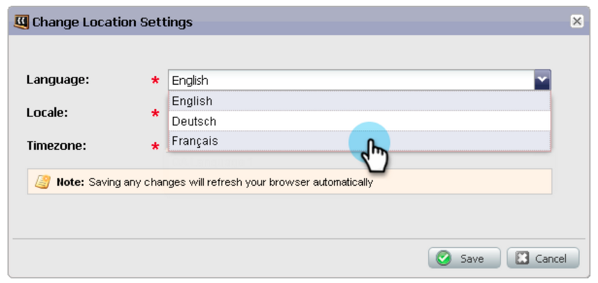
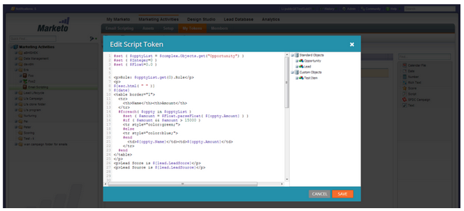

# 2013

## 2013 1月 {#january}

1月版本通过&#x200B;**推荐选件**&#x200B;扩展了我们的社交选件。 此外，[!DNL Marketo Lead Management]用户可以设置其时区、语言和区域设置首选项。 请注意，标有&#42;的功能仅在Select版本中可用。

## 反向链接优惠 {#referral-offers}

**推荐选件**&#x200B;会激励您的潜在客户推荐他们的朋友。 为成功的推荐创建目标和奖励。 您可以在登陆页面、您的网站，甚至是Facebook上使用它。

## 时区首选项 {#time-zone-preference}

您可以更改个人Marketo帐户的默认时区。 例如，即使订阅的默认值为“太平洋时间”，您也可以将其更改为您自己的帐户的东部时间。

## 选择您的[!DNL Marketo Lead Management]语言 {#select-your-marketo-lead-management-language}

您可以更改Marketo用户帐户的默认语言。 即使订阅的默认内容为英文，您也可以将其更改为德文或法文供自己使用。

## 多语言表单错误消息 {#multi-lingual-form-error-messages}

当潜在客户填写Marketo表单时，会自动内置一些验证消息。 您可能希望为这些错误消息选择不同的显示语言。 我们现在支持英语、德语和法语。

法语形式示例：

## 选择您的[!DNL Sales Insight]语言（仅限[!DNL Salesforce]） {#select-your-sales-insight-language-salesforce-only}

如果您的[!DNL Salesforce]语言首选项设置为法语或德语，Marketo [!DNL Sales Insight]将遵循此首选项。 下载最新的MSI包以获取此功能（1月14日当周提供）。

## 字段显示名称 {#field-display-name}

字段显示名称可以以不同的语言显示文本（例如，支持多字节字符）。

## 更改项目数据 {#change-program-data}

[!UICONTROL Change Program Data]流程步骤允许您通过营销活动手动更改项目成员的[!UICONTROL Success]状态和[!UICONTROL Success Date]。 您可以使用此流程步骤纠正错误，或手动更改可能没有按预期参与计划的成员。

## 2013年2 {#february}

2月版包括强烈要求的功能、对[!DNL Apple Safari]的支持以及其他小增强功能。

## 对[!DNL Apple Safari]的正式支持 {#official-support-for-apple-safari}

Mac和[!DNL Windows]的最新版本[!DNL Apple Safari]完全支持与Marketo潜在客户管理一起使用。 注意：iOS上的[!DNL Safari]不完全兼容。

## Webhook增强功能 {#webhooks-enhancements}

Webhook已得到增强，能够转义URL/有效负载中的令牌，并且还可以通过解析来自第三方系统的XML/JSON响应（在[!DNL Spark SMB Edition]中不可用）来更新Marketo潜在客户字段。

## 更新了SOAP API端点 {#updated-soap-api-endpoint}

首选的SOAP API端点已更新，显示在[!UICONTROL Admin] -> SOAP API中。 请更新您的调用以使用此新端点。 对旧端点的API调用已弃用，但将继续正常运行。 （SOAP API在[!DNL Spark SMB Edition]中不可用）

## 对[!DNL Facebook]选项卡的移动支持 {#mobile-support-for-facebook-tabs}

从Marketo发布的[!DNL Facebook]选项卡将检测移动设备并将它们路由到登陆页面。 这将确保用户在不支持[!DNL Facebook]选项卡的移动设备上获得正确内容（在[!DNL Spark]、[!DNL Standard]、[!DNL Select SMB Editions]和[!DNL Marketo Social Marketing]中可用）。

## 即将推出：支持多种模型 {#coming-soon-support-for-multiple-models}

我们正在为支持多种收入周期模型奠定基础，在未来的版本中，我们投票支持社区中#1RCA的构想。 在此版本中，您会注意到一些更改，包括智能列表筛选器和在流程步骤中添加选择以支持模型和阶段的选择。 我们还将潜在客户收入阶段和潜在客户收入周期模型字段移出“智能列表潜在客户网格”选项卡。

## 2013年3 {#march}

3月版本中包含以下功能。

## Marketo日历文件 {#marketo-calendar-files}

创建日历文件作为&#x200B;**我的令牌**，用于事件确认和提醒电子邮件中。 此集成的日历文件（如.ics文件）将渲染所有令牌，包括“我的令牌”和`{{member.webinar URL}}`令牌。

## 等待直到+/- {#wait-until}

创建可以在日期令牌之前或之后执行指定天数的“等待”步骤。 例如，您可以创建一个等待步骤，该步骤将在事件日期之前等待3天，然后发送提醒！

您可以创建一个等待步骤，该步骤将等待14天之后是该商机的生日。 通过选择“使用此日期的下一个周年纪念日”，系统将自动忽略与日期关联的年份，并改用当前日历年或下一个日历年。

## 社交抽奖 {#social-sweepstakes}

抽奖活动让你的潜在客户有机会赢得奖项，并告诉他们的朋友你的情况。 您可以从参与者中选择随机入选者，并向他们发送电子邮件。

## 其他表单[!UICONTROL Error Message]语言 {#additional-form-error-message-languages}

表单错误消息中添加了十多种语言！

## 支持新闻和通知 {#support-news-and-alerts}

通过订阅P1警报、已知问题、支持专家提供的提示和提示以及Marketo客户支持提供的更新的“支持新闻”和“支持警报”，保持与Marketo客户支持团队的联系。

## 2013年4 {#april}

4月版本中包含以下功能。

## [!DNL Box]集成 {#box-integration}

将Marketo与您的[!DNL Box]帐户连接，以便轻松地将文件复制到设计工作室中。

## [!DNL Gmail]插件 {#gmail-plugin}

如果您同时使用Marketo [!DNL Sales Insight]和[!DNL Gmail]，则可以通过[!DNL Chrome]应用商店安装我们的新[!DNL Gmail]插件。 插件允许您使用Marketo记录消息、加载Marketo电子邮件模板，以及使用Marketo跟踪功能发送消息。

## 电子邮件分析 {#email-analysis}

在[!UICONTROL Revenue Explorer]中创建高级电子邮件报表，如“单击活动热网格”报表。 此报告可提供insight用户单击电子邮件中链接的日期和时间。

随着我们迁移您的2012和2013年电子邮件数据，电子邮件分析功能作为一个整体将在4月和5月分阶段启用。 换言之，某些客户将比其他客户更早地获得此功能的访问权限。

## 程序API {#program-apis}

支持SOAP API调用中的项目，包括只读访问项目数据，例如：项目会员计数、获得者、成功、设置、渠道、标记、令牌和成本。 有关更多详细信息，请参阅SOAP API文档。

## [!DNL ON24]增强功能 {#on-enhancement}

职务和公司名称将从Marketo注册表中同步到[!DNL ON24]。

## 2013年5 {#may}

5月版本中包含以下功能。

## 登陆页面的日历文件 {#calendar-files-for-landing-pages}

将日历文件创建为“我的令牌”，该文件可添加到您的登陆页面中。 此集成的日历文件（例如.ics文件）将渲染所有令牌，包括本地资产登陆页面上的“我的令牌”。

## “模型成员资格”选项卡 {#model-membership-tab}

在一个位置查看模型成员的所有数据，以便轻松进行监控和故障诊断。 新的[!UICONTROL Members]选项卡是只读视图，当您选择批准的收入周期模型时可用。

## 重新组织的流操作树 {#reorganized-flow-action-tree}

使用新重新组织的流操作树，更快地找到流操作。

## 重命名的流量操作 {#renamed-flow-actions}

更改进度状态现在为[!UICONTROL Change Program Status]。 更改项目数据现在为[!UICONTROL Change Program Success]。

## 2013年6 {#june}

6月版本中包含以下功能。

## 其他用户语言 {#additional-user-languages}

以您的首选语言查看Marketo潜在客户管理界面 — 现在支持西班牙语和葡萄牙语。

## Cobalt用户界面 {#cobalt-user-interface}

在接下来的几个月中，您将会注意到应用程序中不同部分推出了新的主题；例如，影响模式窗口。

## 子文件夹克隆 {#subfolder-cloning}

将资产克隆到子文件夹中。

## 多个模型 {#multiple-models}

作为社区中收入周期分析(RCA)的首要想法，此功能允许您创建多个模型，以便按产品线、业务部门或区域对您的收入funnel有更详细的了解。 按收入阶段列出的潜在客户、成功路径分析器、Program Analyzer和收入资源管理器报表现在支持选择特定模型以用于报表的功能。

默认情况下，Select SMB Edition提供两种型号，Enterprise Edition提供十五种型号。 您也可以购买其他型号。

## 2013年7 {#july}

7月版本中计划于7月26日星期五推出以下功能。

## 仪表板上的已用内容小组件 {#exhausted-content-widget-on-the-dashboard}

提供有关潜在客户何时耗尽流中内容的信息。 系统将为您提供有关有多少潜在客户即将达到耗尽内容的信息，或者潜在客户耗尽时间长短的信息。

## 通信限制 {#communication-limits}

想停止过度发送电子邮件潜在客户吗？ 现在，可以轻松地将频率自动限制为每个人。 只需设置每天和每周的通讯限制，系统就会完成剩下的工作。 在Select、Enterprise以及适用于Standard客户的附加组件包中提供。

## Cobalt用户界面 {#cobalt-user-interface-july}

在接下来的几个月中，您将会注意到我们在应用程序的不同部分中推出了更多新主题。 不会移动或删除任何功能。

## 项目群成员日期列 {#program-member-date-column}

按添加潜在客户的日期查看和排序成员网格。

## 对WYSIWYG编辑器中的拼写检查的更改 {#changes-to-spell-check-in-wysiwyg-editor}

WYSIWYG编辑器用于拼写检查的服务已停止。 我们从编辑器中删除了“拼写检查”按钮，直到找到替代项为止。

## 2013年8 {#august}

2013年8月版本中包含以下功能。

**纯文本电子邮件**

现在，您可以只发送电子邮件的[文本版本](/help/marketo/product-docs/email-marketing/general/creating-an-email/create-a-text-only-email.md)。 请记住，使用此选项时，不会修饰链接。

## 客户参与引擎增强功能 {#customer-engagement-engine-enhancements}

### 忽略已用完的内容 {#ignore-exhausted-content}

将参与计划配置为[忽略耗尽](/help/marketo/product-docs/email-marketing/drip-nurturing/using-engagement-programs/disable-and-enable-exhausted-content-notifications.md)，包括禁止显示任何通知。

## 参与流测试 {#engagement-stream-testing}

使用[新测试功能](/help/marketo/product-docs/email-marketing/drip-nurturing/engagement-program-streams/test-an-engagement-stream.md)来模拟演绎版，并测试新添加的内容到实时流。

## 个性化发送测试 {#personalized-send-test}

在发送电子邮件测试时，您可以选择商机的名称来个性化测试电子邮件。

## “以网页形式查看电子邮件”和“取消订阅”系统令牌 {#view-email-as-web-page-and-unsubscribe-system-tokens}

利用这[个新令牌](/help/marketo/product-docs/email-marketing/general/using-tokens/system-tokens-glossary.md)更好地控制它们在电子邮件中的位置。

## 自动清理触发型营销活动 {#automatic-trigger-campaign-cleanup}

Marketo现在将定期通知您，并[自动停用过去六个月未运行的触发营销活动](/help/marketo/product-docs/core-marketo-concepts/smart-campaigns/using-smart-campaigns/automatic-trigger-campaign-cleanup.md)。

## Marketo财务管理增强功能 {#marketo-financial-management-enhancement}

### 计划成本更新  {#program-cost-update}

程序成本同步支持跨多个平台跟踪程序成本。

### Cobalt用户界面 {#cobalt-user-interface-august}

我们正在继续推出新的Cobalt界面。 此项目将使Marketo中的所有内容都超级快速！ 升级将在今年余下时间继续进行。

## 2013年9月 {#september}

9月版本中包含以下功能。

## 较短的URL {#shorter-urls}

电子邮件URL已进行了修剪，使其对收件人具有点击友好性，同时保留所有跟踪功能

>[!CAUTION]
>
>当我们转为使用短URL时，在9月版本之前发送的电子邮件中的链接将在本版本发布90天后过期。

使用Marketo自定义对象中的数据，或使用Velocity模板语言向电子邮件内容添加条件逻辑。

## 更改发送测试以发送示例 {#change-send-test-to-send-sample}

我们已将操作“发送测试”重命名为“发送示例”

## 个性化[!UICONTROL Send Sample Email] {#personalized-send-sample-email}

在发送电子邮件示例时，您可以选择潜在客户的名称来个性化示例电子邮件。

## [!DNL GoToWebinar]的其他字段同步 {#additional-field-sync-for-gotowebinar}

您可以将公司名称和职称从Marketo表单同步到[!DNL GoToWebinar]。 要启用这些附加字段，请转到Event Partners并选中“Enable Additional Fields”。

## 限制用户仅登录SSO {#restrict-user-login-to-sso-only}

将订阅配置为仅允许Marketo用户通过SSO登录，而不允许通过正常的登录屏幕登录

## 已上传文件的病毒扫描 {#virus-scan-of-uploaded-files}

现在，如果上载到Design Studio的文件包含病毒，则会自动扫描并阻止这些文件

## 导出机会影响分析器 {#export-opportunity-influence-analyzer}

您现在可以将Opportunity Influence Analyzer中的数据导出到[!DNL Excel]。 每个导出的[!DNL Excel]文件都包含所有潜在客户（包括在商机中没有角色的那些潜在客户）的所有营销交互，以及分析器中选定帐户下的所有商机。 机会行以绿色突出显示。 如果您需要专注于特定潜在客户或营销活动，则可以使用[!DNL Excel]的本机数据筛选功能。

## 项目归因设置 {#program-attribution-settings}

您可以更改Marketo在首次接触和多次接触归因量度中关联联系人和机会的方式，包括执行基于帐户的归因的功能。 这些设置将影响Program Opportunity Analysis区域和Opportunity Analysis区域下[!UICONTROL Revenue Explorer]报告中的归因指标。 这也会影响Program Analyzer中的归因指标。

您可以将项目归因设置更改为三个选项之一。 更改此设置不会修改任何Marketo或CRM数据；它只会更改报表的运行方式，并且可以随时还原。

Explicit设置将只检查具有角色的联系人（当前行为）。 隐式将检查与帐户关联的所有联系人，而不管角色如何。 我们强烈建议尽可能使用显式模式。 使用“隐含”可能会产生误报，即认为机会有价值的人尽管对机会没有实际影响。

## [!UICONTROL Sales Insight]可用法语和德语（仅[!DNL Salesforce]） {#sales-insight-available-in-french-and-german-salesforce-only}

从[!DNL AppExchange]下载最新版本的Marketo潜在客户管理和Marketo [!UICONTROL Sales Insight]，以便您的法文和德文销售人员能够以他们的首选语言查看[!UICONTROL Sales Insight]内容。

## Cobalt用户界面 {#cobalt-user-interface-september}

在接下来的几个月中，将在应用程序的不同部分推出新的主题。 本月，您可能会注意到更多新的蓝色模式窗口。

## 2013年十月 {#october}

2013年10月版本中包含以下功能。

## templates.marketo.com {#templates-marketo-com}

[Templates.marketo.com](/help/marketo/product-docs/demand-generation/landing-pages/landing-page-templates/guided-landing-page-template-list.md)展示了可从[!DNL Marketo Program Library]下载的电子邮件和登陆页面模板（包括响应式移动电子邮件模板）。 我们将每月添加模板，并经常回来查看！

## developers.marketo.com {#developers-marketo-com}

[Developer.adobe.com](https://experienceleague.adobe.com/zh-hans/docs/marketo-developer/marketo/home)适用于希望将集成构建到Marketo中的开发人员。 您可以引用不同的集成选项，包括Munchkin JavaScript API、SOAP API代码示例、Webhook和电子邮件脚本。 [GitHub](https://github.com/Marketo/SOAP-API-Java-Client)上也提供了Java SDK。

## 已更新[!DNL BrightTALK]事件适配器 {#updated-brighttalk-event-adapter}

将其他字段从[!DNL BrightTALK]同步到Marketo，包括公司名称、职务、行业和公司规模。

## Android Tablet事件签入应用程序 {#android-tablet-event-check-in-app}

使用Google Play上提供的基于Android的新签到应用程序，将注册者签到您的事件中。

## 2013年十二月 {#december}

12月版本中包含以下功能。

发布后，请务必查看社区中的新版本选项卡，以了解有关每个功能的详细知识库文章！

## 电子邮件项目 {#email-program}

发送电子邮件从未像现在这样简单。 使用新的[电子邮件程序](/help/marketo/product-docs/email-marketing/email-programs/creating-an-email-program/understanding-email-programs.md)发送批次电子邮件，而不是使用默认程序。 定义智能列表、发送电子邮件、对其进行计划，然后您就关闭了！

另请查看新的[电子邮件量度仪表板](/help/marketo/product-docs/email-marketing/email-programs/email-program-data/view-the-email-program-dashboard.md)，以查看您的电子邮件执行情况。

## 电子邮件A/B测试 {#email-a-b-testing}

在新的电子邮件程序中，对电子邮件发送总数的百分比运行[A/B测试](/help/marketo/product-docs/email-marketing/email-programs/email-program-actions/email-test-a-b-test/add-an-a-b-test.md)。 从4种不同类型的测试中进行选择：主题行、发件人地址、日期/时间和整个电子邮件。 您甚至可以选择手动提升入选者，或让系统根据预定义的入选标准提升入选者。 新的电子邮件程序（包括A/B测试）可以嵌套在Events和默认程序中，以使该电子邮件发送如此简单！

## 电子邮件冠军/挑战者测试 {#email-champion-challenger-testing}

[冠军/挑战者测试](/help/marketo/product-docs/email-marketing/general/functions-in-the-editor/email-tests-champion-challenger/add-an-email-champion-challenger.md)类似于A/B测试，但不同之处在于它用于触发的电子邮件，并且您不会自动发送入选者。 这个测试允许您挑战一种既定的做事方法，称为冠军，并且您通过引入挑战者来测试它是否仍然是最棒的。 此外，还可以在参与计划流中使用冠军/挑战者电子邮件测试。

## [!UICONTROL Email Analysis]中的潜在客户详细信息 {#lead-details-in-email-analysis}

我们在[!UICONTROL Email Analysis]中引入了其他潜在客户属性和公司属性。 您现在可以查看按新属性（如[!UICONTROL Industry]和[!UICONTROL Lead Source]）分组的电子邮件统计信息。

## 增强的[!DNL BrightTALK]事件适配器 {#enhanced-brighttalk-event-adapter}

现在，您可以从您的[!DNL BrightTALK]渠道和活动将注册者拉入Marketo。 您可以使用此信息为其他营销活动提供信息！
