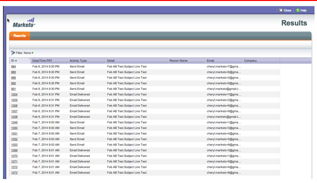
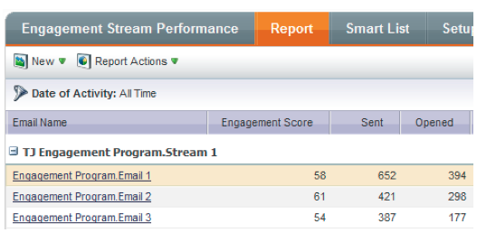
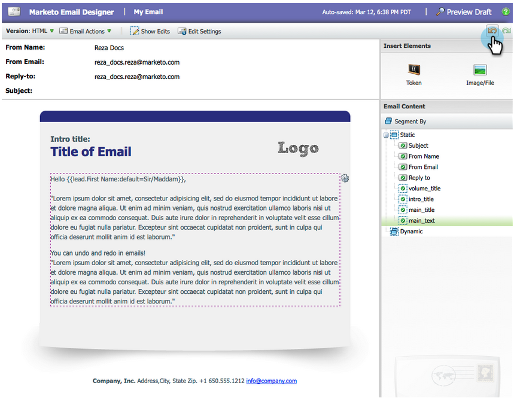
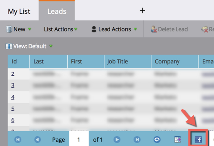

# 2014

## 2014 1月 {#january}

2014年1月版本中包含以下功能。 请检查您的[Marketo版](https://www.marketo.com/pricing/)是否提供相关功能。

## Forms 2.0 {#forms}

注意：Forms 2.0文档即将发布！

控制表单创建过程并让Web开发人员喘口气。 Forms 2.0旨在使营销人员能够创建既具有视觉又功能强大的表单，而无需了解编程。

**为您的Forms提供他们应得的可视化改造：**

通过主题设计、按钮自定义和灵活的布局，您可以设计符合您站点外观的现代外观表单。

**条件可见性和跟进页面逻辑：**

是否希望仅在用户选择美国作为其“国家/地区”时显示“州”？ 根据客户如何回答您表格中的问题，向客户展示不同的白皮书，您觉得如何？ 直接从编辑器将条件逻辑构建到表单中。 不需要[!DNL javascript]！

**轻松地将Forms嵌入到您自己的登陆页中：**

从放置在Marketo登陆页面上的表单中提取html代码并将其放入[!DNL iFrame]中的日子已经一去不复返了。 只需获取嵌入代码，并将其放在您希望表单呈现的登陆页面上。 两种模式（普通模式和灯箱模式）可让您在网站上使用Marketo表单更加灵活。

## 电子邮件程序的通信限制 {#communication-limits-for-email-program}

[对电子邮件程序设置通信限制](/help/marketo/product-docs/email-marketing/email-programs/email-program-actions/enable-disable-communication-limits-in-an-email-program.md)以确保不会与数据库过度通信。 如果人员超出定义的限制，她将不会收到电子邮件。

## 计划会员资格分析中的其他字段 {#additional-fields-in-program-membership-analysis}

现在，您可以按潜在客户和公司属性添加计划会员资格分析量度并对量度进行分组。 例如，您可以添加行业字段以查看项目成员和成功的分割。

## 2014年2月 {#february}

2014年2月版本中包含以下功能。 请检查您的Marketo版本以了解功能可用性。 发布后，请务必返回以查找每个功能的详细知识库文章的链接！

## [!UICONTROL Engagement Score]作为获胜条件 {#engagement-score-as-winning-criteria}

[使用参与度分数](/help/marketo/product-docs/email-marketing/email-programs/email-program-actions/email-test-a-b-test/define-the-a-b-test-winner-criteria.md)确定A/B拆分测试或冠军/挑战者测试中的入选变体。 测试必须至少运行24小时，才能给出足够的参与度分数。

## 电子邮件程序[!UICONTROL Results]选项卡 {#email-program-results-tab}

[查看结果](/help/marketo/product-docs/email-marketing/email-programs/email-program-data/view-email-program-results.md)和为电子邮件计划记录的活动。

## 已阻止联系人/[!UICONTROL Leads]的邮件 {#people-leads-blocked-from-mailing}

[单击被阻止发送邮件的人员/潜在客户](/help/marketo/product-docs/email-marketing/email-programs/managing-people-in-email-programs/define-an-audience-with-a-smart-list.md)号码，以查看哪些人由于被取消订阅、被列入黑名单、电子邮件地址无效或空白，或营销活动被暂停而无法接收电子邮件。

## 导出电子邮件程序数据 {#export-email-program-data}

[将电子邮件量度导出到 [!DNL Excel]](/help/marketo/product-docs/email-marketing/email-programs/email-program-data/export-email-program-dashboard-to-excel.md)，包括AB测试变体数据。

## [!UICONTROL Engagement Stream Performance]报告中的[!UICONTROL Engagement Score] {#engagement-score-in-engagement-stream-performance-report}

我们已将参与度分数添加到[[!UICONTROL Engagement Stream Performance]报表](/help/marketo/product-docs/email-marketing/drip-nurturing/reports-and-notifications/engagement-stream-performance-report.md)中，以帮助您了解参与计划中的内容的效果。

## 电子邮件分析中的项目详细信息 {#program-details-in-email-analysis}

现在，您可以按项目名称、渠道和标记对电子邮件量度进行分组。 当电子邮件是项目的本地资产时，项目名称会添加到电子邮件名称字段中。 新的项目名称字段显示发送电子邮件的智能营销策划的项目名称。 如果电子邮件是其他项目的本地资产，则此名称可能不同于“电子邮件名称”字段中的项目。

## 更新了链接筛选器和触发器的点击次数 {#update-to-clicks-link-filters-and-trigger}

以下筛选器和触发器名称已更新：

* 单击[!UICONTROL Clicks Link on Web Page]的链接
* 已单击指向[!UICONTROL Clicked Link on Web Page]的链接
* 未单击指向[!UICONTROL Not Clicked Link on Web Page]的链接

## Forms 2.0增强功能 {#forms-enhancements}

在此版本中，我们已为Forms 2.0提供了多项“生活质量”更新。 除了在嵌入表单上启用渐进式分析之外，我们还进行了工作流和UX更改，这些更改将使得在编辑器中使用更高级的功能更加容易，[包括可见性规则](/help/marketo/product-docs/demand-generation/forms/form-fields/dynamically-toggle-visibility-of-a-form-field.md)、高级感谢页面和隐藏字段。

## 2014年3 {#march}

2014年3月版本中包含以下功能。 请检查您的Marketo版本以了解功能可用性。 发布后，请务必返回以获取每个功能的知识库文章链接。

## 电子邮件程序仪表板刷新按钮 {#email-program-dashboard-refresh-button}

使用[刷新按钮](/help/marketo/product-docs/email-marketing/email-programs/email-program-data/use-the-email-program-dashboard.md)获取有关电子邮件发送或AB测试的最新电子邮件量度！

## 在电子邮件编辑器和代码片段编辑器中撤消/重做 {#undo-redo-in-the-email-editor-and-snippet-editor}

[撤消或重做](/help/marketo/product-docs/email-marketing/general/email-editor-2/edit-elements-in-an-email.md)当前会话的最多50个操作。

## 方案执行情况报表中的方案状态列 {#program-status-columns-in-program-performance-report}

使用[项目绩效报表](/help/marketo/product-docs/core-marketo-concepts/programs/program-performance-report/add-program-status-columns-to-a-program-report.md)时，您现在可以看到有多少人处于项目状态。

## 适用于Analytics的包容性和可操作性计划 {#inclusive-and-operational-programs-for-analytics}

现在，您可以通过将Analytics Behavior选项设置为“Inclusive”（包含）来编辑“项目渠道”，从而在[!UICONTROL Revenue Explorer]和分析器中包括没有期间成本的项目。 您还可以通过选择“操作”将操作程序排除在报告之外。

## 用于潜在客户转换的混合和隐式选项 {#hybrid-and-implicit-options-for-lead-conversion}

您可以在Lead Analysis中更改Marketo关联联系人和商机以及商机转化指标的方式。 您可以[将归因设置](/help/marketo/product-docs/administration/settings/change-attribution-settings-for-analytics.md)更改为三个选项之一。 更改此设置不会修改任何Marketo或CRM数据；它只会更改报表的运行方式，并且可以随时还原。

“明确”设置将仅将具有商机中角色的联系人视为转化后的商机（默认行为）。 隐式将转化为opportunity中与客户关联的所有联系人，无论角色如何。 混合会将角色联系人视为已转化（如果可用）；如果没有，我们会将帐户中的所有联系人视为已转化。

提醒一下，此设置还会更改项目归因量度。

## 其他用户语言 {#additional-user-language}

选择您的[Marketo应用程序语言](/help/marketo/product-docs/administration/settings/change-time-zone.md)。 用您的首选语言查看Marketo潜在客户管理界面 — 现在支持日语。

## Marketo开发人员博客 {#marketo-developer-blog}

[Marketo开发人员博客](https://developers.marketo.com/blog/)专门面向那些支持现代营销人员快速发展的需求的Web开发人员和软件工程师。 您可以订阅有关新集成选项、API版本更新的公告，以及一系列新的操作方法文章（包括代码示例以及有关与Marketo平台集成的最佳实践）。

本系列中的[第一篇文章](https://developers.marketo.com/blog/retrieving-customer-and-prospect-information-from-marketo-using-the-api/)将指导您了解如何使用API高效地检索Marketo中存储的人员（客户/联系人/潜在客户）的信息。

## 2014年5月 {#may}

2014年5月版本中包含以下功能。 请检查您的Marketo版本以了解功能可用性。 发布后，请务必返回以查找每个功能的详细知识库文章的链接！

## 删除Workspace {#delete-workspace}

现在您可以[删除未使用的工作区](/help/marketo/product-docs/administration/workspaces-and-person-partitions/delete-a-workspace.md)。 在尝试删除工作区之前，请确保将所有资源移动到另一个工作区。

## 安排首次点播 {#schedule-first-cast}

在参与程序中，您可以安排[首次播放运行](/help/marketo/product-docs/email-marketing/drip-nurturing/engagement-program-streams/set-stream-cadence.md)的日期。 例如，指定每2周播放一次，然后选择第一次播放的日期。

## 增强参与计划 {#enhanced-engagement-programs}

现在，每个人都拥有多个程序、流和通信限制。

## 文本电子邮件中的链接跟踪 {#link-tracking-in-text-emails}

[在电子邮件文本版本的URL两侧添加双方括号](/help/marketo/product-docs/email-marketing/general/functions-in-the-editor/add-tracked-links-to-a-text-email.md)，以指示何时应将链接转换为重定向的Marketo跟踪链接

>[!NOTE]
>
>**示例**
>
>`[[https://www.marketo.com]]`

默认情况下，电子邮件文本版本中不会跟踪任何链接。 添加此新语法以指示何时应将链接转换为跟踪链接。 HTML链接的行为未更改。  要在电子邮件中添加跟踪链接，请执行以下操作：

* **HTML版本：**&#x200B;只需插入您的链接即可。 默认情况下，将对其进行跟踪。
* **文本版本：**&#x200B;输入由双方括号括起的URL。

要在电子邮件中添加未跟踪的链接，请执行以下操作：

* **HTML版本：**&#x200B;插入您的链接并将“mktNoTrack”类添加到该链接中。
* **文本版本：**&#x200B;只需输入URL即可。 默认情况下，将取消跟踪该活动。

## 示例电子邮件中的链接标记 {#link-markup-in-sample-emails}

提前查看您的链接在电子邮件中的行为方式。 现在，示例电子邮件会显示这些链接在潜在客户面前的确切显示方式。 预览哪些链接已转换为跟踪链接，以便您更好地了解消息实际显示给收件人的方式。

## [!UICONTROL Abort Campaign] {#abort-campaign}

不要惊慌！ 如果发现错误，请使用新的[中止营销活动](/help/marketo/product-docs/core-marketo-concepts/smart-campaigns/using-smart-campaigns/abort-a-smart-campaign.md)按钮立即停止其跟踪的营销活动。 您将收到一条通知，其中概述了营销策划停止时每个流程步骤中待定的潜在客户数量。

## [!UICONTROL Sales Insight]日语、葡萄牙语和西班牙语 {#sales-insight-in-japanese-portuguese-and-spanish}

从AppExchange下载[!UICONTROL Sales Insight]的最新版本，以便您的日语、葡萄牙语和西班牙语销售代理使用其首选语言查看[!UICONTROL Sales Insight]内容。

## 计划会员资格分析中的计划状态和成功时间范围 {#program-status-and-success-timeframe-in-program-membership-analysis}

查看每个项目状态有多少成员，以及成员何时更改为每个状态，包括他们获得项目成功的日期。

## [!UICONTROL Email Analysis]中的A/B测试电子邮件 {#a-b-test-emails-in-email-analysis}

在[!UICONTROL Email Analysis]中报告每个A/B测试电子邮件变体。

## Analytics打包更改 {#analytics-packaging-changes}

Revenue Cycle Modeler和Success Path Analyzer现在包含在MA标准版中。

## 移动平台信息 {#mobile-platform-info}

[细分并触发](/help/marketo/product-docs/reporting/basic-reporting/report-activity/build-a-people-performance-report-with-mobile-platform-columns.md)潜在客户打开和单击其移动设备的电子邮件。

## 2014年6 {#june}

2014年6月版本中包含以下功能。 请检查您的Marketo版本以了解功能可用性。

## 更新了UI — 即将推出！ {#updated-ui-coming-soon}

新外观，包括[!DNL Marketo Lead Management]的导航，将在以后的版本中推出！

## [!DNL Outlook]的[!DNL Sales Insight]插件2013 {#sales-insight-plugin-for-outlook}

这将需要下载新的插件。 您可以从[此处](/help/marketo/product-docs/marketo-sales-insight/msi-outlook-plugin/install-the-marketo-email-add-in-for-outlook-with-a-registration-code.md)下载它。

## 令牌解析 {#token-resolution}

当您从[!DNL Sales Insight]发送测试电子邮件时，电子邮件中的当前令牌不会解析，并且会发送默认值。 此增强功能将确保令牌在测试电子邮件中解析。

## 自定义星星和火焰的百分比 {#customize-percentages-for-stars-and-flames}

[设置获得1、2或3星和火焰的潜在客户的百分比](/help/marketo/product-docs/marketo-sales-insight/msi-for-salesforce/features/stars-and-flames/customize-stars-and-flames.md)。

## 潜在客户REST API {#lead-rest-api}

通过我们的新ReST API以编程方式创建、读取和更新潜在客户。 要开始使用ReST，您需要在Marketo中[创建自定义服务](/help/marketo/product-docs/administration/additional-integrations/create-a-custom-service-for-use-with-rest-api.md)。 然后，转到[开发人员网站](https://experienceleague.adobe.com/zh-hans/docs/marketo-developer/marketo/rest/rest-api)，了解有关使用此API的详细信息。

## Marketo Real-Time Personalization (RTP)促销活动页面更新 {#marketo-real-time-personalization-rtp-campaigns-page-update}

RTP营销活动现在包含具有缩略图视图和营销活动效果的新设计。 此外，您还可以[根据日期或最佳效果](/help/marketo/product-docs/web-personalization/working-with-web-campaigns/sort-web-campaigns-by-latest-or-top-performing.md)组织营销活动。

## 网站分析 {#web-analytics-integrations}

在网站分析平台中附加所有RTP数据。

现在默认启用与[Google Analytics](/help/marketo/product-docs/web-personalization/reporting-for-web-personalization/web-analytics-integrations/integrate-rtp-with-google-analytics.md) (GA)的集成，因此在“帐户设置”下，打开要为其将数据发送到GA自定义变量和事件的开关。

我们还完成了与[Adobe SiteCatalyst](/help/marketo/product-docs/web-personalization/reporting-for-web-personalization/web-analytics-integrations/integrate-with-adobe-analytics.md)的集成。

## 2014年7 {#july}

2014年7月版本中包含以下功能。 请检查您的Marketo版本以了解功能可用性。 请在发布后返回以获取指向详细功能文档的链接。

## 营销日程表 {#marketing-calendar}

跨程序查看您的所有活动、电子邮件等。 [此新产品](/help/marketo/product-docs/core-marketo-concepts/marketing-calendar/understanding-the-calendar/navigating-the-marketing-calendar.md)将免费提供给[!DNL Marketo Lead Management]或Dialog用户数量在10个或更少的客户。

有关营销日历的文档将在发布时提供。

## 新外观 {#new-look-and-feel}

[!DNL Marketo Lead Management]将更新为时尚的新外观，并包括更新的导航。

## 日期运算符 {#date-operators}

针对“[!UICONTROL in past before]”、“[!UICONTROL in future]”和“[!UICONTROL in future after]”的[高级筛选器](/help/marketo/product-docs/core-marketo-concepts/smart-lists-and-static-lists/creating-a-smart-list/smart-list-filter-operators-glossary.md)。 例如，查找出生日期在未来3个月内的潜在客户或出生日期在6个月后到期的合同。

## 项目计划视图 {#program-schedule-view}

除了使用营销日历管理您的活动和默认项目外，您还可以在项目上看到新的计划视图。

* 一次性重新计划所有日期
* 新的暂定日期 — 将其铅笔插入！
* 自定义条目类型 — ToDo、Press Release、您想要的任何内容

## REST API中的列表操作 {#list-operations-in-the-rest-api}

我们添加了以下与ReST中的列表操作相关的调用。 请参阅完整文档[https://experienceleague.adobe.com/en/docs/marketo-developer/marketo/rest/rest-api](https://experienceleague.adobe.com/zh-hans/docs/marketo-developer/marketo/rest/rest-api)。

* 按ID获取列表
* 获取多个列表
* 导入到列表
* 获取导入到列表状态

## 快速列表导入 {#fast-list-import}

速度提高&#x200B;**50倍**，您的文件将放大Marketo！ 旧的“正常”和“针对新商机进行了优化”导入选项已替换为“默认（快速导入）”。

“跳过新的潜在客户和更新”选项保持不变。

## 新的改进Munchkin！ {#new-improved-munchkin}

推出将从7月中旬开始，并在未来几个月持续。

* 删除依赖项[!DNL jQuery]以实现完全兼容和未来兼容
* 与网站上的其他JavaScript更兼容
* 过去一年已在许多网站上进行了全面测试！

## RTP：实时Personalization营销活动模板 {#rtp-real-time-personalization-campaign-templates}

RTP集营销活动页面现在[包含现成的模板](/help/marketo/product-docs/web-personalization/using-templates/using-templates-to-create-web-campaigns.md)。 从各种不同的方式中进行选择，包括网络研讨会、案例研究、电子书。

## RTP：JavaScript API增强功能 {#rtp-javascript-api-enhancements}

用于获取实时访客数据（如组织、行业、位置和区段代码匹配）的新RTP API调用。 此外，在“区段”页面中，将鼠标悬停在区段名称上将显示显示区段代码的工具提示。 有关完整文档，请参阅我们的[开发人员网站](https://experienceleague.adobe.com/en/docs/marketo-developer/marketo/javascriptapi/rich-media-recommendation)。

## RTP：Campaign内容编辑器中的HTML5支持 {#rtp-html-support-in-campaign-content-editor}

现在，“设置营销活动”页面中的内容WYSIWYG编辑器具有完全的HTML5兼容性。 单击编辑器中的“HTML”图标可插入任何HTML5代码。

## 2014年8月 {#august}

2014年8月版本中包含以下功能。 检查您的Marketo版本以了解功能可用性。 请在发布后返回以获取指向详细功能文档的链接。

## 营销日历许可证 {#marketing-calendar-licenses}

2014年9月5日之后，只有5名用户可免费访问营销日历。 请务必[为您选择的用户](/help/marketo/product-docs/core-marketo-concepts/marketing-calendar/understanding-the-calendar/issue-revoke-a-marketing-calendar-license.md)颁发/撤销营销日历许可证，以便无中断访问。

## 新用户权限 {#new-user-permissions}

添加了以下新用户权限：

| 权限 | 描述 |
|---|---|
| 访问Revenue Explorer | 如果您购买了RCA，您现在将控制谁可以访问该卡。 |
| 导入列表 | 限制用户将列表导入商机数据库。 |
| 列表导入 | 限制用户通过营销活动下的项目导入列表。 |
| 激活触发器营销活动 | 控制谁可以和谁无法激活触发营销活动。 |
| 计划批处理活动 | 控制谁可以计划批处理营销活动运行，谁不能计划。 |

## 从[!UICONTROL Admin]导出用户和角色 {#export-users-and-roles-from-admin}

您现在可以从Marketo [导出用户和角色列表](/help/marketo/product-docs/administration/users-and-roles/export-a-list-of-users-and-roles.md)。 您还可以包含要包含在导出中的“上次登录”时间戳。

## 删除渠道和标记 {#delete-channels-and-tags}

您现在可以删除任何未使用的渠道和状态。 与往常一样，您只能隐藏当前正在使用的文件。

## 自动化[!DNL DKIM] {#automated-dkim}

为了提高可投放性，所有传出电子邮件都将经过[!DNL DKIM] (DomainKeys Identified Mail)签名。 默认情况下，电子邮件将使用Marketo的共享[!DNL DKIM]签名。 您将可以选择自定义此签名。

>[!NOTE]
>
>[!DNL DKIM]将缓慢转出，您可能几周内看不到它。

## Personalization实时更新 {#real-time-personalization-updates}

我们在营销活动页面中添加了标签，以便您能够为自己的内容添加标签。

## 移动定位 {#mobile-targeting}

您向社区提问，我们完成了任务！ 现在，您可以为移动设备用户和平板电脑用户添加、排除或设置特定的call to action。

## 增强的1:1分段和定位 {#enhanced-segmentation-and-targeting}

您现在可以使用高级过滤器运算符来定位已知访客。

## 营销活动共享 {#campaign-sharing}

您现在可以快速轻松地共享RTP促销活动预览链接。

## 内容推荐引擎报表 {#content-recommendation-engine-report}

我们添加了一个新的内容推荐引擎报告，供您查看漂亮的摘要。

## 增强的用户管理 {#enhanced-user-administration}

由于多次失败的登录尝试，管理员用户现在可以锁定用户。 如果需要，您还可以解锁这些用户。

## 跟踪控制 {#tracking-control}

您现在可以从Real-Time Personalization的所有跟踪和报告中排除特定IP。

## 2014年10 {#october}

检查您的Marketo版本以了解功能可用性。 文档将在发布时提供。

## 营销日历中的项目聚焦 {#program-focus-in-marketing-calendar}

[直接从营销日历创建和编辑条目](/help/marketo/product-docs/core-marketo-concepts/marketing-calendar/understanding-the-calendar/understand-enable-program-focus.md)。

## 新的REST API调用 {#new-rest-api-calls}

使用API向潜在客户提取新活动或更改内容：

* 获取潜在客户更改
* 获取潜在客户活动
* 获取活动类型
* 获取分页令牌

发布后，可在[https://experienceleague.adobe.com/en/docs/marketo-developer/marketo/rest/rest-api](https://experienceleague.adobe.com/zh-hans/docs/marketo-developer/marketo/rest/rest-api)上获得完整的详细信息。

## MSI — 发送[!DNL Microsoft Dynamics]的Marketo电子邮件 {#msi-send-marketo-email-for-microsoft-dynamics}

[发送并跟踪销售电子邮件](/help/marketo/product-docs/marketo-sales-insight/msi-for-microsoft-dynamics/setting-up-and-using/send-a-marketo-sales-email-from-microsoft-dynamics.md)给来自[!DNL Microsoft Dynamics]的潜在客户和联系人。

## MSI — 添加到[!DNL Microsoft Dynamics]的Marketo营销活动 {#msi-add-to-marketo-campaigns-for-microsoft-dynamics}

[直接在[!DNL Microsoft Dynamics]内将潜在客户和联系人添加到Marketo智能营销活动](/help/marketo/product-docs/marketo-sales-insight/msi-for-microsoft-dynamics/setting-up-and-using/add-a-lead-contact-to-a-marketo-campaign-from-microsoft-dynamics.md)。 营销人员可以选择向销售人员提供Marketo促销活动。

## 对[!DNL Microsoft Dynamics]同步的自定义实体支持 {#custom-entity-support-for-microsoft-dynamics-sync}

[使用来自[!DNL Microsoft Dynamics]的自定义对象数据](/help/marketo/product-docs/crm-sync/microsoft-dynamics-sync/microsoft-dynamics-sync-details/enable-sync-for-a-custom-entity.md)在智能列表、智能营销活动、项目中过滤和触发……

## [!DNL Microsoft Dynamics]同步的股东支持 {#shareholder-support-for-microsoft-dynamics-sync}

从[!DNL Dynamics]同步商机股东数据。 另外，使用“主要客户”字段连接到帐户以及使用“主要联系人”同步连接到联系人的机会也受支持。

## RTP — 功能板增强功能 {#rtp-dashboard-enhancements}

功能板现已增强以包含更多概览数据：

* 组织访问总数
* 绩效最佳的前5个行业
* 参与访客总数

## RTP — 新的营销活动移动模板 {#rtp-new-mobile-templates-for-campaigns}

使用这些新模板快速轻松[创建移动营销活动](/help/marketo/product-docs/web-personalization/using-templates/using-templates-to-create-web-campaigns.md)。

## RTP — 用户上下文API {#rtp-user-context-api}

使用跟踪访客过去访问历史记录的新调用。 根据访客的以下内容个性化营销活动：

* 已查看的过去页面
* 感兴趣的产品
* 他们所看到的RTP营销活动

有关完整的详细信息，请访问[https://experienceleague.adobe.com/en/docs/marketo-developer/marketo/javascriptapi/rich-media-recommendation](https://experienceleague.adobe.com/en/docs/marketo-developer/marketo/javascriptapi/rich-media-recommendation)。

## 2014年12 {#december}

2014年12月版本中包含以下功能。 请检查您的Marketo版本以了解功能可用性。 发布后，请务必返回以查找每个功能的详细文章链接！

## [!DNL Sales Insight]报告 {#sales-insight-reports}

[[!DNL Sales Insight] 电子邮件性能报表](/help/marketo/product-docs/marketo-sales-insight/msi-for-salesforce/features/performance-reports/sales-insight-email-performance-report.md)允许您按电子邮件和销售代表查看电子邮件量度。 它支持通过[!DNL Salesforce]、[!DNL Microsoft Dynamics]、[!DNL Outlook]插件和[!DNL Gmail]插件发送的电子邮件。

## [!DNL Facebook]自定义受众 {#facebook-custom-audiences}

一旦您的Marketo管理员通过[!UICONTROL Admin] > [!UICONTROL LaunchPoint][&#128279;](/help/marketo/product-docs/demand-generation/ad-network-integrations/add-facebook-custom-audiences-as-a-launchpoint-service.md)添加了[!DNL Facebook] ，您就可以轻松地创建、更新或[使用Marketo静态或智能列表中的潜在客户替换 [!DNL Facebook] 自定义受众](/help/marketo/product-docs/demand-generation/facebook/create-a-custom-audience-in-facebook.md)。 在任意静态或智能列表的商机网格底部查找新的[!DNL Facebook]图标。

## 改进了跨工作区的克隆  {#improved-cloning-across-workspaces}

[将程序](/help/marketo/product-docs/core-marketo-concepts/programs/working-with-programs/clone-a-program.md)克隆到另一个工作区从未如此容易！ 单击“克隆”时，可以选择目标工作区。 无需先克隆到文件夹，然后再移动文件夹！

>[!NOTE]
>
>此新克隆功能目前仅适用于程序。

## 引用智能列表 {#reference-smart-list}

[在生成智能列表或流时，可以引用与其他工作区共享的智能列表](/help/marketo/product-docs/core-marketo-concepts/smart-lists-and-static-lists/using-smart-lists/reference-a-list-or-smart-list-across-workspaces.md)。

## 列表导入改进 {#list-import-improvements}

[导入以UTF-16、Shift-JIS或EUC-JP编码的文件](/help/marketo/getting-started/quick-wins/import-a-list-of-people.md)。 我们将继续支持UTF-8编码文件。

## 电子邮件脚本中的链接跟踪 {#link-tracking-in-email-scripting}

现在，电子邮件脚本中的链接将受到跟踪，并可在“电子邮件链接性能”报表中使用。

## 令牌编码设置 {#token-encoding-setting}

我们推出了一项新的安全功能，可自动对HTML编码令牌进行编码，此功能将在2015年3月默认启用。 在此之前，请在字段管理中切换此功能以提前测试行为。 所有潜在客户和公司令牌在插入电子邮件或登陆页面时都将进行编码。 选项也可用于单个字段。

## 新的REST API调用 {#new-rest-api-calls-december}

潜在客户与活动REST API的三个新调用：

·获取Lead分区

·关联潜在客户

·合并潜在客户

发布后，可在[https://experienceleague.adobe.com/en/docs/marketo-developer/marketo/home](https://experienceleague.adobe.com/zh-hans/docs/marketo-developer/marketo/home)上获得完整的详细信息

## [!DNL Munchkin Javascript]兼容性增强 {#munchkin-javascript-compatibility-enhancements}

我们对[!DNL Munchkin]进行了一些细微的增强，以确保其继续快速加载，并在与页面上的其他JavaScript一起使用时根据需要正常运行。

推出将从12月中旬开始，并在未来几个月持续。

## [!UICONTROL Revenue Explorer]升级外观 {#revenue-explorer-upgraded-look-and-feel}

## RTP：指定帐户列表模块 {#rtp-named-account-list-module}

在新的[!UICONTROL Named Accounts]页面中管理和监视您的关键高收益帐户。 上载指定帐户的新列表以标识和定位这些组织。 我们已将流程自动化，为您提供更大的控制力和灵活性，以便实施基于帐户的营销计划并跨不同渠道（Web和广告）定位您的关键帐户。

## RTP：对区域营销活动的滑动效果 {#rtp-sliding-effect-for-in-zone-campaigns}

我们为In Zone营销活动添加了新的“滑动”效果，以使您的个性化内容在页面加载时滑入到位。

