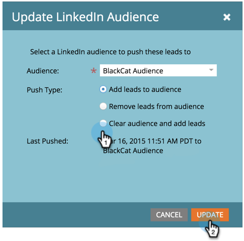
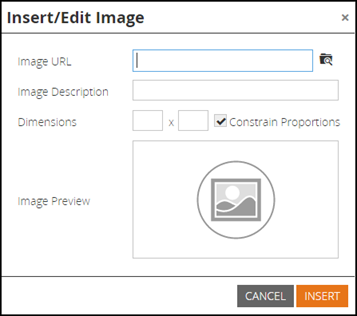

# 2015

## 2015年1 {#january}

2015年1月版本中包含以下功能。 请检查您的Marketo版本以了解功能可用性。 发布后，请务必返回以查找每个功能的详细文章链接！

## 营销自动化更新 {#marketing-automation-updates}

**支持移动设备的登陆页面**

您现在可以从登陆页面编辑器中[构建登陆页面的移动视图](/help/marketo/product-docs/demand-generation/landing-pages/free-form-landing-pages/add-a-mobile-view-for-your-free-form-landing-page.md)。 无论使用什么设备，您都可以有效地传递您的消息，并通过定制内容以方便移动使用，从而增加参与度。 此功能将在版本发布后的一周内逐步推出。

[&#x200B; — 登陆页面演练视频 — &#x200B;](https://youtu.be/aPQHlG2X6c0)

**个新的REST API调用**

潜在客户与活动REST API的三个新调用：

* 删除潜在客户
* 按项目ID获取潜在客户
* 获取已删除的潜在客户

此外，还为Sync Lead提供了一个新选项，用于异步写入潜在客户更改以实现更快的API调用。 发布后，可在[https://experienceleague.adobe.com/en/docs/marketo-developer/marketo/home](https://experienceleague.adobe.com/zh-hans/docs/marketo-developer/marketo/home)上获得完整的详细信息

**电子邮件脚本自定义对象支持**

现在，可在电子邮件脚本中访问与帐户对象关联的自定义对象！

## 实时Personalization {#real-time-personalization}

**Google和[!DNL Facebook]**&#x200B;的个性化再营销

再营销可向访问过您网站的人显示广告。 您现在可以使用Real-Time Personalization中的数据在[Google](/help/marketo/product-docs/web-personalization/website-retargeting/personalized-remarketing-in-google.md)和[[!DNL Facebook]](/help/marketo/product-docs/web-personalization/website-retargeting/personalized-remarketing-in-facebook.md)上个性化再营销活动。 向来自不同行业的受众进行再营销，包括指定的帐户列表、公司规模或任何来自已知潜在客户的数据。

[指定帐户列表模块](/help/marketo/product-docs/web-personalization/account-based-web-marketing/create-a-new-account-list.md)

对指定帐户模块的增强将提高用户的匹配率和验证率。 新增内容包括：

* 使用潜在客户的电子邮件地址从指定帐户列表中匹配组织（也适用于仅RTP客户）
* 支持每个帐户最多10万条记录
* 要查看和下载的CSV文件模板


**已更新RTP标记选项**

“帐户设置”下的“RTP标记”选项已更新为包括：

1. CDN和异步（推荐的标记）
1. CDN和同步（高速）
1. 不具有CDN的异步标记
1. 不带CDN的同步标记

为获得最佳性能，建议在`<head>`之后将标记放在网页标题的顶部。 所有标记都允许使用[RTP API](https://experienceleague.adobe.com/en/docs/marketo-developer/marketo/javascriptapi/rich-media-recommendation)。 有关如何部署RTP标记的信息，请参阅[此处](/help/marketo/product-docs/web-personalization/rtp-tag-implementation/deploy-the-rtp-javascript.md)。


## 2015年2 {#february}

2015年2月版本中包含以下功能。 请检查您的Marketo版本以了解功能可用性。 发布后，请务必返回以查找每个功能的详细文章的链接。 鼓鼓……

## 营销自动化增强功能 {#marketing-automation-enhancements}

**[移动智能营销活动](/help/marketo/product-docs/core-marketo-concepts/smart-campaigns/using-smart-campaigns/move-a-smart-campaign.md)**

欢呼！ 现在，您可以使用拖放或树中的移动功能将智能营销活动移入和移出项目。

**[[!DNL Dynamics] 2015（联机）](https://docs.marketo.com/display/docs/microsoft+dynamics+2013+on-premises)** — 支持！

**HTTPS证书更改**

为了保护客户数据和SaaS服务的机密性和完整性，Marketo遵循SaaS行业最佳实践

和将会为以下域将当前使用的安全协议（SHA-1和SSL）替换为更安全的版本(SHA-2（也称为SHA-256）和TLS)：

* marketo.net （已加密[!DNL Munchkin]流量）

* [marketo.com](https://marketo.com)（主要SaaS应用程序）

此版本发布后不久将进行此操作。 在2015年12月之前，[mktoapi.com](https://mktoapi.com)域将暂时支持SHA-1协议，以允许旧系统和应用程序的所有者更新其系统以使其与SHA-2兼容。

**安全[!DNL Munchkin]**

我们将取消对SSL3的支持。 我们此前一直维护SSL3，以保持对旧版Web浏览器的支持，但在2015年，我们将不再看到来自这些浏览器的大量Web流量。 此问题仅会在安全页面上使用时影响[!DNL Munchkin]，并且在2月发布之后将缓慢展开。

## 实时Personalization增强功能 {#real-time-personalization-enhancements}

营销活动的&#x200B;**[目标URL](/help/marketo/product-docs/web-personalization/working-with-web-campaigns/adding-a-target-url-to-a-web-campaign.md)**

使用“添加目标URL”选择您希望实时营销活动显示的页面。 此功能适用于所有营销活动类型（对话框、区域中的构件），但对于In Zone营销活动特别有用，因为在该营销活动中，营销活动将仅在区域ID中针对所选目标URL呈现。 它支持添加多个URL以定位不同的网页。


已将&#x200B;**国家和州添加到基于帐户的定位**

现在可以将国家/地区和省/市/自治区添加到您的指定帐户列表。 从特定位置定位关键客户潜在客户。

## 2015年3月 {#march}

2015年3月版本中包含以下功能。 请检查您的Marketo版本以了解功能可用性。 发布后，请务必返回以查找每个功能的详细文章的链接。

## 日程表 HD {#calendar-hd}

使用日历的新演示模式显示团队的营销活动。 这些很适合电视或办公室周围的大型显示器！ 根据智能列表或自定义量度设置和显示目标。

>[!NOTE]
>
>此功能不适用于Spark和[!DNL Standard]版本。


## [!DNL Google Adwords]集成 {#google-adwords-integration}

将您的[[!DNL Google AdWords] 帐户关联到Marketo](/help/marketo/product-docs/administration/additional-integrations/add-google-adwords-as-a-launchpoint-service.md)，以自动将离线转化数据从Marketo上传到[!DNL Google AdWords]。 然后，从[!DNL AdWords] UI中，您将能够轻松查看哪些点击产生了符合条件的潜在客户、机会和新客户（或您希望跟踪的任何收入阶段）。


## [!UICONTROL Revenue Explorer]重新设计 {#revenue-explorer-redesign}

[!UICONTROL Revenue Explorer]具有全新的外观，以及新的环状层次图类型！ 我们将在4月的前两周推出此功能。

## 新资产REST API {#new-asset-rest-apis}

[新资产REST API](https://experienceleague.adobe.com/en/docs/marketo-developer/marketo/rest/assets/assets)

我们现在支持通过API [&#128279;](https://developer.adobe.com/marketo-apis/api/asset/)创建和编辑电子邮件、模板、我的令牌、文件和代码片段！

## [!DNL Microsoft Dynamics] 2015年内部部署 {#microsoft-dynamics-on-premise}

最新安装程序支持，现在[可通过应用程序](/help/marketo/product-docs/crm-sync/microsoft-dynamics-sync/sync-setup/update-the-marketo-solution-for-microsoft-dynamics.md)访问。


## RTP — 包含潜在客户数据的个性化Web参与 {#rtp-personalized-web-engagement-with-lead-data}

利用您在Marketo潜在客户数据库中拥有的[潜在客户数据字段](/help/marketo/product-docs/web-personalization/using-web-segments/manage-person-data.md)创建实时分段和个性化内容营销活动。 在RTP中管理您的潜在客户数据字段并添加/删除相关的潜在客户字段。

## RTP — 按电子邮件或项目群促销活动名称个性化Web内容 {#rtp-personalize-web-content-by-email-or-program-campaign-name}

继续通过从电子邮件到Web的各种渠道与潜在客户进行对话。 [根据Marketo营销活动中使用的电子邮件促销活动或项目](/help/marketo/product-docs/web-personalization/using-web-segments/web-segments.md)名称对入站内容进行个性化设置。

## 2015年4 {#april}

2015年4月版本中包含以下功能。 请检查您的Marketo版本以了解功能可用性。 发布后，请务必返回以查找每个功能的详细文章链接！

## Analytics主页重新设计

[Analytics主页重新设计](/help/marketo/product-docs/reporting/basic-reporting/creating-reports/navigating-the-analytics-home-page.md)

>[!NOTE]
>
>此功能将于4月28日星期二发布。

新[[!UICONTROL Analytics]主页](/help/marketo/product-docs/reporting/basic-reporting/creating-reports/navigating-the-analytics-home-page.md)允许快速访问跨可用报告类型运行临时报告。


此外，现在还提供私有报表组织与共享报表组织。 创建报告或将报告拖到您的[!UICONTROL My Reports]文件夹中，以阻止其他用户查看、编辑或删除报告。 [!UICONTROL Group Reports]在所有用户之间共享。

## Marketo移动参与 {#marketo-mobile-engagement}

**Marketo Mobile Engagement**

通过Marketo Mobile Engagement，可以轻松提供引人入胜的移动体验。 创建高度个性化的营销活动，这些活动提供引人入胜的内容，而无需依赖应用程序开发团队。 新的过滤器和触发器允许您通过推送通知在移动渠道上侦听和响应。


## [!DNL LinkedIn]潜在客户加速器集成

[[!DNL LinkedIn]潜在客户加速器集成](/help/marketo/product-docs/demand-generation/social/social-functions/use-a-marketo-list-or-smart-list-as-a-linkedin-audience-segment.md)

将您的潜在客户培养策略扩展到付费展示广告和社交广告。 [广告网络集成](/help/marketo/product-docs/demand-generation/ad-network-integrations/add-linkedin-matched-audiences-as-a-launchpoint-service.md)与[!DNL LinkedIn]潜在客户加速器允许您根据任何智能或静态列表的成员，在[!DNL LinkedIn]内安全地创建受众区段。 然后，可以使用[!DNL LinkedIn]受众区段中的一系列相关广告来培养成员。



## 用于[!DNL Salesforce1]的Marketo [!DNL Sales Insight] {#marketo-sales-insight-for-salesforce}

您最喜爱的[!DNL Sales Insight]功能 — 潜在客户源、最佳答案、有趣的时刻，以及添加到Marketo Campaign — 所有这些功能在[!DNL Salesforce1]应用程序上可用。

 

## RTP - Account-Based Marketing Analytics {#rtp-account-based-marketing-analytics}

**RTP - Account-Based Marketing Analytics**

通过指定帐户列表的新性能图，即时了解您的关键指定帐户列表的性能（基于购买周期的每个阶段）。 此图表根据访问次数和访客的状态，显示从认知到行动这一关键组织的访问阶段。

## 2015年5月 {#may}

2015年5月版本中包含以下功能。 请检查您的Marketo版本以了解功能可用性。 发布后，请务必返回以查找每个功能的详细文章链接！

## 完全响应的登陆页面

[完全响应的登陆页面](/help/marketo/product-docs/demand-generation/landing-pages/guided-landing-pages/create-a-guided-landing-page.md)

我们将发布一个新的登陆页面编辑模式和模板语法。 与我们的“自由格式”登陆页面编辑器不同，新的“引导式”登陆页面编辑器将为完全响应的登陆页面提供结构化编辑体验。


## 中止电子邮件项目

[中止电子邮件项目](/help/marketo/product-docs/email-marketing/email-programs/email-program-actions/abort-email-program.md)

是否在电子邮件程序准备就绪前点击了发送？ 使用新的abort电子邮件程序按钮踩刹车。 这将直接停止正在运行的电子邮件程序。

## 电子邮件可投放性  {#email-deliverability}

Marketo现在将对您添加的域运行每周一次的自动[!DNL SPF]和[!DNL DKIM]检查。 通过检查您的通知随时了解此信息。

## 电子邮件模板行为更改 {#email-template-behavior-change}

自此版本起，现在允许使用有效的HTML评论，并且在创建新电子邮件时不会将其删除。

## RTP：拖放区段编辑器 {#rtp-drag-and-drop-segment-editor}

RTP： [拖放区段编辑器](/help/marketo/product-docs/web-personalization/using-web-segments/web-segments.md)

将您的条件拖放到区段生成器中，定义相应的值，这样您便可以顺利创建实时区段。

## RTP：预测内容推荐 {#rtp-predictive-content-recommendations}

[预测内容推荐](/help/marketo/product-docs/predictive-content/enabling-predictive-content/enable-predictive-content-for-web-rich-media.md)

使用RTP的机器学习和预测分析算法向正确的潜在客户推荐正确的内容。 使用图像和文本描述以可视方式增强内容资产，并推荐多个内容资产。

## 2015年6 {#june}

2015年6月版本中包含以下功能。 请检查您的Marketo版本以了解功能可用性。 发布后，请务必返回以查找每个功能的详细文章链接！

## 归因电子邮件报表 {#attribution-email-report}

[归因电子邮件报表](/help/marketo/product-docs/web-personalization/reporting-for-web-personalization/email-reports.md)

查看个性化的价值以及推荐的内容为您的营销活动提供的内容。 [归因电子邮件报表](/help/marketo/product-docs/web-personalization/reporting-for-web-personalization/email-reports.md)显示从RTP的个性化和推荐的内容营销活动归因的直接和辅助潜在客户。 在RTP的用户设置和电子邮件报表中，添加归因电子邮件报表，以接收每月或每季的电子邮件。

## 2015年7 {#july}

## [!DNL Marketo Moments] {#marketo-moments}

午餐时间外出，但需要重新安排电子邮件发送时间？ 通过App Store或[!DNL Google Play]提供的[!DNL Marketo Moments]应用程序，您能够实时查看电子邮件和活动营销活动的执行情况，以及未来从您的iPhone、iPad或Android手机上显示的内容。


## 富文本编辑器更新 {#rich-text-editor-update}

更新了具有现代外观和风格的文本编辑器，包括简化的文本格式、图像编辑、链接插入和HTML编辑。 HTML编辑器现在具有极少的验证功能，允许进行限制性较少的代码编辑。
`<iframe width="420" height="315" src="https://www.youtube.com/embed/LmmBN6IQrII" frameborder="0" allowfullscreen></iframe>`此更新将在7月发布后的几天内自动推出。 之后，您将能够从&#x200B;**[!UICONTROL Admin]> [!UICONTROL Email] >[!UICONTROL Edit Editor Settings]**&#x200B;在编辑器的新版本和旧版本之间进行切换。


更新了链接和图像对话框。




切换文本编辑器版本。


## 电子邮件可投放性单点登录 {#email-deliverability-single-sign-on}

单击电子邮件可投放性拼贴后，您不再需要提供登录凭据。

## 营销活动优先级 {#campaign-prioritization}

您是否已设置多个个性化的RTP营销活动，并发现其中某些活动可能与其他活动重叠？ 继续，设置营销活动的RTP应显示在其他活动上的优先级。


## 公司API {#company-api}

**通过REST API访问Company对象**： REST API现在提供对Marketo Company (a.k.a. Account)对象的访问权限。 这意味着您可以读取、更新和删除在Marketo中创建的公司对象，并使用更新的[!DNL Lead] API将潜在客户与此类公司关联。

在我们的公司API参考指南中了解[更多]<https://developer.adobe.com/marketo-apis/api/mapi/#tag/Companies>)。

## 访问电子邮件可投放性 {#access-email-deliverability}

**访问电子邮件可投放性工具**：此新权限允许管理员授予用户访问电子邮件可投放性工具的权限。

## 2015年秋季 {#fall}

2015年秋季版本中包含以下功能。 请检查您的Marketo版本以了解功能可用性。

## 订阅智能列表 {#subscribe-to-a-smart-list}

[订阅智能列表](/help/marketo/product-docs/reporting/basic-reporting/report-subscriptions/subscribe-to-a-smart-list.md)

订阅智能列表允许营销人员导出智能列表并通过电子邮件将其发送给未使用Marketo的利益相关者，例如销售或电话营销团队。

可以计划每日、每周或每月导出，可以有结束交付日期，并且可以自定义以共享有限数量的列。


可以在智能列表上创建多个订阅。 根据Marketo实例的限制，每个订阅（跨工作区）有100个订阅，每个订阅10万个潜在客户。


## Marketo 自定义对象 {#marketo-custom-objects}

[Marketo 自定义对象](/help/marketo/product-docs/administration/marketo-custom-objects/understanding-marketo-custom-objects.md)

从管理员UI轻松创建自定义对象。 我们当前支持在Marketo中创建1:N自定义对象并将其连接到潜在客户或公司的功能。

>[!NOTE]
>
>Marketo自定义对象不适用于Spark。


## [!DNL Google Chrome]的Marketo分析 {#marketo-insights-for-google-chrome}

[&#x200B; [!DNL Google Chrome]的Marketo分析](/help/marketo/product-docs/marketo-sales-insight/msi-chrome-plugin/using-marketo-insights-for-google-chrome.md)

我们很高兴地宣布发布[!DNL Google Mail] [!DNL Sales Insight]扩展的更新！ 在[[!DNL Chrome Store]](https://chrome.google.com/webstore/detail/marketo-insights-for-goog/jjkfbhajlmoeegbjgjipliamplidmbjb)中查看它。

此更新包括许多新特性和功能：

* 在参与之前，销售人员可以直接在[!DNL Google Mail]中查看其潜在客户的相关信息，包括职称、Twitter个人资料、公司信息、照片等。
* 销售人员可以实时查看跨渠道的潜在客户参与的内容，例如打开或单击电子邮件、参加在线或面对面活动、访问网页、下载电子书等等。
* 通过[!DNL Google Mail]发送的电子邮件记录在Marketo中并实时跟踪。 这可以让销售人员查看潜在客户何时查看其电子邮件，以便他们在适当的时间进行跟踪。 适用于[!DNL Google Mail]的Marketo [!DNL Sales Insight]还使销售人员能够轻松利用营销创建的模板来发送精美的邀请、优惠和其他类型的内容。


## Marketo Mobile参与度 — 令牌、发送示例和预览 {#marketo-mobile-engagement-tokens-send-sample-preview}

* [令牌](/help/marketo/product-docs/mobile-marketing/push-notifications/configure-mobile-push-notification.md)
* [发送示例](/help/marketo/product-docs/mobile-marketing/push-notifications/send-a-push-notification-sample.md)
* [预览](/help/marketo/product-docs/mobile-marketing/push-notifications/preview-a-push-notification.md)

使用[令牌](/help/marketo/product-docs/mobile-marketing/push-notifications/configure-mobile-push-notification.md)轻松个性化推送通知。


您还可以[预览](/help/marketo/product-docs/mobile-marketing/push-notifications/preview-a-push-notification.md)，或者在将其部署到客户之前发送[示例](/help/marketo/product-docs/mobile-marketing/push-notifications/send-a-push-notification-sample.md)推送通知。


## 即时智能营销活动 {#smart-campaigns-in-moments}

[即时智能营销活动](/help/marketo/product-docs/core-marketo-concepts/mobile-apps/marketo-moments/understanding-moments/understanding-smart-campaign-cards.md)

现在，通过Smart Campaigns发送的电子邮件统计信息在瞬间可用。 此升级中的其他功能包括：

* 轻扫至完成。 你的流中有太多卡片吗？ 现在你可以把它们扫走！
* 直接从预览屏幕发送示例
* 智能列表详细信息已添加到电子邮件程序卡片
* 为电子邮件程序添加了对“已中止”状态的支持


## RTP - Content Analytics和建议 {#rtp-content-analytics-and-recommendations}

[Content Analytics](/help/marketo/product-docs/web-personalization/understanding-web-personalization/understanding-content-analytics.md)和建议

RTP Content Analytics通过常规Web访问以及通过RTP内容推荐引擎生成的访问来显示Web内容资源的性能。

* 查看哪些内容表现最佳并带来最多商机
* 通过在RTP的预测内容引擎中启用内容来自动向合适的访客推荐最佳内容，增加内容使用量
* 深入查看每个内容资产以了解更深入的量度、图形和性能

RTP的Assets页面现在分为Content Analytics和内容推荐。

* **Content Analytics：**&#x200B;显示所有已发现和定义的Web内容的视图和直接潜在客户，帮助您分析表现最佳的内容
* **内容推荐：**&#x200B;显示RTP推荐内容的展示次数和点击次数以及关联的潜在客户归因。 您还可以编辑和启用此页面中的[栏](/help/marketo/product-docs/predictive-content/enabling-predictive-content/enable-the-content-recommendation-bar.md)和[富媒体](/help/marketo/product-docs/predictive-content/enabling-predictive-content/enable-predictive-content-for-web-rich-media.md)推荐的内容推荐。

* 自年初（2015年1月1日）以来，已追溯更新这两个页面中的所有直接销售线索数据。

## RTP — 克隆RTP营销活动 {#rtp-clone-an-rtp-campaign}

[RTP — 克隆RTP营销活动](/help/marketo/product-docs/web-personalization/working-with-web-campaigns/clone-a-web-campaign.md)

克隆RTP营销活动可以更快、更高效地创建更加个性化的Web营销活动。 使用RTP活动页面中的克隆功能，可以复制活动设置并更改内容以进行拆分测试优化，也可以克隆具有相同内容的活动并将其定位到不同的区段。 在秒内创建营销活动！


## 富文本编辑器改进 {#rich-text-editor-improvements}

我们正在对富文本编辑器进行几项改进。 在7月发布更新编辑器后，我们收到了很好的反馈，并且能够将这些更改用于此升级。 接下来的几个月里，还有很多事情要做。 下面是第4季度新增功能列表：

* 您的HTML代码现在支持VML：

```
<v:background xmlns:v="urn:schemas-microsoft-com:vml" fill="t">
<v:fill type="tile" src="<a href="https://i.imgur.com/YJOX1PC.png" rel="nofollow">https://i.imgur.com/YJOX1PC.png</a>" color="#7bceeb"/>
</v:background>
```

* 现在，任何内容都可以插入有效的HTML注释中（下面所示的某些语法已被去除）：

`<!--[if gte mso 9]> <![endif]-->`

* 不要用`&nbsp;`填充空表单元格

* 已向HTML源代码编辑器中添加“最大化/最小化”按钮
* 现在可在“表属性”对话框中识别和显示预先存在的表属性
* 现在，默认情况下将显示两行按钮。
* 编辑器现在将接受任何元素（甚至已弃用或非标准元素）：

`<myCustomElement>Hello World!</myCustomElement>`

* 编辑器现在将接受任何属性（甚至是已弃用或非标准属性）：

```
<myCustomElement myCustomAttribute="foo">Hello World!</myCustomElement>
<td background="someImage.png">
```

## [!DNL Microsoft Dynamics] — 验证同步 {#microsoft-dynamics-validate-sync}

[[!DNL Microsoft Dynamics] — 验证同步](/help/marketo/product-docs/crm-sync/microsoft-dynamics-sync/sync-setup/validate-microsoft-dynamics-sync.md)

这个新的管理工具会运行一系列检查，以查看同步配置是否已正确设置。


## 将字段添加到CRM自定义对象同步 {#add-fields-to-crm-custom-object-sync}

轻松将新字段添加到从[!DNL Salesforce]和[!DNL Dynamics]同步的自定义对象。 您现在可以向自定义对象同步添加新字段，而无需禁用和启用整个自定义对象。

## 对安全功能的更改 {#changes-to-security-features}

* 密码尝试次数限制为5次。 在第五次尝试后，用户将被锁定。
* 现在可以为订阅配置非活动会话超时。


## IE 11支持（并弃用对IE 9的支持） {#ie-support-and-deprecating-support-for-ie}

我们现在正式支持[!DNL Microsoft Internet Explorer] 11浏览器，并正在删除对[!DNL Microsoft Internet Explorer] 9浏览器的支持。

## MSI的Lightning UI支持 {#lightning-ui-support-for-msi}

应用程序交换上的最新MSI包适用于[!DNL Salesforce] UI的闪电版和旧版。

## 新建[!DNL Dynamics]插件 {#new-dynamics-plug-in}

此新插件以异步模式运行各种操作，以帮助提高性能。

## 在Design Studio中按登陆页面的URL搜索 {#search-by-url-of-landing-page-in-design-studio}

在Design Studio登陆页面网格中，您现在可以按页面URL进行搜索以查找登陆页面。 该内容也可以导出。

