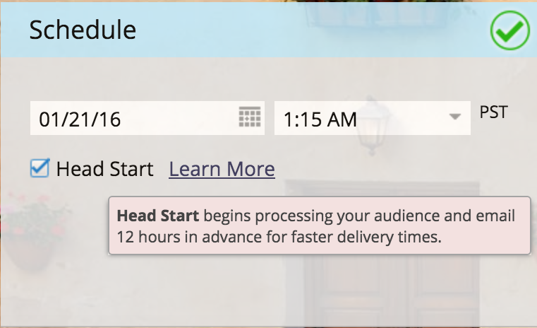
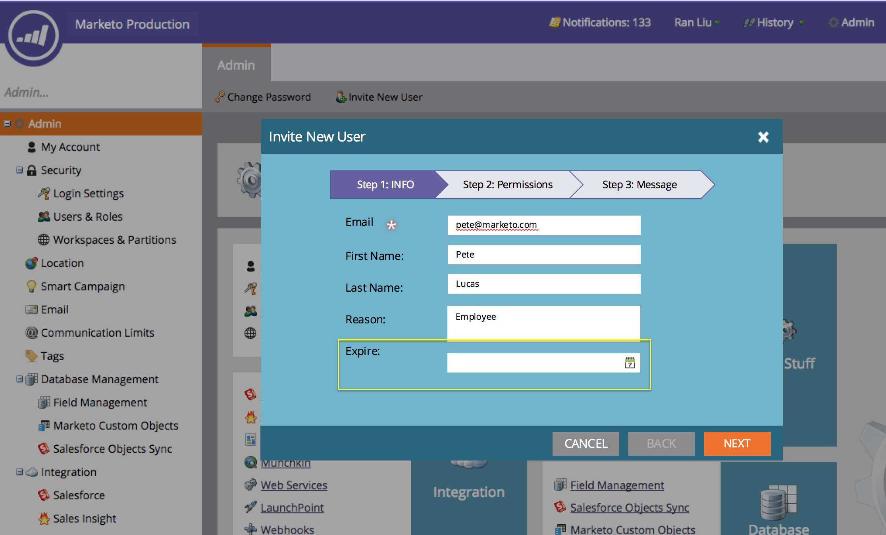
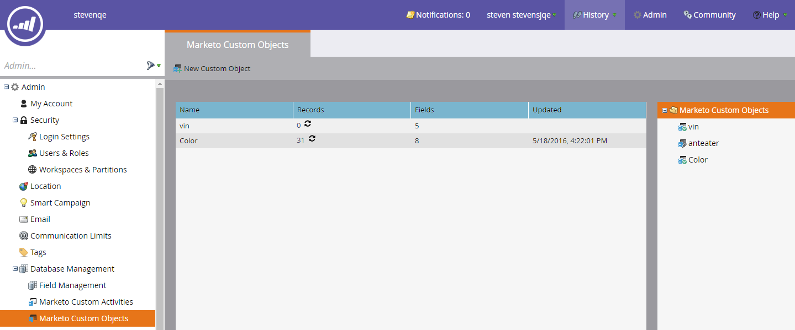

# 2016

## 2016年冬 {#winter}

’16年冬季版本包括以下功能。 请单击标题链接以查看每个功能的详细文章。

## [是匿名筛选器](/help/marketo/product-docs/administration/additional-integrations/add-munchkin-tracking-code-to-your-website/next-generation-munchkin-tracking-faq.md) {#is-anonymous-filter}

已为智能列表删除了Is匿名筛选器。 有关详细信息，请参阅[下一代Munchkin跟踪常见问题解答](/help/marketo/product-docs/administration/additional-integrations/add-munchkin-tracking-code-to-your-website/next-generation-munchkin-tracking-faq.md)文档。 此更改不会影响Web Personalization (RTP)，RTP会继续识别匿名和已知的Web访客，并实时为这些访客个性化内容。

## [数据库仪表板](/help/marketo/product-docs/core-marketo-concepts/smart-lists-and-static-lists/managing-people-in-smart-lists/database-dashboard.md)  {#database-dashboard}

[!UICONTROL Lead Database]更新了“摘要仪表板”，其中包括总人员数据库大小、可销售商机数量以及按前五个来源列出的商机细分。

## [Microsoft Edge浏览器](/help/marketo/product-docs/administration/setup-administration/supported-browsers.md) {#microsoft-edge-browser}

我们已将[!DNL Microsoft Edge]添加到Marketo支持的[浏览器](https://docs.marketo.com/display/public/DOCS/Supported+Browsers)列表。

## [Microsoft Outlook 2016](/help/marketo/product-docs/marketo-sales-insight/msi-outlook-plugin/install-the-marketo-email-add-in-for-outlook-with-a-registration-code.md) {#microsoft-outlook}

现在支持[[!DNL Microsoft Outlook] 2016](/help/marketo/product-docs/marketo-sales-insight/msi-outlook-plugin/install-the-marketo-email-add-in-for-outlook-with-a-registration-code.md)。

## [电子邮件计划头开始](/help/marketo/product-docs/email-marketing/email-programs/email-program-actions/head-start-for-email-programs.md) {#email-program-head-start}

使用[!UICONTROL Head Start]指示应提前处理您的发送。 [!UICONTROL Head Start]确保在计划的时间提前完成这些任务，而不是在计划的时间确认潜在客户并准备电子邮件。 这样，您的受众将在计划的时间开始接收电子邮件。

要使用此功能，必须提前至少12小时计划电子邮件程序，智能列表将在发送前12小时被锁定。

>[!NOTE]
>
>此功能将在’16年冬季版本发布后为期一周的逐步推出。 它不适用于智能营销活动或API。

## [移动营销增强功能](/help/marketo/product-docs/mobile-marketing/admin/add-a-mobile-app.md) {#mobile-marketing-enhancements}

**[!DNL PhoneGap]支持：**&#x200B;我们现在为您的移动应用程序提供[!DNL PhoneGap]支持。 [了解详情](https://developers.marketo.com/documentation/mobile/phonegap-plugin/)。

**支持沙盒应用程序**：

## [程序API](https://developers.marketo.com/documentation/programs/) {#program-api}

通过REST API创建、更新和克隆程序。 这不包括创建或更新项目中的智能列表和智能营销策划。

## [Microsoft Dynamics增强功能](/help/marketo/product-docs/crm-sync/microsoft-dynamics-sync/microsoft-dynamics-sync-details/sync-status.md) {#microsoft-dynamics-enhancements}

**[[!UICONTROL Sync Status]](/help/marketo/product-docs/crm-sync/microsoft-dynamics-sync/microsoft-dynamics-sync-details/sync-status.md)**：保持对同步进程的当前吞吐量和积压的关注。 按插入数和更新数按对象细分。

**[[!UICONTROL Notifications]](/help/marketo/product-docs/core-marketo-concepts/miscellaneous/understanding-notifications/notification-types.md)**：获取有关常见同步错误的通知，以及具有该错误的潜在客户列表。

## [自定义对象增强功能](/help/marketo/product-docs/administration/marketo-custom-objects/create-marketo-custom-objects.md) {#custom-objects-enhancements}

现在，您可以使用具有多个链接字段的中间对象，在潜在客户/帐户和自定义对象之间创建多对多关系。

## [Facebook潜在客户广告](/help/marketo/product-docs/demand-generation/facebook/set-up-facebook-lead-ads.md) {#facebook-lead-ads}

[[!UICONTROL Facebook Lead ads]](https://www.facebook.com/business/a/lead-ads)是企业在[!DNL Facebook]上运行商机开发营销活动的更直接方式。 人们填写表格来表达对产品或服务的兴趣，以便企业能够跟进他们。 Marketo与[!UICONTROL Facebook Lead Ads]的集成会自动捕获潜在客户在潜在客户广告表单中提供的信息。 然后，可以使用新的[!UICONTROL Fills Out Facebook Lead Ads]触发器自动执行跟进操作和通知。

## [Web （实时Personalization）营销活动计划程序](/help/marketo/product-docs/web-personalization/working-with-web-campaigns/schedule-a-web-campaign.md) {#web-real-time-personalization-campaign-scheduler}

提前计划您的营销活动。 设置个性化Web内容的开始和结束日期，并在特定日期和时间重复营销活动。 个性化计划，以根据Web访客的时间或所选时区显示活动。

## 2016年春季 {#spring}

2016年春季版中包括以下功能。 请单击标题链接以查看每个功能的详细文章。

## [电子邮件分析](/help/marketo/product-docs/reporting/email-insights/email-insights-overview.md) {#email-insights}

电子邮件分析是全新的历史汇总数据电子邮件分析体验 — 重新设计了端到端结构，实现了闪电般的快速性能。 它配有全新的用户界面设计，已针对电子邮件营销人员的需求和工作流程进行了优化。

>[!NOTE]
>
>我们将从6月3日开始分批向客户启动电子邮件分析。 我们的目标是在未来几个月内完成此操作。 启用后，我们将通过电子邮件通知您。

## [电子邮件模板选择器](/help/marketo/product-docs/email-marketing/general/email-editor-2/email-template-picker-overview.md) {#email-template-picker}

使用我们新的入门模板创建漂亮的电子邮件！ 此外，还可从其实时缩略图快速找到您的模板。

>[!NOTE]
>
>从6月3日开始，电子邮件编辑器2.0（带模板选取器）将逐步推出。 我们将在6月30日之前完成推出。 与电子邮件分析不同，当您具有访问权限时，不会通知您。 要查看您是否这样做，请按照[本文章](/help/marketo/product-docs/email-marketing/general/email-editor-2/transitioning-to-email-editor-2-0.md)中的步骤操作。

## [电子邮件编辑 — 思路重新调整](/help/marketo/product-docs/email-marketing/general/email-editor-2/email-editor-v2-0-overview.md) {#email-editing-re-imagined}

没错，全新的电子邮件编辑器！ 使用轻量级的拖放功能来添加内容并重新排序内容。 新元素（包括图像、视频、变量和模块）肯定会增强您的编辑体验。 另外，请查看更新的代码编辑器、预览器和预览器支持。

## [移动应用程序内消息](/help/marketo/product-docs/mobile-marketing/in-app-messages/understanding-in-app-messages.md) {#mobile-in-app-messages}

直接在Marketo中为您的应用程序创建令人惊叹的应用程序内消息。 确切定义谁应该看到它以及使用应用程序内消息程序查看它的时间。 通过程序仪表板轻松监控其性能。

## [没有草稿代码片段](/help/marketo/product-docs/administration/users-and-roles/enable-no-draft-for-snippets.md) {#no-draft-snippets}

在每次更新代码片段时必须重新批准所有内容的日子已经一去不复返！ 通过无草稿，所有使用代码片段的电子邮件和登陆页面都将获得代码片段更新并保持其先前状态。 每次批准代码片段时，您都可以选择运行无草稿并更新所有内容，或者创建草稿。 由你来决定！ 无草稿可供所有客户使用，并由“管理员”中的新权限控制。

## [登陆页面、登陆页面模板和表单API](https://developers.marketo.com/blog/spring-2016-updates/) {#landing-page-landing-page-template-and-form-apis}

Marketo REST API现在支持对Marketo登陆页面、登陆页面模板和表单的控制。 用户现在可以通过Marketo REST API直接创建、更新内容、批准和删除这些资源。

## [用于API访问的IP](/help/marketo/product-docs/administration/additional-integrations/create-an-allowlist-for-ip-based-api-access.md) {#ip-allowlisting-for-api-access}

与Marketo用户登录的IP列入允许列表功能类似，Marketo管理员现在可以设置IP地址允许列表，以访问Marketo SOAP和REST API，从而阻止来自未授权IP地址的访问。 这为Marketo实例增添了一个安全层，并确保只能从贵组织的网络内部进行API访问。 有关如何设置的详细信息，请访问[Marketo文档网站](/help/marketo/product-docs/administration/additional-integrations/create-an-allowlist-for-ip-based-api-access.md)。

## [新的高速Microsoft Dynamics同步连接器](/help/marketo/product-docs/crm-sync/microsoft-dynamics-sync/microsoft-dynamics-sync-details/sync-status.md) {#new-high-speed-microsoft-dynamics-sync-connector}

新的高速Dynamics连接器提供初始同步速度提高20倍，增量同步速度提高5倍。 所有新客户都将在发布日期加入此连接器，我们将在夏季发布时间范围内逐步向现有客户推出。

**刷新新字段的数据**：现在您可以随时启用新同步字段，并且该字段的所有数据值将从[!DNL Dynamics] CRM刷新到Marketo中。 不必再担心在初始设置期间必须选择所有字段。 如果禁用现有同步字段并稍后重新启用它，则该字段的所有数据值将从[!DNL Dynamics] CRM刷新到Marketo中。

**将潜在客户同步为联系人**： [!UICONTROL Sync Lead to Microsoft]流程操作有一个新选项，可用于作为潜在客户或联系人进行同步。

**同步错误管理员选项卡**：浏览、搜索或导出无法与操作、方向、错误代码和错误消息等详细信息同步的潜在客户（和其他对象）。

**[!DNL Microsoft Dynamics]2016**：连接器已针对[!DNL Dynamics] 2016 [!DNL Online]和[!DNL On-premise]版本进行完全认证。

**现在记录了插件更新：**&#x200B;请参阅[插件更新文档文章](/help/marketo/product-docs/crm-sync/microsoft-dynamics-sync/marketo-plugin-releases-for-microsoft-dynamics.md)。

## [友好实例名称](/help/marketo/product-docs/administration/settings/edit-subscription-settings.md) {#friendly-instance-name}

现在，很难区分Marketo实例，例如沙盒实例和生产实例。 此功能可让您知道您当前正在处理哪些实例。

## 订阅的有限时间访问 {#limited-time-access-for-subscriptions}

现在，用户可以无限期地受邀订阅Marketo。 管理员可以使用此功能在有限的时间内邀请用户进行订阅，例如2周或1个月。

## [自定义对象网格](/help/marketo/product-docs/administration/marketo-custom-objects/understanding-marketo-custom-objects.md) {#custom-objects-grid}

现在，您可以查看所有已发布的自定义对象的记录数和字段数。

## 自定义活动 {#custom-activities}

Marketo管理员现在可以通过Marketo自定义活动定义建模器定义和管理其自定义活动类型。 与Marketo自定义对象Modeler类似（并与之相结合），管理员现在可以扩展数据模型以满足其确切的业务需求。 有关如何使用此功能的详细信息，请访问[Marketo文档网站](/help/marketo/product-docs/administration/marketo-custom-activities/understanding-custom-activities.md)。

## 2016年夏天 {#summer}

2016年夏季版本中包含以下功能。 检查您的Marketo版本以了解功能可用性。 请单击标题链接以查看每个功能的详细文章。

## [基于帐户的营销](https://docs.marketo.com/display/docs/account+based+marketing) {#account-based-marketing}

基于Marketo帐户的营销在一个统一的平台上提供所有必需品：

* **Target** — 帐户发现、潜在客户与帐户匹配和指定帐户列表
* **参与** — 基于帐户的Personalization、跨渠道参与和特定于帐户的工作流
* **衡量标准** — 帐户和列表级别的洞察、帐户参与度得分以及管道和收入影响

>[!NOTE]
>
>ABM可用作您的Marketo订阅的附加组件，因此请与您的销售代表联系以实施它。

## [审核记录](/help/marketo/product-docs/administration/audit-trail/audit-trail-overview.md) {#audit-trail}

审核记录提供了Marketo订购中所做更改的全面历史记录。 它将创建用户和管理员之间的责任制，帮助识别意外行为的原因，并提供了解谁在做什么以及何时做什么的安全性。 此信息将在任何时间点提供，并可用于回答以下问题：

* 此资源或设置发生了什么变化，谁最后更新了它？
* 用户X的近期活动是怎样的？
* 谁正在登录我们的帐户？

## Marketo-Vibes SMS LaunchPoint集成

直接在Marketo中轻松创建短信消息。 使用丰富的Marketo数据个性化和定向消息，并使用SMS消息仪表板轻松监控其性能。

>[!NOTE]
>
>此功能要求您拥有现有的[!DNL Vibes SMS]帐户。

## [Email 2.0增强功能](/help/marketo/product-docs/email-marketing/general/email-editor-2/email-editor-v2-0-overview.md) {#email-enhancements}

**模块级变量**

以前，在Email 2.0模板中指定的所有变量在范围中均为“全局”。 在模块中使用变量时，如果您计划使用模块的多个实例，则并不总是希望这样做。 在此版本中，现在可以将变量指定为“模块级别”，这样可让您指示用户应能够为其使用的每个模块设置唯一值。

**语法更新**

* 现在，您可以在Email 2.0模板中指定的模块上使用“mktoAddByDefault”，以指示默认情况下应在新电子邮件中显示哪些模块。 如果您要构建包含大量模块的电子邮件模板，这会方便得多。
* 在图像元素上，您现在可以指定是应锁定基础`` HTML元素的“高度”和“宽度”属性，还是应该对最终用户进行编辑。 mktoLockImgSize=&quot;true&quot;将导致高度/宽度被锁定（即使图像已更改）。 同样，mktoLockImgStyle=&quot;true&quot;将导致锁定&quot;style&quot;属性。

**代码搜索**

使用新的搜索功能高效地查找和替换电子邮件代码中的内容。 电子邮件模板编辑器中也提供了此功能。

图像元素中支持&#x200B;**令牌**

令牌现在可用于插入图像体验的“外部URL”区域！ 如果您已使用`{{my.tokens}}`指定图像，则现在可以在电子邮件编辑器2.0中引用这些令牌。 请注意，在电子邮件编辑器2.0画布中，图像仍显示为已损坏。 但是，在发送电子邮件之前，您会在预览和发送示例中看到这些幻灯片。

## 多个品牌化域 {#multiple-branding-domains}

电子邮件跟踪链接只能使用单个品牌域进行标记的日子已经一去不复返了。 您现在可以添加多个品牌域来激发消费者的信心，创建更加简化的外观以重点关注品牌，改进电子邮件投放能力，并根据每封电子邮件选择用于每封电子邮件的跟踪链接的品牌域。

## [计划令牌](/help/marketo/product-docs/demand-generation/landing-pages/personalizing-landing-pages/tokens-overview.md) {#program-tokens}

我们为项目创建了新令牌类型。 您现在可以在资源和智能营销活动流程步骤中呈现项目名称、描述和ID。

## [企业密钥](/help/marketo/product-docs/marketo-sales-insight/msi-outlook-plugin/authorize-the-marketo-outlook-plugin.md) {#enterprise-key}

要求您的销售团队中的每个人为[!DNL Outlook]安装我们的[!DNL Sales Insight]插件可能会很繁琐。 我们引入了一种使用企业密钥远程安装[!DNL Outlook]插件的新方法。 向IT团队发送您在[!UICONTROL Admin]的Marketo [!DNL Sales Insight]部分中找到的唯一密钥，然后让他们完成其余任务。

## [Web Personalization营销活动](/help/marketo/product-docs/web-personalization/working-with-web-campaigns/create-a-new-dialog-web-campaign.md) {#web-personalization-campaigns}

指定Web营销活动在您的网站上做出反应的时间延迟。

## [Content Analytics和推荐导出](/help/marketo/product-docs/web-personalization/understanding-web-personalization/understanding-content-analytics.md) {#content-analytics-and-recommendations-export}

脱机查看内容分析和推荐数据。

## 电子邮件编辑器2.0](https://developers.marketo.com/documentation/asset-api/) {#api-support-for-email-editor}的[API支持

以前仅与v1.0电子邮件和模板兼容的预先存在的Asset API现在为v2.0电子邮件资产启用。

## [Marketo开发人员网站](https://developers.marketo.com/) {#marketo-developers-site}

新增功能和改进功能！

## [隐私设置](/help/marketo/product-docs/administration/settings/understanding-privacy-settings.md) {#privacy-settings}

营销人员可以使用隐私设置决定是否使用[!DNL Munchkin]和Web Personalization功能跟踪访客。 跟踪级别可通过使用浏览器的Do Not Track设置、选择退出Cookie或非特定IP来控制。 这些方法可能会影响Marketo在特定领域中的价值和功能，但是，如果营销人员不更改任何内容，则Marketo功能将保持不变。

该功能将在六周后逐步向客户发布。 如果您需要立即获取帮助，请联系Marketo支持部门。

## 2016年秋季 {#fall}

2016年秋季版本中包含以下功能。 检查您的Marketo版本以了解功能可用性。 请单击标题链接以查看每个功能的详细文章。

## 电子邮件中的[!UICONTROL Predictive Content] {#predictive-content-in-email}

我们的[!UICONTROL Predictive Content]应用程序现在有了新的用户体验，可以通过我们的机器学习和预测算法跨Web和电子邮件渠道跟踪、管理和推荐您的内容。

>[!NOTE]
>
>所有使用预测模块的客户将于1月10日前启用。

您现在可以向电子邮件添加预测性内容。 打开电子邮件时，收件人会自动收到相关的推荐内容，这有助于提高内容参与度和转化率。

## [Facebook离线转化](/help/marketo/product-docs/demand-generation/facebook/understanding-facebook-offline-conversions.md) {#facebook-offline-conversions}

通过[!DNL Facebook]离线转化集成，Marketo中的转化数据（适用于潜在广告商机）会自动发送回[!DNL Facebook]，以便您的广告团队可以更好地优化其广告支出。 在此[!DNL Facebook]广告管理器报表中，脱机转化突出显示。

## 通用Id {#universal-id}

通用ID允许您通过一次登录访问多个Marketo订阅，并快速在订阅之间切换。 您可以将单个社区配置文件用于所有订阅。

>[!NOTE]
>
>请联系Marketo支持以启用此功能。

## 基于Marketo帐户的营销增强功能 {#marketo-account-based-marketing-enhancements}

现在，您可以将帐户团队分配给基于帐户的营销(ABM)中的指定帐户，例如帐户所有者、销售开发代表、业务开发代表和客户成功经理。 您还可以构建特定于帐户所有者的帐户列表，并向帐户团队发送个性化的每周ABM报告。

**REST API**

此版本还允许您使用Marketo REST API在ABM中管理指定帐户属性和帐户分数。 有关API操作的更多详细信息，请访问[Marketo开发人员网站](https://developers.marketo.com/rest-api/lead-database/named-accounts)。

## [审核记录增强功能](/help/marketo/product-docs/administration/audit-trail/change-details-in-audit-trail.md) {#audit-trail-enhancements}

审核记录提供了Marketo订购中所做更改的全面历史记录。 我们为项目添加了其他跟踪功能，并展示了智能营销活动、智能列表以及对用户和角色所做更改的重要更改详细信息。

## 新权限

**使电子邮件正常工作**

以前，您必须担心用户向数据库中已取消订阅的用户发送事务性电子邮件，现在这种日子已经一去不复返了。 您现在可以指定哪些用户可以使电子邮件成为可操作电子邮件或编辑操作电子邮件。

**编辑营销活动限制**

如果无法强制执行[营销活动限制](/help/marketo/product-docs/administration/email-setup/enable-person-restrictions-for-smart-campaigns.md)，为什么要设置这些限制？ 当您将营销活动限制设置设置为限制数据库中可通过单个营销活动进行定位的人员数量时，您现在能够限制哪些用户在计划营销活动时可以覆盖这些设置。

## 移动推送通知的[声音](/help/marketo/product-docs/mobile-marketing/push-notifications/configure-mobile-push-notification.md) {#sound-for-mobile-push-notifications}

通过启用声音功能，为您的iOS推送通知增添丰富内容。 这项新功能允许您在移动设备上显示推送通知时触发声音。

>[!NOTE]
>
>* 设备所有者可以选择阻止在设备设置中播放声音，应用程序开发人员可以在应用程序中向设备所有者提供选项来阻止播放声音。
>* 在Android设备上显示推送通知时，会自动播放声音。

## [与Salesforce Encryption兼容的Sales Insight](/help/marketo/product-docs/marketo-sales-insight/msi-for-salesforce/installation/install-marketo-sales-insight-package-in-salesforce-appexchange.md) {#sales-insight-compatible-with-salesforce-encryption}

市场[!DNL Sales Insight]现在与[!DNL Salesforce] Shield Encryption兼容。 所有[!DNL Sales Insight]客户都应升级到此最新的托管包（版本1.4359.2），该包在 [!DNL Appexchange]](https://appexchange.salesforce.com/listingDetail?listingId=a0N30000001SVZmEAO)上有[可用。

## [命名帐户API](https://developers.marketo.com/rest-api/lead-database/named-accounts/) {#named-accounts-apis}

在此版本中，Marketo ABM用户可以通过指定帐户API管理指定帐户。 用户可以创建、更新和删除指定帐户，也可以读取和更新ABM指定帐户分数。

## [电子邮件编辑器v2.0 API支持](https://developers.marketo.com/rest-api/assets/emails/) {#email-editor-v-api-support}

使用Marketo REST API管理v2.0格式的电子邮件变量和模块。

## [对Marketo Salesforce Sync的更改](https://nation.marketo.com/docs/DOC-3840) {#changes-to-marketo-salesforce-sync}

Marketo的[!DNL Salesforce]集成正在不断发展，以改进Marketo字段与[!DNL Salesforce]同步的方式。 现在，您无需同步大量您可能需要（也可能不需要）的字段，而是可以选择您要包括的字段。 请在此处查看我们的文档以了解更多信息：[https://nation.marketo.com/docs/DOC-3840](https://nation.marketo.com/docs/DOC-3840)。

