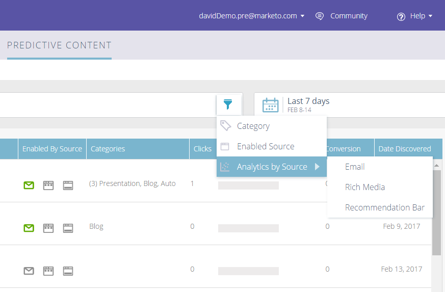
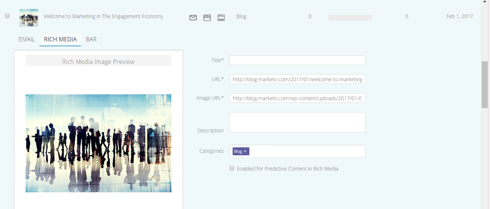

# 2017

## 2017年冬 {#winter}

’17年冬季版本包括以下功能。 检查您的Marketo版本以了解功能可用性。

请单击标题链接以查看每个功能的详细文章。

>[!NOTE]
>
>如果一个主题有多个子标题，则链接会放置在该处。

## [Facebook自定义受众的高级匹配](/help/marketo/product-docs/demand-generation/ad-network-integrations/add-facebook-custom-audiences-as-a-launchpoint-service.md) {#advanced-matching-for-facebook-custom-audiences}

基本匹配仅使用电子邮件地址，但新的高级匹配使用额外的七个字段，从而提高匹配率以实现更多转化。

## [自定义对象导入API](https://developers.marketo.com/rest-api/lead-database/custom-objects/) {#custom-object-import-api}

此API提供了一个更快的界面，用于将自定义对象同步到Marketo中。 您可以将CSV、TSV或SSV电子表格文件作为自定义对象导入Marketo。

## [Web Personalization促销活动导出](/help/marketo/product-docs/web-personalization/working-with-web-campaigns/export-web-campaign-data.md) {#web-personalization-campaigns-export}

以CSV格式导出所有Web Campaign详细信息和分析。 然后，您便可以用方便的布局查看数据。

## 本地化 {#localization}

Web Personalization、[!UICONTROL Predictive Content]和电子邮件分析应用程序现在提供日语、德语和西班牙语版本。 您[选择语言和区域设置](/help/marketo/product-docs/administration/settings/change-time-zone.md)以查看您在这些语言中的内容。

## 基于帐户的营销增强功能 {#account-based-marketing-enhancements}

**[导入指定帐户](/help/marketo/product-docs/target-account-management/target/named-accounts/import-named-accounts.md)**

使用[!UICONTROL Named Account]导入选项，通过CSV上传一次创建或更新多个记录。

**[电子邮件分析支持](/help/marketo/product-docs/reporting/email-insights/filtering-in-email-insights.md)**

在电子邮件分析中使用[!UICONTROL Named Account]或[!UICONTROL Account List]作为维度。

## [!UICONTROL Predictive Content]增强功能 {#predictive-content-enhancements}

**[按[!UICONTROL Enabled Source]](/help/marketo/product-docs/predictive-content/working-with-predictive-content/understanding-predictive-content.md)**&#x200B;筛选

筛选为[!UICONTROL Email]、[!UICONTROL Rich Media]或[!UICONTROL Recommendation Bar]启用的[!UICONTROL Predictive Content]部分。

**[筛选器[!UICONTROL Analytics by Source]](/help/marketo/product-docs/predictive-content/working-with-predictive-content/understanding-predictive-content.md)**

为特定源（[!UICONTROL Email]、[!UICONTROL Rich Media]或[!UICONTROL Recommendation Bar]）筛选[!UICONTROL Predictive Content]分析。

**[!UICONTROL Predictive Content]编辑器**

改进了按源（[!UICONTROL Email]、[!UICONTROL Rich Media]或[!UICONTROL Recommendation Bar]）拆分内容准备的编辑体验和布局。

**[预测的自动发现内容](/help/marketo/product-docs/predictive-content/getting-started/enable-content-discovery.md)**

图像URL和元数据现在用于内容自动发现过程。

## [SDK增强功能](https://developers.marketo.com/mobile/) {#sdk-enhancements}

现在，开发人员通过添加新的SDK API调用（允许开发人员删除推送令牌），对推送通知的投放进行了额外控制。

## Vibes SMS LaunchPoint集成

使用新的筛选器选项“Member of Vibes List”改进您的定位。

## [弃用旧版富文本编辑器和表单编辑器1.0](https://nation.marketo.com/docs/DOC-4315)

从2017年8月1日开始，仍在使用旧版富文本编辑器和表单编辑器1.0的客户将自动过渡到新体验。

## [Marketo活动API](https://developers.marketo.com/blog/important-change-activity-records-marketo-apis/) {#marketo-activity-apis}

Marketo的活动API即将发生重要更改。 准备好了吗？

## 2017年春 {#spring}

2017年春季发行版中包含以下功能。 检查您的Marketo版本以了解功能可用性。

请单击标题链接以查看每个功能的详细文章。 **注意**：如果一个主题有多个子标题，则链接会放在那里。

## [LinkedIn潜在客户Gen Forms](/help/marketo/product-docs/demand-generation/social/social-functions/set-up-linkedin-lead-gen-forms.md) {#linkedin-lead-gen-forms}

[[!UICONTROL LinkedIn Lead Gen] Forms](https://business.linkedin.com/marketing-solutions/native-advertising/lead-gen-ads)是企业在[!DNL LinkedIn]上开展商机开发活动的更直接方式。 人员可以填写一些表单来表达对产品或服务的兴趣，这样，企业就可以捕获人员的详细信息，并将这些详细信息同步到Marketo，以便进行自动的跟进流程和潜在客户传递活动。

Marketo与[!UICONTROL LinkedIn Lead Gen] Forms的集成会自动捕获潜在客户在Lead Gen表单中提供的信息。 然后，可以使用新的&#x200B;**填写[!DNL LinkedIn Lead Gen]表单**&#x200B;触发器和筛选器自动执行跟进操作和通知。

## [使MSI模板过期](/help/marketo/product-docs/marketo-sales-insight/msi-for-salesforce/features/actions-in-the-msi-panel/send-marketo-email/publish-an-email-to-sales-insight.md) {#expire-msi-template}

在[!DNL Sales Insight]中清理过时模板的日子已经过去。 当您发布电子邮件时设置一个过期日期，我们将在过期日期临近时为您取消发布该电子邮件。

>[!NOTE]
>
>将过期日期设置为2017年5月31日意味着模板将在2017年5月31日当天结束时从[!DNL Sales Insight]中删除。

## [批量提取人员和活动的API](https://developers.marketo.com/rest-api/bulk-extract/) {#bulk-extract-apis-for-people-and-activities}

轻松地将大量人员和活动数据从Marketo传输到外部系统。

## ABM增强功能

ABM命名帐户上的&#x200B;**[自定义字段](https://docs.marketo.com/x/1wnG)**

Marketo ABM现在允许您在指定帐户中创建最多10个自定义字段。 您可以将这些自定义字段映射到CRM帐户对象中的字段，Marketo ABM将同步数据，从而允许您扩展ABM指定帐户并帮助推动营销。

ABM命名帐户的&#x200B;**[百分点评分](https://docs.marketo.com/display/docs/assets/abmpercentiles.png)**

命名帐户得分可能差别很大。 Marketo ABM现在会自动计算每个得分的百分位数，以便您一眼就能看到每个指定帐户在其他指定帐户中的排名。

**[ABM帐户列表API](https://developers.marketo.com/rest-api/lead-database/named-account-lists/)**

利用丰富而强大的ABM合作伙伴集成，以及针对指定帐户列表的增强API支持。

## Web Personalization增强功能

滚动时&#x200B;**[Web营销活动](/help/marketo/product-docs/web-personalization/working-with-web-campaigns/set-how-your-web-campaign-displays.md)**

新的Web促销活动效果为您的Web访客提供了更加个性化的体验。 将您的个性化[!UICONTROL Web Campaigns]设置为仅在Web访客向下滚动您的网页时显示。 您可以根据以下条件将您的对话框[!UICONTROL Web Campaigns]设置为在滚动时显示：

* 已滚动页面的百分比
* 已达到像素
* 在页面折叠下方滚动

**[退出意图时的Web营销活动](/help/marketo/product-docs/web-personalization/working-with-web-campaigns/set-how-your-web-campaign-displays.md)**

在访客关闭您的页面之前捕获访客的注意力。 将您的个性化[!UICONTROL Web Campaigns]设置为仅在鼠标手势指示访客离开页面时显示。

[!UICONTROL Web Campaigns]](/help/marketo/product-docs/web-personalization/working-with-web-campaigns/create-a-new-dialog-web-campaign.md)**的**[&#x200B;动画效果

设置Dialog Web Campaign的动画效果，以自定义活动在进入或退出网页时的显示方式。 您可以从6种不同的效果中进行选择，并控制对话框的时间和方向。

**[对话框关闭按钮自定义](/help/marketo/product-docs/web-personalization/working-with-web-campaigns/create-a-new-dialog-web-campaign.md)**

自定义对话框的“关闭”按钮。 从透明对话框样式[!UICONTROL Web Campaigns]中使用的选项范围中选择。 选择“关闭”按钮的图标、颜色和位置。 您还可以添加自己的按钮图像。

**[存档Web营销活动](/help/marketo/product-docs/web-personalization/working-with-web-campaigns/archive-a-web-campaign.md)**

存档是一种新的Web营销活动状态，允许您存档[!UICONTROL Web Campaigns]并在默认Web营销活动视图中隐藏它们。 这样，您就可以专注于最相关、最活跃的营销活动，并根据需要检索较早的已存档营销活动。

**[本地化](/help/marketo/product-docs/administration/settings/change-time-zone.md)**

Web Personalization现在以所有Marketo支持的语言（英语、日语、德语、西班牙语、法语和葡萄牙语）提供。

## 预测性增强功能 {#predictive-enhancements}

**[本地化](/help/marketo/product-docs/administration/settings/change-time-zone.md)**

预测内容现在以所有Marketo支持的语言（英语、日语、德语、西班牙语、法语和葡萄牙语）提供。

## [弃用旧版富文本编辑器和表单编辑器1.0](https://nation.marketo.com/docs/DOC-4315)

从2017年8月1日开始，仍在使用旧版富文本编辑器和表单编辑器1.0的客户将自动过渡到新体验。

## 2017年夏天 {#summer}

2017年夏季版本中包含以下功能。 检查您的Marketo版本以了解功能可用性。

请单击标题链接以查看每个功能的详细文章。 注意：此版本中包含的某些功能没有关联的文章。 如果一个主题有多个子标题，则链接会放置在该处。

## [其他Facebook离线转换阶段](/help/marketo/product-docs/demand-generation/facebook/set-up-facebook-offline-conversions.md) {#additional-facebook-offline-conversion-stages}

选择最多7个额外的离线转化阶段以映射到Marketo生命周期阶段（超出目前可用的3个）。 根据客户历程中的转化优化您的[!DNL Facebook]广告支出，以实现更好的ROI。

## [锁定Sales Insight模板](/help/marketo/product-docs/marketo-sales-insight/msi-for-salesforce/features/actions-in-the-msi-panel/send-marketo-email/lock-sales-template.md) {#lock-sales-insight-template}

通过阻止对销售模板进行编辑，确保消息和内容的一致性。 这有助于标准化模板和维护专业通信。

## ABM增强功能

**用于日本公司查找的Data Source**

用当地语言将人员与日本公司的名称匹配。

**[ABM和LeanData集成](https://docs.marketo.com/x/pKmt)**

[!DNL LeanData]集成现在允许在Marketo中进行商机帐户匹配。 通过将相同的潜在客户与记录销售和营销系统中的客户关联起来，使营销和销售保持一致。 更灵活的选项使营销和销售运营部门能够更好地控制商机与客户的匹配规则，以便他们达到所需的精确级别。

## Web Personalization增强功能

**[促销活动预览增强功能](/help/marketo/product-docs/web-personalization/working-with-web-campaigns/preview-and-test-a-web-campaign.md)**

营销从业者现在可以确保其Web营销活动在启动任何设备&#x200B;*之前*&#x200B;都具有出色的外观。 借助这些增强功能，了解您的Web营销活动在台式机、移动设备和平板电脑上的呈现方式。 [!DNL Chrome]的新插件还提供了更一致且更准确的预览。

**[构件促销活动增强功能](/help/marketo/product-docs/web-personalization/working-with-web-campaigns/create-a-new-widget-web-campaign.md)**

现在提供了构件营销活动的新选项，包括：

* 触发营销活动（延迟、滚动）
* 显示营销活动（屏幕周围的任意位置）
* 将展开/最小化箭头更改为任何CTA文本

## ContentAI {#contentai}

**[ContentAI分析和建议](/help/marketo/product-docs/predictive-content/predictive-content-analytics-overview.md)**

通过更深入的分析和AI支持的内容建议提高内容营销的回报率，从而提升参与度。 功能强大的分析可展示推荐内容的表现如何，包括热门、趋势和基于受众的视图。 您还将看到有关要包含的其他内容的建议。

## Analytics {#analytics}

**[!UICONTROL Email Insights]增强功能**

用新的方法准备和共享数据，从您的[!UICONTROL Email Insights]体验中获得更多好处。 您现在可以将您的[!UICONTROL Email Insights]结果下载到[!DNL Microsoft Excel]和[!DNL PowerPoint]中以处理Marketo之外的数据。

## 联合身份配置支持 {#federated-identity-configuration-support}

将身份验证(Active Directory)保留在防火墙内部部署之后，同时继续在云中使用[!DNL Microsoft Dynamics] CRM。

## 2017年秋季 {#fall}

2017年秋季版本包括以下功能。 检查您的Marketo版本以了解功能可用性。

请单击标题链接以查看每个功能的详细文章。 注意：此版本中包含的某些功能没有关联的文章。 如果一个主题有多个子标题，则链接会放置在该处。

## 系统可靠性 {#system-reliability}

我们进一步改进了核心Marketo基础架构，包括优化排序、减少不匹配和提高[!DNL Munchkin]稳定性。

## SFDC同步性能 {#sfdc-sync-performance}

利用Marketo和[!DNL Salesforce]之间更丰富、更快的同步。 需要批量更新帐户或潜在客户的数据更改可以拆分为并行队列以避免积压。 事件和任务的同步速度也加快了50%。

## Analytics性能改进 {#analytics-performance-improvements}

最近的基础架构改进在Marketo报告和分析工具中增加了正常运行时间和稳定性，使您能够更快地构建临时报告。

## [收件人时区](/help/marketo/product-docs/email-marketing/email-programs/email-program-actions/scheduling-with-recipient-time-zone/understanding-recipient-time-zone.md) {#recipient-time-zone}

借助此新功能，您现在可以根据本地时区保留和投放电子邮件。 可以将电子邮件和参与程序配置为在收件人的时区中发送，从而无需创建多个程序 — 只发送一次，Marketo会自动保留电子邮件，直到到达正确的本地时间。 提升电子邮件指标，观察本地实践，并在全局范围内使用单个项目来节省时间。

>[!NOTE]
>
>如果您还无法在电子邮件和参与程序上启用收件人时区，请不要惊慌！ 我们正在逐步向所有客户启用此功能。

## [按区段查看示例电子邮件](/help/marketo/product-docs/email-marketing/general/creating-an-email/send-a-sample-email.md) {#review-sample-emails-by-segment}

在发送示例电子邮件以供审阅时，Marketo新增了一个用于选取区段的选项。 您不再需要手动确定商机属于哪个区段，从而更轻松地向不同区段发送包含动态内容的电子邮件。

## [LinkedIn潜在客户一般自定义问题](/help/marketo/product-docs/demand-generation/social/social-functions/set-up-linkedin-lead-gen-forms.md) {#linkedin-lead-gen-custom-questions}

自定义您的[!UICONTROL LinkedIn Lead Gen]表单以收集自定义潜在客户属性。 现在，您最多可以为每个表单询问三个自定义问题，从单行文本输入或多选问题中进行选择，然后映射回Marketo潜在客户字段。

## Slack集成 {#slack-integration}

作为新的Slack集成的一部分，我们发布了两项功能：

* 系统通知：获取有关Marketo实例中的重要事件的Slack通知，例如有关当前营销活动状态的警报以及任何需要立即关注的问题。
* 有趣的时刻：当销售帐户中的已知个人触发了Marketo Insight时，可以通过Slack通知潜在所有者。 通知包括潜在客户信息以及有关销售帐户的详细信息。

## ABM增强功能

**[显示没有联系人的帐户](https://docs.marketo.com/x/fKCt)**

Marketo ABM现在同步并显示没有联系人的CRM帐户。 包括以前没有销售或营销历史的新帐户，并通过将后续销售线索与帐户匹配来跟踪进度。

## ContentAI分析 {#contentai-analytics}

**[新ABM帐户列表筛选器](https://docs.marketo.com/x/1BPG)**

查看和比较ABM帐户列表中的内容性能，以优化现有内容。 ContentAI向您显示：

* 查看的排名最前的内容
* 排名最前的转化内容
* AI支持的营销活动建议内容

## Web Personalization增强功能

Web营销活动的&#x200B;**[令牌](/help/marketo/product-docs/web-personalization/working-with-web-campaigns/using-the-web-personalization-rich-text-editor.md)**

令牌现在可在Web营销活动中使用。 利用令牌提供个性化的消息和内容，以提高Web促销活动的参与度。

**[在Web Campaign编辑器中设计工作室图像](/help/marketo/product-docs/web-personalization/working-with-web-campaigns/using-the-web-personalization-rich-text-editor.md)**

通过在Marketo中跨多个渠道重复使用创意资源和图像，节省时间。

## 集成  {#integration}

**[电子邮件预览API](https://experienceleague.adobe.com/en/docs/marketo-developer/marketo/email-scripting)**

现在，您可以在Marketo之外远程预览电子邮件，从而简化电子邮件内容本地化的过程并减少错误。

**[替换HTML API](https://experienceleague.adobe.com/en/docs/marketo-developer/marketo/email-scripting)**

开发人员可以远程更新电子邮件资产的HTML内容，从而能够在单个系统中维护资产。

## 4月ABM增强功能 {#april-abm}

2017年4月的ABM增强版本中包含以下功能。 检查您的Marketo版本以了解功能可用性。

## 同步CRM映射的标准字段 {#synching-of-crm-mapped-standard-fields}

Marketo ABM正在更改与CRM相关的行为。 今后，Marketo ABM会在CRM中的ABM帐户和帐户之间建立并保持1对1关系。 这允许Marketo使映射的帐户字段与CRM保持同步。

## CRM发现的自定义字段 {#custom-fields-for-crm-discovery}

您现在可以将自定义字段添加到帐户，将它们映射到您的CRM，并将它们用于Marketo中的CRM帐户发现。

## 指定帐户网格中基于帐户的筛选器 {#account-based-filters-in-the-named-account-grid}

您现在可以根据帐户列表轻松筛选指定帐户。

## 8月ABM增强功能 {#august-abm}

2017年8月的ABM增强版本中包含以下功能。 检查您的Marketo版本以了解功能可用性。

请单击标题链接以查看每个功能的详细文章。

## [!DNL Account Insight] {#account-insight}

**[[!DNL Account Insight]](/help/marketo/product-docs/target-account-management/setup-tam/account-insight-plug-in-overview.md)**&#x200B;是一个[!DNL Google Chrome]插件，可为您的销售团队提供可操作的ABM和帐户分析，从而使他们能够与营销部门密切合作，从而有效地吸引帐户。 销售团队将了解为其拥有的每个指定帐户生成的数据和见解。 这将包括帐户分数百分比、其指定帐户的优先级列表、这些帐户中的参与人员以及帐户中近期活动的实时活动流。

 

## [动态帐户列表](/help/marketo/product-docs/target-account-management/target/account-lists.md) {#dynamic-account-lists}

我们正在添加一种在ABM中创建帐户列表的新方法。 除了现有的帐户列表之外，您现在还可以创建从公共CRM帐户视图生成的动态帐户列表。 CRM帐户视图是一组规则，在显示帐户时充当过滤器。 例如，您可以使用它查找行业为医疗保健&#x200B;_且_&#x200B;收入超过1亿美元的帐户。

